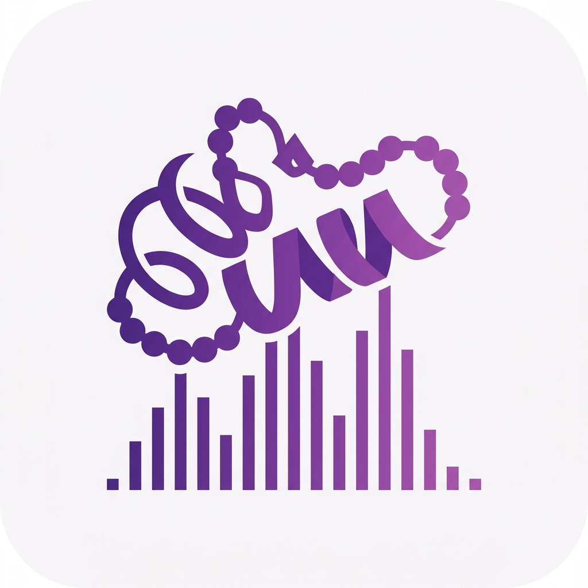

<!-- markdownlint-disable MD007 MD010 MD033 MD036 MD041 -->

  

<h1 align="center">Awesome Proteomics</h1>

  A curated list of tools, resources, and knowledge for mass spectrometry-based proteomics - covering both bottom-up (peptide-centric) and top-down (proteoform-centric) approaches.

  
  
  

  
  
  
  

> **New to proteomics data?** [Start here &rarr;](guides/beginners-guide.md)

**Project Health** &middot; Links Verified: `2026-07-31` | New Tools this Month: `na` | Stale Entries Pruned: `na`

_Inclusion does not constitute endorsement. Commercial tools are marked with 💰. See the [contribution guidelines](CONTRIBUTING.md) for entry format and quality bar._

**Scope:** Mass spectrometry-based proteomics. The list currently leans toward bottom-up / shotgun proteomics, with top-down / native approaches covered more selectively while our coverage grows. Affinity- and aptamer-based platforms (for example Olink and SomaScan) are out of scope; this list deliberately stays MS-focused.

---

## Contents

- [Contents](#contents)
- [Legend](#legend)
- [General Resources](#general-resources)
  - [Start Here: Tutorials \& Practical Guides](#start-here-tutorials--practical-guides)
  - [Courses \& Training](#courses--training)
  - [Books](#books)
  - [Reference \& Standards](#reference--standards)
  - [Reviews \& Perspectives](#reviews--perspectives)
  - [Milestone Papers](#milestone-papers)
  - [Blogs, Podcasts \& Media](#blogs-podcasts--media)
- [Mass Spectrometry Fundamentals](#mass-spectrometry-fundamentals)
  - [Advanced MS Applications](#advanced-ms-applications)
- [Sample Preparation](#sample-preparation)
- [Discovery Proteomics](#discovery-proteomics)
- [Top-Down Proteomics](#top-down-proteomics)
- [Quantitative Proteomics](#quantitative-proteomics)
  - [DIA Tools](#dia-tools)
  - [Targeted / SRM / PRM](#targeted--srm--prm)
  - [Label-Based Quantification (TMT, SILAC, iTRAQ)](#label-based-quantification-tmt-silac-itraq)
- [Post-Translational Modifications](#post-translational-modifications)
  - [Phosphoproteomics](#phosphoproteomics)
  - [Glycoproteomics](#glycoproteomics)
  - [Ubiquitination \& Other PTMs](#ubiquitination--other-ptms)
- [Single-Cell Proteomics](#single-cell-proteomics)
- [Bioinformatics \& Computational Tools](#bioinformatics--computational-tools)
  - [Identification](#identification)
  - [Quantification](#quantification)
  - [Statistical Analysis](#statistical-analysis)
  - [Visualization](#visualization)
  - [Quality Control](#quality-control)
  - [Pipelines \& Frameworks](#pipelines--frameworks)
  - [Cloud \& HPC](#cloud--hpc)
- [AI \& Machine Learning in Proteomics](#ai--machine-learning-in-proteomics)
  - [Foundation Models / Protein Language Models (pLMs)](#foundation-models--protein-language-models-plms)
- [Data Repositories \& Standards](#data-repositories--standards)
- [Protein Databases \& Knowledge Bases](#protein-databases--knowledge-bases)
  - [Sequence \& Function Knowledge Bases](#sequence--function-knowledge-bases)
  - [Structure Databases](#structure-databases)
  - [Families, Domains \& Ontologies](#families-domains--ontologies)
  - [Enzymes \& Peptidases](#enzymes--peptidases)
  - [Pathways \& Interactions](#pathways--interactions)
  - [Disease, Drug \& Target Knowledge Bases](#disease-drug--target-knowledge-bases)
  - [Expression \& Proteoform Atlases](#expression--proteoform-atlases)
- [Multi-Omics Integration](#multi-omics-integration)
- [Frontier \& Niche Techniques](#frontier--niche-techniques)
  - [Metaproteomics](#metaproteomics)
  - [Proteogenomics](#proteogenomics)
  - [Other Emerging Approaches](#other-emerging-approaches)
- [Deprecated \& Legacy](#deprecated--legacy)
- [Community \& Organizations](#community--organizations)
- [Research Labs \& Software Portals](#research-labs--software-portals)
- [Guides \& Workflows](#guides--workflows)
- [Contributing](#contributing)
- [License](#license)

---

## Legend

Each entry follows the format `[Name](link) - One-line description.` with optional tags so you can tell, at a glance, how to run a tool and what it does.

**Interface** - how you use it:

| Tag     | Meaning                                                                   |
| ------- | ------------------------------------------------------------------------- |
| `[CLI]` | Runs from the command line (terminal tool or script)                      |
| `[GUI]` | Graphical desktop or web application                                      |
| `[API]` | Importable library or package you call from code (Python, R, and similar) |

**Data type / workflow** - what it processes:

| Tag            | Meaning                                       |
| -------------- | --------------------------------------------- |
| `[DDA]`        | Data-dependent acquisition                    |
| `[DIA]`        | Data-independent acquisition (includes SWATH) |
| `[Label-Free]` | Label-free quantification                     |
| `[TMT]`        | Isobaric labeling (TMT / iTRAQ)               |
| `[SILAC]`      | Metabolic labeling (SILAC)                    |
| `[Targeted]`   | Targeted assays (SRM / PRM)                   |

**Status** - maturity and licensing:

| Emoji | Meaning                                                     |
| ----- | ----------------------------------------------------------- |
| 💰    | Commercial or paid license (a free academic tier may exist) |
| 📦    | Containerized image available (Docker / Singularity)        |
| 🏭    | Production-grade / built for high throughput                |
| 🧪    | Experimental / research-stage                               |

**Platform** - shown only when support is non-obvious or restricted:

| Emoji | Meaning |
| ----- | ------- |
| 🐧    | Linux   |
| 🪟    | Windows |
| 🍎    | macOS   |

Tags stack: a single entry can read `[DIA]` `[CLI]` 🐧 🪟. No platform emoji means the tool is broadly cross-platform or runs in the browser.

---

## General Resources

_Last Verified: Q2 2026_

> Start-here guides, courses, books, key reviews, milestone papers, and community media. Includes clinical and medical proteomics resources until that subfield warrants its own section.

### Start Here: Tutorials & Practical Guides

- [A beginner's guide to mass spectrometry-based proteomics](https://portlandpress.com/biochemist/article/42/5/64/226371/A-beginner-s-guide-to-mass-spectrometry-based) - Open-access introduction by Sinha and Mann (2020, The Biochemist) to mass spectrometer components, sample preparation, and quantification strategies.
- [An Introduction to Mass Spectrometry-Based Proteomics](https://doi.org/10.1021/acs.jproteome.2c00838) - Illustrated tutorial by Shuken (2023, Journal of Proteome Research) covering a label-free quantitative experiment from sample preparation to protein-group analysis.
- [Comprehensive Overview of Bottom-Up Proteomics Using Mass Spectrometry](https://doi.org/10.1021/acsmeasuresciau.3c00068) - Crowd-sourced handbook by Jiang, Meyer, et al. (2024, ACS Measurement Science Au) covering the bottom-up workflow from biochemistry basics to biological interpretation, maintained as a living tutorial at [proteomics-tutorial](https://jessegmeyerlab.github.io/proteomics-tutorial/). (open access)
- [A researcher's guide to mass spectrometry-based proteomics](https://doi.org/10.1002/pmic.201600113) - Overview (2016, Proteomics) of experimental design and workflow choices for newcomers to MS-based proteomics.
- [Data-independent acquisition-based SWATH-MS for quantitative proteomics: a tutorial](https://doi.org/10.15252/msb.20178126) - Tutorial by Ludwig et al. (2018, Molecular Systems Biology) on designing and analyzing DIA/SWATH-MS experiments. (open access)
- [R for Mass Spectrometry](https://rformassspectrometry.github.io/book/) - Online book teaching mass spectrometry and proteomics data handling and analysis with the R for Mass Spectrometry packages.
- [RforProteomics](https://bioconductor.org/packages/release/data/experiment/html/RforProteomics.html) - Bioconductor ExperimentData companion (~1.48) reproducing Gatto & Christoforou BBA proteomics-in-R tutorials and discovering related Bioconductor MS packages ([paper](https://doi.org/10.1016/j.bbapap.2013.04.032)).
- [Expasy](https://www.expasy.org/) - SIB Swiss Bioinformatics Resource Portal cataloging 160+ databases and tools for protein analysis, proteomics, and related bioinformatics.
- [ProteomicsEducation (Payne Lab)](https://github.com/PayneLab/ProteomicsEducation) - Open Colab tutorials on computational proteomics (ID/quant) and peptide embeddings for machine learning ([paper](https://doi.org/10.1021/acs.jproteome.5c00563)).

### Courses & Training

- [EMBL-EBI Proteomics Bioinformatics](https://www.ebi.ac.uk/training/events/proteomics-bioinformatics) - Course covering search engines, quantification, data repositories, and downstream analysis.
- [Proteomics: An Introduction (EMBL-EBI)](https://www.ebi.ac.uk/training/online/courses/proteomics-an-introduction) - Free self-paced course introducing proteomics concepts and EMBL-EBI resources.
- [May Institute](https://computationalproteomics.khoury.northeastern.edu/) - Annual Northeastern University program on computation and statistics for MS-based proteomics with hands-on open-source tool training.
- [Broad Institute Proteomics Tutorials and Workshops](https://www.broadinstitute.org/proteomics/tutorials-and-workshops) - Tutorials and workshop materials on proteomics technologies and methods from the Broad Proteomics Platform.
- [Proteomics Academy](https://www.proteomics-academy.org/) - Free educational materials and a community Q&A forum maintained by EuBIC-MS and the EuPA education committee.
- [ProteomicsML](https://proteomicsml.org/) - Community-curated ML-ready proteomics datasets and tutorials spanning peptide RT, fragmentation, ion mobility, and detectability prediction ([paper](https://doi.org/10.1021/acs.jproteome.2c00629)).
- [CompOmics Lectures](https://www.youtube.com/playlist?list=PLXxp6nsBenSX_W8DiOocKJ0laNauYNdYl) - Video lecture series from the CompOmics group covering mass spectrometry and computational proteomics fundamentals.
- [HUMOS](https://github.com/SimpleNumber/HUMOS) - Interactive Orbitrap eLearning app that models peptide-mixture spectra so learners can explore resolution, duty cycle, ion accumulation, dynamic range, and BoxCar (self-host; SDU live site may block bots) ([paper](https://doi.org/10.1021/acs.jproteome.0c00395)). `[GUI]` 📦

### Books

- [Introduction to Proteomics: Tools for the New Biology](https://link.springer.com/book/10.1007/978-1-59259-130-5) - Liebler (2002) textbook on protein and peptide separation, mass spectrometry, and data analysis for biologists; a lending copy is available at the [Internet Archive](https://archive.org/details/introductiontopr0000lieb).
- [Computational and Statistical Methods for Protein Quantification by Mass Spectrometry](https://onlinelibrary.wiley.com/doi/book/10.1002/9781118494042) - Eidhammer, Barsnes, Eide, and Martens (2013, Wiley) textbook on the computational and statistical foundations of protein identification and quantification.

### Reference & Standards

> Reporting guidelines, terminology, and community reference studies. For data formats and controlled vocabularies see [Data Repositories & Standards](#data-repositories--standards).

- [HUPO-PSI Minimum Reporting Guidelines (MIAPE)](https://www.psidev.info/miape) - Community-developed guidelines specifying the minimum information needed to report and interpret a proteomics experiment.
- [Definitions of Terms Relating to Mass Spectrometry (IUPAC Recommendations)](https://doi.org/10.1351/PAC-REC-06-04-06) - Murray et al. (2013, Pure and Applied Chemistry) reference defining standardized mass spectrometry terminology.
- [ABRF Proteomics Research Groups (sPRG / iPRG)](https://abrf.org/research-groups/proteomics-research-group-prg/) - Community research groups that run collaborative studies producing reference standards, benchmark datasets, and method comparisons.
- [ProteoBench](https://proteobench.readthedocs.io/en/stable/) - Community-curated platform for comparing proteomics data analysis workflows (DDA/DIA LFQ, de novo, SCP modules) with public and private benchmark runs ([preprint](https://doi.org/10.64898/2025.12.09.692895)). `[CLI]` 🧪

### Reviews & Perspectives

- [Mass spectrometry-based proteomics](https://doi.org/10.1038/nature01511) - Aebersold and Mann (2003, Nature) review of the principles, instrumentation, and applications of MS-based proteomics.
- [The ABC's (and XYZ's) of peptide sequencing](https://doi.org/10.1038/nrm1468) - Steen and Mann (2004, Nature Reviews Molecular Cell Biology) primer on peptide fragmentation and tandem mass spectrometry.
- [Quantitative, high-resolution proteomics for data-driven systems biology](https://doi.org/10.1146/annurev-biochem-061308-093216) - Cox and Mann (2011, Annual Review of Biochemistry) review of high-accuracy quantitative proteomics methods.
- [Protein analysis by shotgun/bottom-up proteomics](https://doi.org/10.1021/cr3003533) - Zhang, Fonslow, Shan, Baek, and Yates (2013, Chemical Reviews) reference on the bottom-up proteomics workflow.
- [Mass-spectrometric exploration of proteome structure and function](https://doi.org/10.1038/nature19949) - Aebersold and Mann (2016, Nature) review of the scope and capabilities of MS-based proteomics.
- [Progress in top-down proteomics and the analysis of proteoforms](https://pubmed.ncbi.nlm.nih.gov/27306313/) - Toby, Fornelli, and Kelleher (2016, Annual Review of Analytical Chemistry) review of intact-protein top-down analysis.
- [Proteomic and interactomic insights into the molecular basis of cell functional diversity](https://doi.org/10.1038/s41580-020-0231-2) - Bludau and Aebersold (2020, Nature Reviews Molecular Cell Biology) review of how proteoforms, interactions, and modifications generate functional diversity.
- [Mass-spectrometry-based proteomics: from single cells to clinical applications](https://doi.org/10.1038/s41586-025-08584-0) - 2025 Nature review of advances in sample preparation, instrumentation, data acquisition, and single-cell and clinical applications.

### Milestone Papers

- [Proteoform: a single term describing protein complexity](https://doi.org/10.1038/nmeth.2369) - Smith, Kelleher, et al. (2013, Nature Methods) defines "proteoform" as the term for the molecular forms of a protein.
- [A draft map of the human proteome](https://doi.org/10.1038/nature13302) - Kim et al. (2014, Nature) mass spectrometry profiling of 30 human tissues and cell types covering proteins from about 84% of protein-coding genes.
- [Mass-spectrometry-based draft of the human proteome](https://pubmed.ncbi.nlm.nih.gov/24870543/) - Wilhelm et al. (2014, Nature) draft human proteome assembled from large-scale datasets and released through the ProteomicsDB database.
- [The Human Proteoform Project: defining the human proteome](https://doi.org/10.1126/sciadv.abk0734) - Smith, Kelleher, et al. (2021, Science Advances) proposal for a reference set of human proteoforms.

### Blogs, Podcasts & Media

- [News in Proteomics Research](https://proteomicsnews.blogspot.com/) - Community blog by Ben Orsburn covering new papers, tools, and methods.
- [The Proteomics Show](https://open.spotify.com/show/3R8aGNVMKwfovkWWRVnu4E) - Interview podcast hosted by Ben Orsburn and Ben Neely featuring proteomics researchers.

<!-- More entries welcome. See CONTRIBUTING.md -->

**[&uarr; Back to Contents](#contents)**

## Mass Spectrometry Fundamentals

_Last Verified: Q2 2026_

> Instrument principles, ionization methods, mass analyzers, and data formats. Includes advanced MS applications (spatial proteomics, structural MS, HDX-MS, XL-MS, ion mobility, native MS) as sub-topics.
>
> Conceptual introductions to instrumentation and workflows are listed under [General Resources](#general-resources). The tools below help interpret spectra and plan experiments.

- [Protein Prospector](https://prospector.ucsf.edu/) - Web suite for MS-based sequence database searching with utilities (MS-Product, MS-Digest, MS-Isotope) for calculating fragment ions, in silico digests, and isotope patterns (desktop v6.8.0).
- [NIST Mass and Fragment Calculator](https://www.nist.gov/services-resources/software/nist-mass-and-fragment-calculator-software) - Free Visual Basic calculator (v2.0) for peptide/protein masses and b/y/c/z fragment m/z, with Monte Carlo expanded uncertainty and common modifications.
- [ChemCalc](https://www.chemcalc.org/) - Web toolset for calculating molecular masses, isotopic distributions, and peptide and protein fragmentation.
- [UW Proteomics Resource Tools](https://proteomicsresource.washington.edu/protocols06/) - Collection of online calculators for MS/MS fragmentation, in silico digestion, isotope distributions, and peptide masses.

### Advanced MS Applications

> Structural and specialized MS techniques: cross-linking (XL-MS), hydrogen-deuterium exchange (HDX-MS), thermal proteome profiling and CETSA, limited proteolysis (LiP-MS), ion mobility, and spatial proteomics.

- [pLink](https://github.com/pFindStudio/pLink2) - Search engine for identifying cross-linked peptides (XL-MS) with built-in false discovery rate control. `[GUI]` 🪟
- [SIM-XL](https://patternlabforproteomics.org/sim-xl/) - PatternLab XL-MS search for chemically cross-linked peptides with FDR control and spectrum visualization (~v1.5.7) ([paper](https://doi.org/10.1016/j.jprot.2015.01.013)). `[GUI]` 🪟
- [XL-MSDigger](https://github.com/Chen-micslab/XL-MSDigger) - Deep learning XL-MS platform (Deep4D-XL RT/CCS/MS2 prediction) for DDA rescoring (pLink/Scout) and DIA predicted-library analysis ([paper](https://doi.org/10.1038/s41467-026-69489-8)). `[CLI]` `[DIA]` `[DDA]`
- [XL-Ranker](https://github.com/bzhanglab/xlranker) - Parsimony plus XGBoost workflow that resolves ambiguous cross-linked peptide mappings into prioritized PPIs ([preprint](https://doi.org/10.1101/2025.07.18.665625)). `[CLI]` `[API]` 🧪
- [xiSEARCH](https://www.rappsilberlab.org/software/xisearch/) - Search engine for cross-linked peptides supporting cleavable and non-cleavable cross-linkers, paired with the xiVIEW visualization tool. `[GUI]`
- [xiVIEW](https://www.xiview.org/) - Web XL-MS visualization integrating residue-level xiNET networks, xiSPEC annotated spectra, and NGL 3D structure views (mzIdentML 1.2; Edinburgh-hosted) ([paper](https://doi.org/10.1016/j.jmb.2024.168656)). `[GUI]`
- [DisVis](https://wenmr.science.uu.nl/disvis/) - Bonvin/WeNMR tool that explores accessible complex poses consistent with XL-MS (or other) distance restraints and flags violated links (HADDOCK companion; [GitHub](https://github.com/haddocking/disvis)) ([paper](https://doi.org/10.1093/bioinformatics/btv333)). `[GUI]` `[CLI]`
- [xlms (decoy-free FDR)](https://github.com/shawn-peng/xlms) - Decoy-free FDR estimation for XL-MS/MS via skew-normal mixture modeling of ranked cross-link PSM scores ([paper](https://doi.org/10.1093/bioinformatics/btae233)). `[CLI]`
- [RawVegetable 2.0](https://github.com/loukurt/RawVegetable2) - Windows QC toolkit for XL-MS acquisition (cleavable doublet Pair Finder, reporter-ion diagnostics, precursor signal ratio, Xrea spectral quality); v2.1.2 ([paper](https://doi.org/10.1021/acs.jproteome.3c00791)). `[GUI]` 🪟
- [MeroX](https://www.stavrox.com/) - Software for identifying cross-linked peptides from MS-cleavable and non-cleavable cross-linkers. `[GUI]`
- [MS Annika](https://github.com/hgb-bin-proteomics/MSAnnika) - Proteome Discoverer node for cleavable and non-cleavable XL-MS (MS2 and MS2–MS3); current v3.1.1 ([2.0 paper](https://doi.org/10.1021/acs.jproteome.3c00325), [3.0 paper](https://doi.org/10.1038/s42004-024-01386-x)). `[GUI]`
- [XlinkX](https://www.hecklab.com/software/xlinkx/) - Thermo Proteome Discoverer node for cleavable/non-cleavable XL-MS (MS2–MS3 workflows; current XlinkX 3.2 / PD 3.2) from the Heck lab ([paper](https://doi.org/10.1038/ncomms15473)). `[GUI]` 💰 🪟
- Cross-ID (historical) - Windows visualization of XL-MS protein networks from XlinkX/.pdResult (or CSV); no current public product page was identified ([paper](https://doi.org/10.1021/acs.jproteome.8b00725)). `[GUI]` 🪟
- [MaXLinker](https://www.yulab.org/resources/MaxLinker/) - MS3-centric search for cleavable cross-linkers (MS2–MS3 XL-MS) with proteome-wide FDR control ([paper](https://doi.org/10.1074/mcp.TIR119.001847)). `[CLI]`
- [ECL2](https://github.com/fcyu/ECL2) - Exhaustive whole-database XL-MS search with linear-time scoring (successor to deprecated ECL; Java; [lab page](https://bioinformatics.hkust.edu.hk/ecl2.html)) ([ECL2](https://doi.org/10.1021/acs.jproteome.7b00338); [ECL](https://doi.org/10.1186/s12859-016-1073-y)). `[CLI]`
- [Kojak](https://kojak-ms.systemsbiology.net/) - Open-source XL-MS search for cross-linked peptides (cleavable/non-cleavable; TPP PeptideProphet/iProphet); current **2.1.0** ([GitHub](https://github.com/mhoopmann/kojak)) ([paper](https://doi.org/10.1021/acs.jproteome.2c00670)). `[CLI]`
- [ProXL](https://proxl-ms.org/) - Open-source XL-MS web platform for sharing, QC, and 2D/3D visualization (pipeline-agnostic ProXL XML; public server [yeastrc](https://www.yeastrc.org/proxl_public/); [GitHub](https://github.com/yeastrc/proxl-web-app)) ([2016](https://doi.org/10.1021/acs.jproteome.6b00274); [2019 update](https://doi.org/10.1021/acs.jproteome.8b00726)). `[GUI]`
- [XLinkDB](https://xlinkdb.gs.washington.edu/xlinkdb/) - Bruce lab public XL-MS database/tools for storing, visualizing, and structure-mapping cross-links (current **6.0**; SASD/Jwalk, docking, interactomes) ([4.0](https://doi.org/10.1021/acs.jproteome.2c00109); [2.0](https://doi.org/10.1093/bioinformatics/btw232)). `[GUI]`
- [Deuteros 2.0](https://github.com/andymlau/Deuteros_2.0) - MATLAB-runtime GUI for Waters DynamX HDX-MS: back-exchange correction, peptide-level stats, Woods/volcano/barcode plots ([2.0](https://doi.org/10.1093/bioinformatics/btaa677), [1.0](https://doi.org/10.1093/bioinformatics/btz022)); no longer actively maintained. `[GUI]` 🪟 🍎
- [DECA](https://github.com/komiveslab/DECA) - Python HDX-MS post-processing (back-exchange correction, overlapping-peptide resolution, ANOVA significance, uptake/coverage plots; DynamX-compatible; v1.16) ([paper](https://doi.org/10.1074/mcp.tir119.001731)). `[GUI]` 🪟 🍎
- [The Deuterium Calculator](https://github.com/OUWuLab/TheDeuteriumCalculator) - Python HDX-MS analysis for differential/nondifferential experiments with IC-HDX-style outputs and Woods’ plots (v1.3.0) ([paper](https://doi.org/10.1021/acs.jproteome.2c00558)). `[CLI]`
- [PyHDX](https://github.com/Jhsmit/PyHDX) - Python tool that derives residue-level protection factors and free energies from HDX-MS data. `[CLI]` `[API]`
- [PepFoot](https://github.com/jbellamycarter/pepfoot) - Cross-platform GUI for semi-automated covalent protein footprinting (carbene/hydroxyl radical) from mz5/vendor data, with fractional modification and structure mapping (v1.2.1) ([paper](https://doi.org/10.1021/acs.jproteome.9b00238)). `[GUI]` 🐧 🪟 🍎
- [TPP (Thermal Proteome Profiling)](https://bioconductor.org/packages/TPP) - R/Bioconductor package for analyzing thermal proteome profiling experiments across temperature or concentration ranges, including the NPARC model. `[CLI]`
- [InflectSSP](https://cran.r-project.org/web/packages/InflectSSP/) - R package (CRAN 1.6) for melt-curve fitting and melt-shift statistics in MS-CETSA / thermal proteome profiling ([paper](https://doi.org/10.1016/j.mcpro.2023.100630)). `[CLI]`
- [CHalf](https://github.com/JC-Price/Chalf_public) - Python/GUI tool that fits chemical or thermal denaturation peptide-intensity curves to C1/2 or Tm midpoints (PEAKS-friendly; CHalf_v4.3) ([paper](https://doi.org/10.1021/acs.jproteome.2c00619)). `[GUI]` `[CLI]`
- [mineCETSA](https://github.com/nkdailingyun/mineCETSA) - R package for processing and visualizing proteome-wide MS-CETSA target-engagement data. `[CLI]`
- [MSstatsLiP](https://bioconductor.org/packages/MSstatsLiP) - R/Bioconductor package for statistical analysis of limited proteolysis (LiP-MS) experiments at peptide and protein level. `[CLI]`
- [FLiPPR](https://github.com/FriedLabJHU/FragPipe-Limited-Proteolysis-Processor) - FragPipe post-processor for LiP-MS with LiP-aware imputation, data merging, and protein-centric multiple-hypothesis correction (flippr 0.3.0) ([paper](https://doi.org/10.1021/acs.jproteome.3c00887)). `[CLI]` `[API]`
- [PeptideVisualizer](https://github.com/kolocode/Peptide-Visualizer) - Open-source PROTOMAP analysis tool that builds MaxQuant peptographs with UniProt features and a mismatch factor to flag proteolytic events ([paper](https://doi.org/10.1021/acs.jproteome.5c01209)). `[GUI]` `[CLI]`
- [ProteoAutoNet](https://github.com/guomics-lab/ProteoAutoNet) - Robotics-assisted co-fractionation MS (CF-MS) workflow with XGBoost co-elution PPI prediction and data augmentation ([paper](https://doi.org/10.1038/s41467-026-68686-9)). `[CLI]` `[DIA]`
- [PCprophet](https://github.com/anfoss/PCprophet) - ML toolkit for protein-complex prediction and differential analysis from cofractionation / SEC-SWATH-MS profiles (CLI + GUI) ([paper](https://doi.org/10.1038/s41592-021-01107-5)). `[CLI]` `[GUI]`
- [AlphaTims](https://github.com/MannLabs/alphatims) - Python package for fast access and visualization of Bruker timsTOF ion-mobility (TIMS-TOF) raw data. `[CLI]` `[API]`
- [pRoloc](https://bioconductor.org/packages/pRoloc) - R/Bioconductor spatial-proteomics ML framework (LOPIT/hyperLOPIT/PCP; v1.52.0) with [pRolocGUI](https://bioconductor.org/packages/pRolocGUI) Shiny exploration (v2.22.0) ([paper](https://doi.org/10.1093/bioinformatics/btu013), [MCP](https://doi.org/10.1074/mcp.M113.036350)). `[CLI]` `[GUI]`
- [PEELing](https://github.com/JaneliaSciComp/peeling/) - Python package and web service for spatially resolved / proximity-labeling proteomics QC, contaminant cutoff, annotation, and visualization ([paper](https://doi.org/10.1093/bioinformatics/btaf439)). `[CLI]` `[GUI]` `[API]`
- [Veneer](https://www.cellsurfer.net/veneer) - Webtool for standardized curation, localization scoring, and reporting of mammalian cell-surface N-glycocapture / µCSC MS datasets ([paper](https://doi.org/10.1021/acs.jproteome.3c00800)). `[GUI]`
- [SurfaceGenie](https://www.cellsurfer.net/surfacegenie) - CellSurfer Shiny app that ranks cell-type-specific surface-marker candidates (GenieScore) from proteomic or transcriptomic abundance tables ([paper](https://doi.org/10.1093/bioinformatics/btaa092)). `[GUI]`
- [SPAT](https://spat.leucegene.ca/) - Surface Protein Annotation Tool (v3.4) that scores proteins for plasma-membrane likelihood to help filter contaminants in surfaceome MS lists ([preprint](https://doi.org/10.1101/2023.07.07.547075)). `[GUI]` 🧪
- [OpenDVP](https://github.com/CosciaLab/openDVP) - Open-source deep visual proteomics framework linking imaging (QuPath/Napari/MCMICRO) with SpatialData/AnnData and label-free proteomics ([preprint](https://doi.org/10.1101/2025.07.13.662099)). `[CLI]` `[API]` 🧪
- [HiTMaP](https://github.com/MASHUOA/HiTMaP) - R toolbox (v1.0.0) for FDR-controlled peptide mass fingerprinting annotation and spatial visualization of high-resolution MALDI-MSI proteomics ([Docker](https://hub.docker.com/r/mashuoa/hitmap)) ([paper](https://doi.org/10.1038/s41467-021-23461-w)). `[CLI]` `[API]` 📦
- [AnnoSpat](https://github.com/faryabiLab/AnnoSpat) - Neural-network cell-type annotation and point-process spatial patterning for imaging mass cytometry (IMC) and CODEX spatial proteomics ([paper](https://doi.org/10.1038/s41467-024-47334-0)). `[CLI]` `[API]`
- [SpatialSort](https://github.com/Roth-Lab/SpatialSort) - Spatially aware Bayesian clustering and prior-guided cell-type annotation for imaging spatial proteomics (e.g. IMC) ([paper](https://doi.org/10.1093/bioinformatics/btad242)). `[CLI]`
- [VoltRon](https://github.com/BIMSBbioinfo/VoltRon) - R spatial-omics platform (v0.2.6) with OpenCV image registration across multi-resolution assays; supports Visium/Xenium/CosMx/GeoMx and custom IMC via formVoltRon ([preprint](https://doi.org/10.1101/2023.12.15.571667)). `[CLI]` `[API]` 🧪
- [SPOT](https://github.com/sarahsamorodnitsky/SPOT) - R omnibus test relating multiplexed imaging spatial-proteomics cell clustering (Ripley/Besag across radii) to clinical outcomes without pre-choosing a single radius ([paper](https://doi.org/10.1093/bioinformatics/btae425)). `[CLI]`
- [Corona](https://github.com/SchweppeLab/Corona) - Virtual mass spectrometer that replays scans in real time over Thermo IAPI / Helios so developers can build and test real-time MS instrument apps without hardware. `[GUI]` 🪟

> Native and intact-protein MS deconvolution is covered by UniDec under [Top-Down Proteomics](#top-down-proteomics); diaPASEF ion-mobility DIA is supported within [FragPipe](#discovery-proteomics) and [DIA-NN](#dia-tools).

**[&uarr; Back to Contents](#contents)**

## Sample Preparation

_Last Verified: Q2 2026_

> Protocols, method papers, kits, and bench-level resources. Includes [protocols.io](https://protocols.io) entries.

- [protocols.io](https://www.protocols.io/) - Repository for creating, sharing, and following step-by-step research protocols, including many proteomics sample-preparation methods.
- [SP3 (Single-Pot Solid-Phase-enhanced Sample Preparation)](https://doi.org/10.1038/s41596-018-0082-x) - Paramagnetic-bead protocol for protein cleanup and digestion across a wide range of input amounts (Hughes et al., 2019, Nature Protocols).
- [FASP (Filter-Aided Sample Preparation)](https://doi.org/10.1038/nmeth.1322) - Method that exchanges detergents for urea on an ultrafiltration device before on-filter digestion (Wisniewski et al., 2009, Nature Methods).
- [S-Trap](https://protifi.com/) - Suspension-trapping spin columns that capture SDS-solubilized proteins for rapid detergent removal and digestion. 💰
- [PreOmics iST](https://www.preomics.com/products/ist) - Cartridge-based kit performing lysis, digestion, and peptide cleanup in a single workflow for bottom-up proteomics. 💰
- [PeptideCutter](https://web.expasy.org/peptide_cutter/) - ExPASy web tool that predicts protease and chemical cleavage sites in a protein sequence.
- [Protein Digestion Simulator](https://github.com/PNNL-Comp-Mass-Spec/Protein-Digestion-Simulator) - In silico digestion tool that generates peptide lists and evaluates peptide uniqueness from protein sequences. `[GUI]` 🪟
- [ProteaseGuru](https://github.com/smith-chem-wisc/ProteaseGuru) - In silico digestion tool that compares multiple proteases across protein databases and visualizes peptide-level sequence coverage and uniqueness ([paper](https://doi.org/10.1021/acs.jproteome.0c00954)). `[GUI]` 🪟
- [PTMselect](https://sites.google.com/site/fredsoftwares/products/ptm-select) - Julia tool that simulates protease combinations to maximize MS coverage of global or targeted PTM sites (v102; Julia 1.11+) ([paper](https://doi.org/10.1038/s41598-019-40873-3)). `[CLI]`
- [Rapid Peptides Generator (RPG)](https://gitlab.pasteur.fr/nmaillet/rpg) - Command-line tool that predicts protease cleavage sites with support for multiple enzymes and custom rules. `[CLI]`
- [DigestedProteinDB](https://github.com/jankod/DigestedProteinDB) - Mass-indexed in silico peptide digest database (Java/RocksDB) with web and REST search by mass, sequence, or taxonomy ([portal](https://digestedproteindb.pbf.hr/)). `[CLI]` `[API]`

> Tissue and cell lysis, enrichment, and labeling steps are also handled within the suites under [Discovery Proteomics](#discovery-proteomics); PTM enrichment resources are listed under [Post-Translational Modifications](#post-translational-modifications).

<!-- More entries welcome. See CONTRIBUTING.md -->

**[&uarr; Back to Contents](#contents)**

## Discovery Proteomics

_Last Verified: Q2 2026_

> Shotgun and bottom-up proteomics tools and resources. For intact-protein analysis see [Top-Down Proteomics](#top-down-proteomics); for computational analysis tools see also [Bioinformatics & Computational Tools](#bioinformatics--computational-tools).

&#x1F4D6; _Workflow:_ [Label-Free DDA](workflows/label-free-dda.md)

- [MaxQuant](https://maxquant.org/) - Suite for label-free, SILAC, and isobaric quantification from shotgun data, built on the Andromeda search engine. `[DDA]` `[Label-Free]` `[TMT]` `[SILAC]` `[GUI]` 🪟
- [FragPipe](https://fragpipe.nesvilab.org/) - Graphical pipeline built on MSFragger for DDA, DIA, and labeling workflows (v24.0). `[DDA]` `[DIA]` `[TMT]` `[GUI]`
- [PeptideShaker](https://github.com/compomics/peptide-shaker) - Search-engine-independent platform for interpreting and visualizing identification results from multiple engines. `[DDA]` `[GUI]`
- [SearchGUI](https://github.com/compomics/searchgui) - Graphical interface to configure and run multiple open-source search engines and de novo tools together (v4.3.17; pairs with PeptideShaker). `[DDA]` `[GUI]` 🐧 🪟 🍎
- [DeNovoGUI](https://compomics.github.io/projects/denovogui) - CompOmics GUI for classic de novo engines (Novor, PepNovo+, DirecTag, pNovo+; **v1.16.8**; SearchGUI is the newer multi-engine route) ([paper](https://doi.org/10.1021/pr4008078)). `[DDA]` `[GUI]` 🐧 🪟 🍎
- [AlphaPept](https://github.com/MannLabs/alphapept) - Modular Python framework for DDA analysis, accelerated with Numba, with a GUI, command line, and scriptable API. `[DDA]` `[Label-Free]` `[GUI]` `[CLI]` `[API]`
- [Proteome Discoverer](https://www.thermofisher.com/us/en/home/industrial/mass-spectrometry/liquid-chromatography-mass-spectrometry-lc-ms/lc-ms-software/multi-omics-data-analysis/proteome-discoverer-software.html) - Commercial, extensible platform for identification, quantification, and PTM analysis across DDA and DIA. `[DDA]` `[DIA]` `[TMT]` `[GUI]` 💰 🪟
- [Bruker ProteoScape](https://www.bruker.com/en/products-and-solutions/mass-spectrometry/ms-software/proteoscape.html) - Commercial GPU real-time search platform for timsTOF dda-/dia-PASEF (ex-PaSER; TIMScore, TIMS DIA-NN, Spectronaut module; v2026/2027). `[DDA]` `[DIA]` `[GUI]` 💰 🪟
- [Progenesis QI for Proteomics](https://www.waters.com/nextgen/us/en/products/informatics-and-software/mass-spectrometry-software/progenesis-qi-software/progenesis-qi-for-proteomics.html) - Commercial label-free discovery LFQ (Nonlinear Dynamics / Waters) with co-detection alignment for multi-vendor DDA and Waters MSE/HDMSE (v4.2). `[DDA]` `[DIA]` `[Label-Free]` `[GUI]` 💰 🪟
- [ProteinPilot](https://sciex.com/products/software/proteinpilot-software) - Commercial identification/quantification with the Paragon search engine and Pro Group inference; strong for iTRAQ and broad PTM searches (v5.0.2) ([paper](https://doi.org/10.1074/mcp.T600050-MCP200)). `[DDA]` `[TMT]` `[SILAC]` `[GUI]` 💰 🪟
- [Scaffold DDA](https://www.proteomesoftware.com/products/scaffold-dda) - Commercial DDA validation and labeled/label-free quantification platform (Sage/MSFragger search; TMT/iTRAQ/SILAC; v7.0.0; successor to Scaffold 5/Q+S) ([paper](https://doi.org/10.1002/pmic.200900437)). `[DDA]` `[TMT]` `[Label-Free]` `[GUI]` 💰
- [Mascot](https://www.matrixscience.com/) - Commercial probability-based peptide/protein identification search engine (Mascot Server **3.1**; Distiller for MS1 quant) ([paper](https://doi.org/10.1002/(SICI)1522-2683(19991201)20:18%3C3551::AID-ELPS3551%3E3.0.CO;2-2)). `[DDA]` `[GUI]` 💰
- [i2MassChroQ](http://pappso.inrae.fr/en/bioinfo/i2masschroq/) - Open-source DDA desktop suite (X!Tandem identification, protein inference, MassChroQ XIC quantification, MSstats) with native Bruker timsTOF PASEF support (v1.3.7; [paper](https://doi.org/10.1021/acs.jproteome.3c00732)). `[DDA]` `[Label-Free]` `[GUI]` `[CLI]`
- [PEAKS Studio](https://www.bioinfor.com/peaks-studio/) - Commercial suite combining de novo sequencing with database search for identification and quantification (Studio **13.5**). `[DDA]` `[DIA]` `[GUI]` 💰 🪟
- [Novor (novor.cloud)](https://novor.cloud/) - Free cloud de novo sequencing and protein ID (RAW/mzML/timsTOF; Rapid Novor); classic real-time Novor algorithm ([paper](https://doi.org/10.1007/s13361-015-1204-0)). `[DDA]` `[GUI]`
- [pFind](https://github.com/pFindStudio/pFind3) - Open-search engine (Open-pFind) for peptide identification, including unanticipated and unexpected modifications (v3.2.3) ([portal](https://pfind.ict.ac.cn/)). `[DDA]` `[GUI]` 🪟
- [PatternLab for Proteomics](https://patternlabforproteomics.org/) - Integrated Windows GUI for shotgun proteomics (search through differential analysis; includes PepExplorer de novo similarity search); PatternLab V is the stable release and 5.1 adds Spectral Cruncher/SpecFormer ([protocols](https://doi.org/10.1038/s41596-022-00690-x), [PepExplorer](https://doi.org/10.1074/mcp.M113.037002)). `[DDA]` `[GUI]` 🪟
- [SequenceAssembler](https://patternlabforproteomics.org/sa/) - Windows ClickOnce tool that assembles full-length protein sequences from PSM and de novo results (PatternLab, Novor Cloud, PEAKS) ([paper](https://doi.org/10.1016/j.jprot.2025.105542)). `[GUI]` 🪟

> Search engines that power discovery (MSFragger, Comet, Sage) are listed under [Bioinformatics > Identification](#identification).

<!-- More entries welcome. See CONTRIBUTING.md -->

**[&uarr; Back to Contents](#contents)**

## Top-Down Proteomics

_Last Verified: Q2 2026_

> Analysis of intact proteins and proteoforms without digestion, preserving PTMs, isoforms, and sequence variants. Complements the peptide-centric workflows under [Discovery Proteomics](#discovery-proteomics), and covers both denatured and native (complex-down) approaches.

- [TopPIC Suite](https://www.toppic.org/) - Open-source suite (TopFD, TopPIC, TopMG, TopDiff, TopDIA) for proteoform identification, characterization, and quantification from top-down DDA/DIA data; TopDIA demultiplexes TD-DIA into pseudo-MS/MS for TopPIC/TopMG (v1.8.1; [TopDIA paper](https://doi.org/10.1021/acs.jproteome.4c00293)). `[DDA]` `[DIA]` `[CLI]` `[GUI]`
- [TopPICR](https://github.com/PNNL-Comp-Mass-Spec/TopPICR) - R companion to TopPIC for cross-run label-free proteoform quantification (RT/mass alignment, clustering, MBR) exporting Bioconductor MSnSet objects (V0.0.7) ([paper](https://doi.org/10.1021/acs.jproteome.2c00570)). `[Label-Free]` `[CLI]` `[API]`
- [TopLib](https://github.com/toppic-suite/toplib) - Builds and searches top-down mass spectral libraries (TopFD/TopPIC → SQLite) for faster, more reproducible proteoform identification ([paper](https://doi.org/10.1021/acs.analchem.4c06627)). `[CLI]`
- [TopMGQuant](https://github.com/Zeirdo/TopMGQuant) - Alignment-graph method to identify and relatively quantify multiple proteoforms from a single top-down MS/MS spectrum ([paper](https://doi.org/10.1093/bioinformatics/btaf007)). `[CLI]`
- [TopMGFast](https://github.com/Zeirdo/TopMGFast) - Faster peak-error correction for spectrum–proteoform mass-graph alignment in top-down proteoform identification ([paper](https://doi.org/10.1093/bioinformatics/btae149)). `[CLI]`
- [TopRepo](https://github.com/toppic-suite/toprepo) - Top-down spectral repository (>18M MS/MS spectra from 12 species; curated library >5M annotated) for pan-dataset analysis, library search, and DL spectral prediction ([preprint](https://doi.org/10.64898/2026.02.20.707032)). 🧪
- [Informed-Proteomics (MSPathFinder)](https://github.com/PNNL-Comp-Mass-Spec/Informed-Proteomics) - Open-source top-down suite: ProMex MS1 features + MSPathFinder proteoform search (release **1.1.8305**) ([paper](https://doi.org/10.1038/nmeth.4388)). `[CLI]` 🪟
- [MASH Native](https://labs.wisc.edu/gelab/MASH_Explorer/MASHNativeSoftware.php) - Unified Windows GUI for native and denatured top-down / complex-down proteomics (successor to MASH Explorer; UniDec plus multi-algorithm deconvolution and database search) ([paper](https://doi.org/10.1093/bioinformatics/btad359)). `[GUI]` 🪟
- [ProSightPD](https://www.proteinaceous.net/prosightpd) - Commercial high-throughput top-down search platform running as nodes within Thermo Proteome Discoverer. `[GUI]` 💰 🪟
- [ProSight Lite / PSLite Online](https://pslite.proteinaceous.net/) - Free vendor-agnostic fragment matching for a single candidate proteoform and its modifications; modern web app plus Windows desktop ([paper](https://doi.org/10.1002/jms.70037)). `[GUI]`
- [ProSight Annotator](https://prosightannotator.northwestern.edu/) - Free GUI to curate UniProt XML proteoform databases (add/remove PTMs, cleavages, isoforms) for ProSight and related searches (~3.0) ([paper](https://doi.org/10.1002/pmic.202100209)). `[GUI]` 🪟
- [ProteoCombiner](https://proteocombiner.pasteur.fr/) - Windows GUI that integrates bottom-up, middle-down, and top-down search results (CombScore) for proteoform ranking and PTM visualization (v1.0.2.1) ([paper](https://doi.org/10.1093/bioinformatics/btaa958)). `[GUI]` 🪟
- [Proteoform Suite](https://github.com/smith-chem-wisc/ProteoformSuite) - Intact-mass proteoform family construction, quantification, and visualization from MS1 (integrates BU/TD IDs; **0.4.1**) ([paper](https://doi.org/10.1021/acs.jproteome.7b00685); [protocol](https://doi.org/10.1007/978-1-0716-2325-1_7)). `[GUI]` 🪟
- [TDPortal](https://nrtdp.northwestern.edu/resource-software) - High-throughput, Galaxy-based top-down search system on HPC from the NRTDP, available to academic users on request. `[CLI]`
- [UniDec](https://github.com/michaelmarty/UniDec) - Bayesian deconvolution of intact-mass and ion-mobility spectra for native MS and intact protein analysis. `[GUI]` `[API]`
- [masstodon](https://github.com/MatteoLacki/masstodon) - Assigns peaks and models ETD / ETnoD / PTR products in top-down spectra (successor to MassTodonPy; PyPI **0.16**) ([paper](https://doi.org/10.1021/acs.analchem.8b01479)). `[CLI]` `[API]`
- [ESIprot](https://www.nube-gran.de/esiprot/esiprot_form.php) - Lightweight charge-state assignment and average MW from low-resolution ESI protein peak lists (≥2 peaks; no intensities); web form plus Python/Windows ([Codeberg](https://codeberg.org/LabABI/ESIprot)) ([paper](https://doi.org/10.1002/rcm.4384)). `[GUI]` `[CLI]`
- [Theropod](https://github.com/clelandtp/Theropod) - STORI analysis tools for externally collected Orbitrap transients enabling charge-detection / individual-ion proteoform mass spectra ([paper](https://doi.org/10.1021/jasms.5c00328)). `[CLI]`
- [MSModDetector](https://github.com/marjanfaizi/MSModDetector) - Detects and quantifies intact-protein mass shifts from individual-ion MS (I2MS) and infers candidate PTM patterns via linear programming ([paper](https://doi.org/10.1093/bioinformatics/btae335)). `[CLI]` `[API]`
- [IsoForma](https://github.com/EMSL-Computing/isoforma-lib) - R package for relative quantification and visualization of proteoform positional isomers from top-down LC-MS/MS fragment patterns ([paper](https://doi.org/10.1021/acs.jproteome.3c00681)). `[CLI]`
- [IsoMatchMS](https://github.com/PNNL-HubMAP-Proteoform-Suite/IsoMatchMS) - R package for automated isotope-profile matching and Trelliscope visualization of high-resolution MALDI spectra (intact proteins, peptides, glycans; ProForma from TopPIC/MSPathFinder and peers; v0.1.0.1) ([paper](https://doi.org/10.1021/jasms.3c00180)). `[CLI]`
- [ClipsMS](https://github.com/loolab2020/ClipsMS) - Algorithm for assigning both terminal and internal fragment ions in top-down mass spectra to localize modifications along the protein sequence. `[CLI]`
- [MS-TAFI](https://github.com/kylejuetten/MS-TAFI) - Python tool for mapping deconvoluted intact-protein MS/MS fragment abundances (incl. native holo ions and UVPD charge sites); Windows .exe on request ([paper](https://doi.org/10.1021/acs.jproteome.2c00594)). `[CLI]` `[GUI]`
- [Proteo-SAFARI](https://github.com/mblanzillotti/Proteo-SAFARI) - R/Shiny app for m/z-domain fragment-ion assignment from intact-protein MS/MS (including UVPD hydrogen-shift fitting) ([paper](https://doi.org/10.1021/acs.jproteome.4c00607)). `[GUI]`
- [FLASHDeconv](https://openms.de/FLASHDeconv) - Ultrafast OpenMS MS1/MS2 top-down spectral and feature deconvolution with TopPIC-compatible outputs (OpenMS **3.5+**; FLASHDeconvWizard; FDR/scoring updates) ([paper](https://doi.org/10.1016/j.cels.2020.01.003)). `[CLI]` `[GUI]`
- [FLASHQuant](https://www.openms.org/applications/flashquant/) - OpenMS MS1 label-free quantification for top-down proteoforms that resolves coeluting overlapping signals (FLASHQuantWizard; multi-run ConsensusFeatureGroupDetector) ([paper](https://doi.org/10.1021/acs.analchem.4c03117)). `[Label-Free]` `[CLI]` `[GUI]`
- [FLASHApp](https://www.openms.org/FLASHApp/) - OpenMS web app for interactive top-down analysis and visualization wrapping FLASHDeconv and FLASHTnT workflows ([paper](https://doi.org/10.1002/pmic.70042)). `[GUI]`
- [TopDownApp](https://github.com/mwalzer/TopDownApp) - Containerized modular platform for top-down deconvolution, identification, and visualization using open formats (mzML/mzTab) ([paper](https://doi.org/10.1002/pmic.202200403)). `[GUI]` 📦
- [TDEase](https://github.com/Computational-TDMS/TDEase) - TopPIC-oriented TDP framework with TDPipe processing and TDVis/TDVisWeb interactive proteoform visualization ([paper](https://doi.org/10.1002/pmic.70031)). `[GUI]` `[CLI]`
- [VisioProt-MS](https://masstools.ipbs.fr/mstools/visioprot-ms/) - Shiny/web 2D maps of intact-protein / top-down LC-MS (MW vs RT) with MS/MS ID overlays; **v2.3** supports PD 3.0 / ProSightPD 4.2 ([GitHub](https://github.com/mlocardpaulet/VisioProt-MS); [paper](https://doi.org/10.1093/bioinformatics/bty680)). `[GUI]`
- [TDFragMapper](https://msbio.pasteur.fr/tdfragmapper/) - Windows GUI to map/compare top-down fragment ions across fragmentation methods and parameters for sequence-coverage optimization (v1.0; ProSight Lite/FreeStyle inputs; academic) ([paper](https://doi.org/10.1093/bioinformatics/btab784)). `[GUI]` 🪟
- [IMTBX + Grppr](https://chhh.github.io/IMTBX/) - Waters IM-MS toolkit: IMTBX 2D peak extraction + Grppr isotopic grouping for top-down (and LC-IM-MS) monoisotopic lists (combined **v5.0.1**, 2018) ([paper](https://doi.org/10.1021/acs.analchem.7b04999)). `[CLI]` `[GUI]`
- [Proteoform-predictor](https://github.com/Tao-su/Proteoform-predictor) - Homology-based PTM-site transfer to expand proteoform search databases for top-down analysis of poorly annotated species ([paper](https://doi.org/10.1021/acs.jproteome.4c00943)). `[CLI]`
- [DiagnoTop](https://patternlabforproteomics.org/diagnoprot/) - PatternLab pipeline (DiagnoProt + TDGC) that discriminates bacterial pathogens from top-down MS without database search ([paper](https://doi.org/10.1021/jasms.1c00014)). `[GUI]` 🪟
- [TDGC (Top-Down Garbage Collector)](https://patternlabforproteomics.org/tdgc/) - Windows ClickOnce filter that trains a Bayesian classifier to retain high-quality top-down MS/MS spectra for library building and search (academic) ([paper](https://doi.org/10.1093/bioinformatics/btz085)). `[GUI]` 🪟
- [SpectroGene](https://github.com/fenderglass/SpectroGene) - Top-down proteogenomic annotation that maps TopPIC proteoforms onto six-frame translated bacterial genomes to discover/correct gene models ([paper](https://doi.org/10.1021/acs.jproteome.5b00610)). `[CLI]`
- [Consortium for Top-Down Proteomics (CTDP)](https://ctdp.org/) - Nonprofit community advancing proteoform analysis, standards, the Human Proteoform Project, and the Proteoform Atlas data repository.

<!-- More entries welcome. See CONTRIBUTING.md -->

**[&uarr; Back to Contents](#contents)**

## Quantitative Proteomics

_Last Verified: Q2 2026_

> DIA, targeted (SRM/PRM), and label-based quantification. Consolidates DIA and targeted approaches; will split via the [30/10 Rule](GOVERNANCE.md#the-3010-rule) when content density warrants it.

&#x1F4D6; _Workflow:_ [Label-Free DDA](workflows/label-free-dda.md) &middot; [DIA Analysis](workflows/dia-analysis.md) _(planned)_

### DIA Tools

- [DIA-NN](https://github.com/vdemichev/DiaNN) - Automated DIA (and DDA) quantification with deep learning; 2.x adds Proteoform Confidence for peptidoform/protein-level confidence closer to DDA and PTM model fine-tuning. `[DIA]` `[Label-Free]` `[CLI]` 🐧 🪟 ([benchmark](https://doi.org/10.1021/acs.jproteome.1c00490))
- [Spectronaut](https://biognosys.com/software/spectronaut/) - Commercial DIA analysis software supporting directDIA and spectral-library workflows (Spectronaut **21**; Pulsar/Kuiper search). `[DIA]` `[GUI]` 💰 ([benchmark](https://doi.org/10.1021/acs.jproteome.1c00490))
- [Scaffold DIA](https://www.proteomesoftware.com/products/scaffold-dia) - Commercial DIA identification/quantification with Scaffold-style visualization (DDA/Prosit/custom libraries; DIA-NN/Spectronaut/PEAKS import; v5.0.0). `[DIA]` `[GUI]` 💰
- [OpenSWATH](https://openms.readthedocs.io/en/latest/tutorials/knime-user-tutorial/openswath.html) - Targeted analysis of DIA and SWATH-MS data within the OpenMS ecosystem. `[DIA]` `[CLI]` ([benchmark](https://doi.org/10.1038/nbt.3685))
- [msproteomicstools](https://github.com/msproteomicstools/msproteomicstools) - Python toolkit for OpenSWATH/targeted proteomics including **TRIC** multi-run alignment, TAPIR chromatogram GUI, and spectral-library helpers (PyPI **0.11.0**; install from GitHub for latest) ([TRIC](https://doi.org/10.1038/nmeth.3954)). `[DIA]` `[Targeted]` `[CLI]` `[GUI]`
- [SWATHProphet](http://tools.proteomecenter.org/wiki/index.php?title=Software:SWATHProphet) - TPP-integrated SWATH/DIA peak-group validation with interference removal and pepXML export for iProphet/ProteinProphet ([downloads](https://sourceforge.net/projects/sashimi/files/SWATHProphet/)) ([paper](https://doi.org/10.1074/mcp.O114.044917)). `[DIA]` `[CLI]`
- [EncyclopeDIA](https://bitbucket.org/searleb/encyclopedia) - Library search engine for DIA using chromatogram and DDA-based spectral libraries; Walnut implements PECAN-style library-free FASTA search; also ships [Scribe](#identification) for predicted-library DDA search (≥2.12.30). `[DIA]` `[GUI]`
- [nf-encyclopedia](https://github.com/TalusBio/nf-encyclopedia) - Cloud-ready Nextflow pipeline connecting MSConvert, EncyclopeDIA, and MSstats for DIA with or without gas-phase-fractionated chromatogram libraries (v1.1.0) ([paper](https://doi.org/10.1021/acs.jproteome.2c00613)). `[DIA]` `[CLI]` 📦
- [Carafe2](https://github.com/Noble-Lab/Carafe) - Deep learning tool that builds experiment-specific in silico spectral libraries by fine-tuning RT, fragment intensity, and (for timsTOF) ion mobility models on DIA data, including native Bruker .d ([preprint](https://doi.org/10.64898/2026.03.27.714846)). `[DIA]` `[CLI]` 🧪
- [Pioneer](https://github.com/nwamsley1/Pioneer.jl) - Fast Julia CLI for spectrum-centric DIA identification and quantification with isolation-window–aware re-isotoping of Altimeter/Koina predicted libraries ([preprint](https://doi.org/10.64898/2026.02.16.706201)). `[DIA]` `[CLI]` 🧪
- [Disc-Hub](https://github.com/yuyiwen-yiyuwen/Disc_Hub) - Python package for benchmarking DIA target–decoy ML strategies (semi/fully supervised/k-fold × LDA/SVM/XGBoost/MLP) ([paper](https://doi.org/10.1093/bioadv/vbaf232)). `[DIA]` `[CLI]` `[API]`
- [DIAlignR](https://github.com/Roestlab/DIAlignR) - Retention time alignment across DIA, SWATH, PRM, and SRM runs for consistent quantification (Bioconductor ~2.14) ([paper](https://doi.org/10.1074/mcp.TIR118.001132)). `[DIA]` `[CLI]`
- [Calib-RT](https://github.com/chenghui03/Calib_RT) - Engine-independent nonlinear peptide retention-time calibration for DIA spectral libraries (PyPI: pycalib-rt) ([paper](https://doi.org/10.1093/bioinformatics/btae417)). `[DIA]` `[CLI]` `[API]`
- [DIALib-QC](https://swathatlas.org/DIALibQC.php) - Assesses and repairs DIA/SWATH spectral ion libraries (PeakView, OpenSWATH, Spectronaut, Prosit) across 62 QC metrics; online via SWATHAtlas or local Perl (v1.2) ([paper](https://doi.org/10.1038/s41467-020-18901-y)). `[DIA]` `[CLI]`
- [specL](https://bioconductor.org/packages/specL) - Bioconductor package that builds SWATH/MRM spectral assay libraries from BiblioSpec (Spectronaut export; v1.46.0) ([paper](https://doi.org/10.1093/bioinformatics/btv105)). `[DIA]` `[Targeted]` `[CLI]`
- [STAVER](https://github.com/Ran485/STAVER) - Uses standardized reference DIA datasets to reduce non-biological variation and noise in large-scale hybrid spectral-library DIA quantification ([paper](https://doi.org/10.1093/bib/bbae553)). `[DIA]` `[CLI]`
- [DIA-Umpire](https://github.com/Nesvilab/DIA-Umpire) - Untargeted DIA analysis that generates pseudo-MS/MS spectra for conventional database searching; still maintained and used in FragPipe DIA-Umpire workflows ([paper](https://doi.org/10.1038/nmeth.3255)). `[DIA]` `[CLI]` ([benchmark](https://doi.org/10.1038/nbt.3685))
- [MSPLIT-DIA](https://proteomics.ucsd.edu/software-tools/msplit-dia/) - Untargeted spectral-library matching for multiplexed DIA spectra (up to ~10 peptides per window; CCMS/MassIVE workflow) ([paper](https://doi.org/10.1038/nmeth.3655)). `[DIA]` `[CLI]`

### Targeted / SRM / PRM

- [Skyline](https://skyline.ms/) - Open-source environment for building and analyzing SRM, PRM, targeted, and DIA assays. `[Targeted]` `[DIA]` `[GUI]` 🪟 ([benchmark](https://doi.org/10.1038/nbt.3685))
- [TomahaqCompanion](https://github.com/CMRose3355/TomahaqCompanion) - Desktop builder/analyzer for TOMAHAQ multiplexed targeted TMT assays (priming lists, method files, quant export); real-time Thermo iAPI successor is [Tomahto](https://gygi.hms.harvard.edu/software.html) ([paper](https://doi.org/10.1021/acs.jproteome.8b00767)). `[Targeted]` `[TMT]` `[GUI]` 🪟
- [Picky](https://picky.mdc-berlin.de/) - Online PRM/SRM method designer that picks ProteomeTools peptides, rescales RTs to user HPLC gradients, and exports inclusion lists plus Skyline spectral libraries ([paper](https://doi.org/10.1038/nmeth.4607)). `[Targeted]` `[GUI]`
- [Purple](https://gitlab.com/HartkopfF/Purple) - Selects taxon-unique viral peptides against background proteomes for MS-based targeted viral diagnostics (PyPI/Bioconda `purple-bio` 0.4.2.5) ([paper](https://doi.org/10.3390/v11060536)). `[Targeted]` `[GUI]` `[CLI]`
- [BiodiversityPlugin](https://skyline.ms/home/software/Skyline/tools/skyts-details.view?name=BiodiversityPlugin) - Skyline external tool for pathway-centric browsing of the PNNL Biodiversity Library (~3M peptides / 118 organisms) to import spectra for SRM/PRM/DIA assay design ([paper](https://doi.org/10.1007/s13361-016-1448-3)). `[Targeted]` `[GUI]` 🪟
- [Population Variation](https://skyline.ms/home/software/Skyline/tools/skyts-details.view?name=Population+Variation) - Skyline plugin reporting dbSNP/1000 Genomes missense, stop-gain, and frameshift MAF for target peptides to flag SRM/PRM assays at risk from human genetic variation ([paper](https://doi.org/10.1021/pr4011052)). `[Targeted]` `[GUI]` 🪟
- [Prego](https://skyline.ms/home/software/Skyline/tools/skyts-details.view?name=Prego) - Skyline external tool that ranks high-responding peptides for SRM/PRM using an ANN trained on DIA fragment-ion intensities from equimolar synthetics ([paper](https://doi.org/10.1074/mcp.M115.051300)). `[Targeted]` `[GUI]` 🪟
- [DIGEST](https://digest.raylab.iiitd.edu.in/) - Web tool for de novo MRM transition / unique-ion-signature design from protein sequences with PTM and interference checks ([preprint](https://doi.org/10.1101/2023.11.27.568790)). `[Targeted]` `[GUI]` 🧪
- [PeptideRanger](https://github.com/rr-2/PeptideRanger) - R package that ranks proteotypic peptides for synthetic/targeted assays via a retrained random-forest detectability model ([paper](https://doi.org/10.1021/acs.jproteome.2c00538)). `[Targeted]` `[CLI]` `[API]`
- [typic](https://github.com/MAS-LNBio/typic) - Perl CLI/GUI that ranks proteotypic peptides for targeted assays by integrating public repository evidence into colored per-protein tables and plots ([paper](https://doi.org/10.1021/acs.jproteome.2c00585)). `[Targeted]` `[GUI]` `[CLI]`
- [AlacatDesigner](https://bitbucket.org/mjr129/alacat) - Designs quantotypic peptides and QconCAT/ALACAT concatamer standards for absolute MS protein quantitation (desktop/CLI; hosted monod UI often flaky) ([paper](https://doi.org/10.1021/acs.jproteome.2c00608)). `[Targeted]` `[GUI]` `[CLI]` `[API]`
- [Panorama](https://panoramaweb.org/) - Web repository and dashboard for targeted proteomics data built on Skyline documents. `[Targeted]` `[API]`
- [CPTAC Assay Portal](https://assays.cancer.gov/available_assays) - NCI repository of fit-for-purpose MRM/PRM targeted assays (~3.6k assays / ~1.8k proteins) with characterization data, SOPs, and Skyline documents ([paper](https://doi.org/10.1038/nmeth.3002)). `[Targeted]` `[GUI]`
- [MRMAssayDB](http://mrmassaydb2.proteomicscentre.com/) - Integrated targeted-assay knowledge base aggregating CPTAC, SRMAtlas, Panorama, PeptideAtlas/PASSEL, and PeptideTracker (~1.1M assays / ~61k proteins / 146 organisms; AlphaFold mapping) ([paper](https://doi.org/10.1080/14789450.2025.2557023), [PeptideTracker](https://doi.org/10.1002/pmic.201600210)). `[Targeted]` `[GUI]`
- [Avant-garde](https://github.com/SebVaca/Avant_garde) - Data-driven refinement of DIA and PRM signals by removing interfering transitions and scoring peaks ([paper](https://doi.org/10.1038/s41592-020-00986-4)). `[Targeted]` `[DIA]` `[CLI]`
- [QuaSAR](https://skyline.ms/home/software/Skyline/tools/skyts-details.view?name=QuaSAR) - Skyline external tool for MRM/SID-MRM assay QC (CV, calibration, LOD/LOQ) with integrated AuDIT interference detection ([paper](https://doi.org/10.1186/1471-2105-13-S16-S9)). `[Targeted]` `[GUI]` 🪟
- [MsTargetPeaker](https://github.com/chiyang/MsTargetPeaker) - Quality-aware MRM/PRM peak picking via deep reinforcement learning and Monte Carlo tree search, with Skyline-compatible boundaries and diagnostic reports ([paper](https://doi.org/10.1016/j.mcpro.2026.101523)). `[Targeted]` `[CLI]`
- [ProPickML](https://github.com/Ellcoy/ProPickML) - XGBoost peak picking for label-free SRM chromatograms, aimed at reducing manual validation versus mProphet-style scoring ([paper](https://doi.org/10.1021/acs.jproteome.4c00689)). `[Targeted]` `[CLI]`
- [HeapMS](https://github.com/ccllabe/HeapMS) - CNN peak picking for Skyline MRM chromatograms via light/heavy 2D heatmaps, with auto/uncertain/delete triage ([web](http://ccllab.cgu.edu.tw:58132/); [paper](https://doi.org/10.1021/acs.analchem.3c01011)). `[Targeted]` `[GUI]`
- [PB-Net](https://github.com/miaecle/PB-Net) - Sequential deep learning for automatic MRM peak-boundary integration (~170k expert-annotated transitions; last push 2021) ([paper](https://doi.org/10.1016/j.jprot.2020.103820)). `[Targeted]` `[CLI]`
- [PeakPerformance](https://github.com/JuBiotech/peak-performance) - Bayesian MCMC fitting of targeted LC-MS/MS chromatographic peaks with model selection and uncertainty-aware acceptance metrics (v0.7.3) ([paper](https://doi.org/10.21105/joss.07313)). `[Targeted]` `[CLI]` `[API]`
- [loqculate](https://github.com/eneskemalergin/loqculate) - Command-line calculator and Python library for limits of detection and quantitation (LoD/LoQ) from DIA and targeted calibration curves, reading DIA-NN, Spectronaut, Skyline, and EncyclopeDIA outputs. `[Targeted]` `[DIA]` `[CLI]` `[API]`
- [matrix-matched_calcurves](https://github.com/lindsaypino/matrix-matched_calcurves) - Reference Python implementation of matrix-matched calibration curves for LOD/LOQ figures of merit, fitting a piecewise noise-plus-signal model with bootstrapped CV thresholds; the Pino 2020 method that loqculate reimplements ([paper](https://pubmed.ncbi.nlm.nih.gov/32037841/)). `[Targeted]` `[CLI]` 📦

### Label-Based Quantification (TMT, SILAC, iTRAQ)

> Isobaric and metabolic labeling is handled within the major suites; the entries below cover label-specific steps and statistics.

- [TMT-Integrator](https://tmt-integrator.nesvilab.org/) - Generates multi-level isobaric quantification reports, distributed with [FragPipe](https://fragpipe.nesvilab.org/). `[TMT]` `[CLI]`
- [optTMT](https://github.com/mgerault/optTMT) - R/Shiny tool that optimizes TMT channel layouts to minimize reporter-ion interference false positives ([paper](https://doi.org/10.1093/bioadv/vbaf243)). `[TMT]` `[GUI]` `[CLI]`
- [MSstatsTMT](https://github.com/Vitek-Lab/MSstatsTMT) - R/Bioconductor package for protein-level statistical analysis of TMT experiments, including thermal proteome profiling designs that trade temperatures for biological replicates ([paper](https://doi.org/10.1016/j.mcpro.2025.100999)). `[TMT]` `[CLI]`
- [isobar](https://bioconductor.org/packages/isobar) - R/Bioconductor iTRAQ/TMT quantification with noise models and reports (v1.58.0; isobar-PTM module) ([paper](https://doi.org/10.1021/pr1012784), [PTM](https://doi.org/10.1016/j.jprot.2013.02.022)). `[TMT]` `[CLI]`
- [TurnoveR](https://skyline.ms/home/software/Skyline/tools/skyts-details.view?name=TurnoveR) - Skyline external tool (v1.0.0.3) for protein turnover from metabolic labeling (isotopologue demultiplexing, precursor-pool correction, stats) ([paper](https://doi.org/10.1021/acs.jproteome.2c00173)). `[SILAC]` `[GUI]`
- [DeuteRater](https://github.com/JC-Price/DeuteRater) - Protein (and lipid) turnover from metabolic D2O labeling via isotope-envelope and neutromer-spacing kinetics (**v7** Windows EXE; [DeuteRater-H](https://github.com/JC-Price/DeuteRater-H) for variable enrichment) ([paper](https://doi.org/10.1093/bioinformatics/btx009)). `[CLI]` `[GUI]` 🪟
- Core TMT and SILAC quantification is supported by [MaxQuant](#discovery-proteomics) and [FragPipe](#discovery-proteomics).

<!-- More entries welcome. See CONTRIBUTING.md -->

**[&uarr; Back to Contents](#contents)**

## Post-Translational Modifications

_Last Verified: Q2 2026_

> Tools and resources organized by modification type. For unrestricted (open) modification discovery, see also the search engines under [Bioinformatics & Computational Tools](#bioinformatics--computational-tools).

&#x1F4D6; _Guide:_ [PTM Analysis Strategy](guides/ptm-analysis-strategy.md) _(planned)_

### Phosphoproteomics

> Site localization, motif discovery, kinase-activity inference, and curated PTM knowledge bases.

- [PhosphoSitePlus](https://www.phosphosite.org/) - Curated knowledge base of experimentally observed phosphorylation, acetylation, ubiquitination, and methylation sites in human, mouse, and rat; free for academic and commercial use.
- [EPSD 2.0](http://epsd.biocuckoo.cn/) - Eukaryotic phosphorylation site database (~2.77M experimental p-sites in 223 species) with functional annotations and phosphopeptide provenance ([paper](https://doi.org/10.1093/gpbjnl/qzaf057)).
- [Scop3P](https://iomics.ugent.be/scop3p) - Human phosphosites in structural and biophysical context (UniProt, PDB, reprocessed PRIDE) with REST API and Python client ([paper](https://doi.org/10.1021/acs.jproteome.0c00306)). `[GUI]` `[API]`
- [Phosphopedia](https://phosphopedia.gs.washington.edu/PhosphoproteomicsAssay/) - Human phosphosite/phosphopeptide atlas (~109k sites) with plug-and-play PRM assay design for targeted phosphoproteomics ([paper](https://doi.org/10.1038/nmeth.3810)). `[GUI]`
- [PhosphoDB](https://phosphodb.hecklab.com/) - Heck-lab multi-protease human phosphopeptide atlas (~26k sites) for choosing protease/fragmentation and inspecting spectra for targeted or shotgun phosphoproteomics ([paper](https://doi.org/10.1016/j.celrep.2015.05.029)). `[GUI]`
- [qPhos](http://qphos.cancerbio.info/) - Curated quantitative human phosphoproteome dynamics (~3.5M events across ~199k sites and 484 conditions) with qKinAct kinase-activity annotation ([paper](https://doi.org/10.1093/nar/gky1052)). `[GUI]`
- [Nphos](http://www.bio-add.org/Nphos/) - Database and predictor of protein N-phosphorylation (pHis/pLys/pArg; ~11.7k experimental sites across 39 species) ([paper](https://doi.org/10.1093/gpbjnl/qzae032)). `[GUI]`
- [LuciPHOr2](http://luciphor2.sourceforge.net/) - Target-decoy site localization for generic modifications with false localization rate estimation from tandem MS data. `[CLI]`
- [pyAscore](https://github.com/Villen-Lab/pyAscore) - Fast Cython/Python Ascore PTM localization (CLI/API; mzML + pepXML; any user-defined mod mass; v1.0.1) ([paper](https://doi.org/10.1021/acs.jproteome.2c00194)). `[CLI]` `[API]`
- [Scaffold PTM](https://www.proteomesoftware.com/products/scaffold-ptm) - Commercial GUI for PTM site localization confidence (Ascore), motif/kinase annotation, and mod-site quant from Scaffold Q+S (v4.0.2) ([Ascore](https://doi.org/10.1038/nbt1240)). `[GUI]` 💰
- [onsite](https://github.com/bigbio/onsite) - Python package for phosphosite localization (AScore, PhosphoRS, LuciPHOr2/pyLucXor) with alanine-decoy false localization rate estimation; integrated with quantms ([preprint](https://doi.org/10.64898/2026.07.08.737157)). `[CLI]` `[API]` 🧪
- [DeepMS2-phospho](https://github.com/lmsac/DeepMS2-phospho) - Deep learning prediction of phosphopeptide fragment spectra for spectral matching-based site localization. `[CLI]`
- [PhosSight](https://github.com/YiCITI/PhosSight) - Deep learning phosphoproteomics framework (PhosDetect BiGRU detectability) for DDA rescoring/site localization and DIA library pruning ([paper](https://doi.org/10.1002/advs.75856)). `[CLI]` `[API]`
- [DeepRescore2](https://github.com/bzhanglab/DeepRescore2) - Deep learning RT and fragment-intensity prediction workflow that rescores PSMs and improves phosphosite localization in shotgun phosphoproteomics ([paper](https://doi.org/10.1016/j.mcpro.2023.100707)). `[CLI]`
- [PhosMap](https://github.com/liuzan-info/PhosMap) - Interactive platform for quantitative phosphoproteomics (QC, DE, kinase activity, motifs, survival) from MaxQuant, Spectronaut, and DIA-NN ([paper](https://doi.org/10.1016/j.compbiomed.2024.108391)). `[GUI]` `[CLI]` 📦
- [Phosphomatics](https://phosphomatics.com/) - Web suite for global MS phosphoproteomics (kinase–substrate networks, pathways, limma stats; MaxQuant/FragPipe import; Kinase Library updates) ([paper](https://doi.org/10.1093/bioinformatics/btaa916)). `[GUI]`
- [PhosFate](http://phosfate.com/) - Browser/profiler for human conditional phosphoregulation that infers kinase and complex activity from quantitative phosphoproteomics (Profiler live; public Browser flaky) ([paper](https://doi.org/10.15252/msb.20167295)). `[GUI]`
- [Phospho-Analyst](https://analyst-suites.org/apps/phospho-analyst/) - Shiny DE/viz for MaxQuant phosphoproteomics with optional total-proteome normalization of phospho changes (LFQ-Analyst sibling; v1.0.6) ([paper](https://doi.org/10.1021/acs.jproteome.3c00186)). `[GUI]`
- [ProteoViz](https://github.com/ByrumLab/ProteoViz) - R/Shiny MaxQuant phosphoproteomics workflow (protein-normalized phospho limma, motifs, PTMsig/EGSEA, interactive dashboard) ([paper](https://doi.org/10.1039/c9mo00149b)). `[GUI]` `[CLI]`
- [RokaiXplorer](https://rokai.io/explorer/) - Interactive web/Shiny tool for proteomics and phosphoproteomics (DE, kinase inference via RoKAI, enrichment, deployable data browsers) ([paper](https://doi.org/10.1093/bioadv/vbae077)). `[GUI]`
- [sitereport (msproteomics)](https://github.com/tvpham/msproteomics) - MaxLFQ site- and peptide-level reporting from DIA-NN/Spectronaut phosphoproteomics outputs ([paper](https://doi.org/10.1093/bioinformatics/btae432)). `[DIA]` `[CLI]` `[API]`
- [PTMoreR](https://github.com/wangshisheng/PTMoreR) - Motif-window cross-species PTM ortholog mapper for comparative phosphoproteomics, enrichment, and kinase–substrate networks ([paper](https://doi.org/10.1016/j.crmeth.2024.100859)). `[GUI]`
- [DAPPLE 2](https://saphire.usask.ca/saphire/dapple2/) - Homology-based prediction of 20 PTM types in a target organism from experimental sites in other species (BLAST/RAPSearch2; SAPHIRE) ([paper](https://doi.org/10.1021/acs.jproteome.6b00304)). `[GUI]`
- [InstaNovo-P](https://github.com/instadeepai/InstaNovo-P) - Phosphorylation-specialized InstaNovo de novo sequencer for phosphopeptide identification and site localization beyond database search ([paper](https://doi.org/10.1038/s41467-026-75138-x)). `[CLI]`
- [MoMo (MEME Suite)](https://meme-suite.org/meme/doc/momo.html) - Discovers sequence motifs associated with modification sites, reimplementing motif-x and MoDL with a web server and source code. `[CLI]`
- [KSEA App](https://github.com/casecpb/KSEA) - Kinase-Substrate Enrichment Analysis to infer changes in kinase activity from phosphoproteomics data; non-commercial use. `[CLI]`
- [KEA3](https://maayanlab.cloud/kea3/) - Web tool inferring upstream kinases whose putative substrates are enriched in a query protein or phosphoprotein list. `[API]`
- [GPS 6.0](http://gps.biocuckoo.cn/) - Kinase-specific phosphorylation-site predictor (~577 models covering ~44k kinases in 185 species) with multi-resource result annotation ([paper](https://doi.org/10.1093/nar/gkad383)). `[GUI]`
- [SELPHI 2.0](https://selphi2.com/) - Web tool for phosphoproteomics analysis with ML kinase–substrate predictions (~73M scored pairs) and context-specific network fitting ([paper](https://doi.org/10.1016/j.mcpro.2025.100994)). `[GUI]`
- [PTM-SEA](https://github.com/broadinstitute/ssGSEA2.0) - PTM Signature Enrichment Analysis that scores site-level signatures from the PTMsigDB database. `[CLI]`
- [PTMNavigator](https://www.proteomicsdb.org/analytics/ptmNavigator) - ProteomicsDB interactive viewer that overlays differential PTM (esp. phosphoproteomics) data on ~3,000 pathway diagrams with kinase/pathway enrichment ([paper](https://doi.org/10.1038/s41467-024-55533-y)). `[GUI]`
- [phuEGO](https://github.com/haoqichen20/phuego) - Network propagation with ego-network decomposition to reconstruct small active signaling modules from phosphoproteomics (PyPI v1.2.0) ([paper](https://doi.org/10.1016/j.mcpro.2024.100771)). `[CLI]` `[API]`

### Glycoproteomics

> Intact glycopeptide search engines and glycan structure knowledge bases.

- [pGlyco3](https://github.com/pFindStudio/pGlyco3) - Search engine for intact N- and O-glycopeptides and modified glycans with separate peptide and glycan FDR control. `[GUI]` 🪟
- [MS-Decipher](https://github.com/DICP-1809/MS-Decipher) - Cross-platform Java search engine with O-Search / O-Search-Pattern modes for intact O-glycopeptides plus general peptide search (v1.2.0) ([paper](https://doi.org/10.1093/bioinformatics/btac014)). `[GUI]`
- [MoFi](https://github.com/cdl-biosimilars/mofi) - Annotates intact glycoprotein mass spectra by combining deconvoluted proteoform peaks with glycopeptide/released-glycan libraries (v1.1; biopharma-oriented) ([paper](https://doi.org/10.1021/acs.analchem.8b00019)). `[GUI]` `[CLI]`
- [GlycoPAT](https://www.virtualglycome.org/glycopat) - MATLAB toolbox for shotgun N-/O-glycoproteomics (CID/HCD/ETD) with Ensemble Score ranking and decoy-based FDR ([paper](https://doi.org/10.1074/mcp.m117.068239)). `[GUI]`
- [GlycReSoft](https://github.com/mobiusklein/glycresoft) - Command-line search engine for glycomics and glycoproteomics LC-MS/MS data. `[CLI]`
- [glypy](https://github.com/mobiusklein/glypy) - Python library for reading, writing, and manipulating glycan structures/compositions with GlyTouCan and UniCarbKB APIs (v1.0.17) ([paper](https://doi.org/10.1021/acs.jproteome.9b00367)). `[CLI]` `[API]`
- [LaCyTools](https://github.com/Tarskin/LaCyTools) - Targeted LC-MS glycopeptide alignment, calibration, and relative quantitation with multi-charge and QC metrics (widely used for IgG Fc glycomics) ([paper](https://doi.org/10.1021/acs.jproteome.6b00171)). `[CLI]`
- [GlyComboCLI](https://github.com/Protea-Glycosciences/GlyComboCLI) - Command-line tool for combinatorial glycan composition assignment from mzML or mass lists, with Skyline/Galaxy/Docker-friendly FAIR workflows ([preprint](https://doi.org/10.64898/2026.05.13.725058)). `[CLI]` 📦 🧪
- [GRable](https://glycosmos.org/grable) - Browser tool for MS1-based Glyco-RIDGE site-specific glycoform analysis with parallel clustering and MS2 confidence scoring (v1.0) ([paper](https://doi.org/10.1016/j.mcpro.2024.100833)). `[GUI]`
- [GlycoGenius](https://github.com/LoponteHF/GlycoGenius_GUI) - GUI/CLI for high-throughput LC/CE-MS(/MS) glycomics composition identification, quantification, MS2 annotation, and SNFG cartoons ([paper](https://doi.org/10.1038/s41467-025-65265-2)). `[GUI]` `[CLI]`
- [GRITS Toolbox](http://www.grits-toolbox.org/) - Platform for processing, annotating, and archiving glycomics MS data with integrated GELATO annotation against curated glycan databases ([paper](https://doi.org/10.1093/glycob/cwz023)). `[GUI]`
- [NovoGlyco](https://sourceforge.net/projects/novoglycox/) - Untargeted prokaryotic glycoproteomics platform combining oxonium discovery, sequence-tag matching, and mass-offset binning from shotgun MS data ([preprint](https://doi.org/10.64898/2026.04.15.718822)). `[GUI]` 🧪
- [Oxonium Browser](https://sourceforge.net/projects/oxoniumbrowserx/) - GUI for untargeted oxonium-ion discovery in high-resolution shotgun proteomics, especially rare prokaryotic sugar fragments; companion to NovoGlyco ([preprint](https://doi.org/10.64898/2026.04.15.718822)). `[GUI]` 🪟 🧪
- [GlycoDiveR](https://github.com/riley-research/GlycoDiveR) - Modular R framework that imports FragPipe, Byonic, pGlyco, Perseus, and MSstats glycoproteomics outputs into >25 publication-ready visualizations ([preprint](https://doi.org/10.64898/2026.03.21.713336)). `[CLI]` `[API]` 🧪
- [GlyCounter](https://github.com/riley-research/GlyCounter) - Windows GUI that extracts oxonium, Y-type, and custom glycan ions from Thermo .raw/mzML without requiring glycopeptide IDs ([paper](https://doi.org/10.1016/j.mcpro.2025.101085)). `[GUI]` 🪟
- [glycoTraitR](https://github.com/matsui-lab/glycoTraitR) - R package that converts pGlyco3/Glyco-Decipher GPSMs into composition and structural glycan traits (site/protein SummarizedExperiment) for differential analysis ([preprint](https://doi.org/10.64898/2025.12.16.694754)). `[CLI]` `[API]` 🧪
- [GP-Plotter](https://github.com/DICP-1809/GP-Plotter) - GUI for annotated MS/MS spectral visualization with strong glycan-ion support for intact glycopeptides; also bundled in Glyco-Decipher ([paper](https://doi.org/10.1093/gpbjnl/qzae069)). `[GUI]`
- [StrucGP](https://github.com/Sun-GlycoLab/StrucGP) - Database-independent search engine for structural interpretation of N-glycans on intact glycopeptides. `[GUI]` 🪟
- [StrucGAP](https://github.com/Sun-GlycoLab/StrucGAP) - Python platform for downstream structural and site-specific glycoproteomics analysis, covering preprocessing, quantification, network visualization, and annotation across multiple search engines. `[CLI]` `[API]`
- [Byonic](https://www.proteinmetrics.com/products/byonic) - Commercial search engine for peptide, protein, and glycopeptide identification supporting wide PTM searches. `[GUI]` 💰
- [pGlycoQuant](https://github.com/Power-Quant/pGlycoQuant) - Quantification tool for intact glycopeptides that works with pGlyco3 and other search results. `[CLI]`
- [DeepGlyco](https://github.com/yyi17/DeepGlyco) - Deep learning prediction of intact-glycopeptide MS/MS (and iRT) for DIA spectral libraries and GPSM rescoring ([paper](https://doi.org/10.1038/s41467-024-46771-1)). `[DIA]` `[CLI]`
- [Glyco-DIA](https://github.com/ZiluYe/Glyco-DIA) - In silico-boosted O-glycopeptide spectral libraries for quantitative DIA O-glycoproteomics (~2k glycoproteins / ~11k sequences; Spectronaut-ready) ([paper](https://doi.org/10.1038/s41592-019-0504-x)). `[DIA]`
- [GproDIA](https://github.com/lmsac/GproDIA) - DIA intact glycopeptide pipeline with 2D FDR and glycoform inference (OpenSWATH-oriented; N-glycopeptide benchmarks) ([paper](https://doi.org/10.1038/s41467-021-26246-3)). `[DIA]` `[CLI]`
- [DIALib](https://github.com/bschulzlab/DIALib) - Theoretical PeakView ion libraries for peptides and glycopeptides (b/y, Y-type, oxonium/"oxoniome") without prior DDA IDs (prototype; Windows releases) ([paper](https://doi.org/10.1039/c9mo00125e)). `[DIA]` `[GUI]` 🪟
- [GlyTouCan](https://glytoucan.org/) - International glycan structure repository that assigns globally unique accession numbers to registered glycans.
- [GPnotebook (Glycoprotein-Notebook)](https://www.biomarkercenter.org/gpnotebook) - Pan-cancer CPTAC intact glycopeptide MS resource and analysis toolkit (~90k N-glycopeptides across 10 tumor types) with Python notebooks ([paper](https://doi.org/10.1016/j.mcpro.2025.101089)). `[GUI]` `[CLI]`
- [N-GlycositeAtlas](http://nglycositeatlas.biomarkercenter.org/) - Curated MS map of human N-glycosites from de-glycosylated peptides (~30k glycosite peptides / >14k sites / >7k glycoproteins across tissues and fluids) ([paper](https://doi.org/10.1186/s12014-019-9254-0)). `[GUI]`
- [GlycoDomainViewer](https://glycodomain.glycomics.ku.dk/) - Interactive map of experimental and predicted glycosites (N-/O-GalNAc/O-Man/O-Xyl/O-GlcNAc and more) onto protein domains and PTM context (v2.0) ([paper](https://doi.org/10.1093/glycob/cwx104)). `[GUI]`
- [NetOGlyc 4.0](https://services.healthtech.dtu.dk/services/NetOGlyc-4.0/) - Predicts mucin-type O-GalNAc glycosylation sites in mammalian proteins; trained on SimpleCell ETD glycoproteomics ([paper](https://doi.org/10.1038/emboj.2013.79)). `[GUI]`
- [GlyConnect](https://glyconnect.expasy.org/) - Database of glycosylation sites, glycan structures, and associated proteins on the SIB ExPASy portal.
- [UniCarbKB](https://unicarbkb.org/) - Curated glycoproteomics knowledgebase of experimentally determined glycan structures linked to glycoproteins and sites ([paper](https://doi.org/10.1093/nar/gkt1128)). `[GUI]`
- [GlycoSiteAlign](https://glycoproteome.expasy.org/glycositealign/) - Aligns amino acid contexts around glycosylation sites filtered by glycan structural features (e.g. fucosylation) using UniCarbKB/UniProt ([paper](https://doi.org/10.1021/acs.jproteome.6b00481)). `[GUI]`
- [DQGlyco explorer](https://apps.embl.de/glycoapp/) - Interactive browser for deep quantitative N-glycoproteomics mouse and human datasets from the DQGlyco study ([paper](https://doi.org/10.1038/s41594-025-01485-w)). `[GUI]`
- [GlyGen](https://www.glygen.org/) - Integrated knowledge base unifying glycan, glycoprotein, and glycosylation data from multiple sources.
- [GlyCosmos](https://glycosmos.org/) - Glycoscience portal (v4.5.0) integrating glycan structures, glycogenes, glycoproteins, pathways, and related repositories ([v4 paper](https://doi.org/10.1007/s00216-024-05692-0)).
- [GlyComb](https://glycomb.glycosmos.org/) - FAIR glycoconjugate repository that assigns stable IDs to glycopeptide/glycoprotein + GlyTouCan glycan sets and links GlyCosmos / GlyTouCan / GlycoPOST ([paper](https://doi.org/10.1016/j.jbc.2023.105624)).
- [GlycoEnzDB](https://www.virtualglycome.org/glycoenzdb/) - Database of ~403 human glycosylation enzymes (GlycoEnzOnto) with pathway maps, expression, and CRISPR aids ([paper](https://doi.org/10.1093/glycob/cwaf074)).

> Glyco workflows are also built into [FragPipe](#discovery-proteomics) (MSFragger-Glyco) and [MetaMorpheus](#pipelines--frameworks) (O-Pair Search).

### Ubiquitination & Other PTMs

> Open-search modification characterization and cross-modification reference databases.

- [PTM-Shepherd](https://github.com/Nesvilab/PTM-Shepherd) - Characterizes and summarizes PTM profiles from open searches using localization, spectral similarity, retention time, and modification rates. `[CLI]`
- [PTMiner](http://fugroup.amss.ac.cn/software/ptminer/ptminer.html) - Filters, localizes, and Unimod-annotates modifications from open or closed searches (pFind, MSFragger, MaxQuant, and others) with mass-shift FDR and Bayesian site assignment ([paper](https://doi.org/10.1074/mcp.RA118.000812)). `[DDA]` `[CLI]` 🪟
- [ReCom](https://github.com/CNIC-Proteomics/ReCom) - Comet-based semi-supervised ultra-tolerant open search that rescores modified-peptide candidates using Unimod delta-mass priors (Comet-ReCom v1.0.0) ([paper](https://doi.org/10.1016/j.jprot.2023.104968)). `[DDA]` `[CLI]`
- [OpenSpec](https://github.com/BUAA-LiuLab/OpenSpec) - Windows GUI workflow that deconvolutes Orbitrap Astral DIA into pseudo-MS/MS spectra for DDA open search of unexpected modifications ([paper](https://doi.org/10.1021/acs.analchem.5c03055)). `[DIA]` `[GUI]` 🪟
- [rDeamidation](https://github.com/tsutatsuta/rdeamidation) - R port of MaxQuant evidence-based N/Q deamidation rate calculation with bootstrap confidence intervals (useful for paleoproteomics and sample QC). `[CLI]`
- [MSstatsPTM](https://bioconductor.org/packages/MSstatsPTM) - R/Bioconductor package for statistical analysis of PTM-site abundance that adjusts for changes in overall protein levels, supporting DDA, DIA, SRM, and TMT data. `[CLI]`
- [FLEXIQuant-LF](https://github.com/SteenOmicsLab/FLEXIQuantLF) - RANSAC-based label-free quantification of peptide modification extent from unmodified-peptide intensities without prior knowledge of the PTM type ([paper](https://doi.org/10.7554/eLife.58783)). `[CLI]`
- [multiFLEX-LF](https://gitlab.com/SteenOmicsLab/multiflex-lf) - Scales FLEXIQuant-LF to discovery label-free/DIA datasets to detect differentially modified precursors and quantify relative PTM stoichiometry (mod-agnostic; CLI/GUI; [GitHub mirror](https://github.com/SteenOmicsLab/multiFLEX-LF)) ([paper](https://doi.org/10.1021/acs.jproteome.1c00669)). `[CLI]` `[GUI]`
- [PEIMAN2](https://cran.r-project.org/package=PEIMAN2) - R package for UniProt-based PTM singular enrichment (SEA) and protein-set enrichment (PSEA) with matching across protein lists ([paper](https://doi.org/10.1002/pmic.202400238)). `[CLI]` `[API]`
- [TeaProt](https://github.com/ryip10903/TeaProt) - Shiny enrichment/annotation pipeline for proteomics/transcriptomics with urPTMdb gene sets for underrepresented PTMs (hosted tea.coffeeprot.com flaky; run locally) ([paper](https://doi.org/10.1021/acs.jproteome.2c00048)). `[GUI]`
- [ProteoMeter](https://github.com/PNNL-Predictive-Phenomics/ProteoMeter) - Python pipeline that maps multi-PTM and limited-proteolysis (LiP-MS) peptide quantitation to residue/site resolution with abundance correction and unified coordinates. `[CLI]` `[API]`
- [ProteoSushi](https://github.com/HeldLab/ProteoSushi) - GUI to collapse modification-specific peptide tables to annotated PTM sites (shared-protein assignment, quant merging, UniProt features; PyPI **1.7.0**) ([paper](https://doi.org/10.1021/acs.jproteome.1c00203)). `[GUI]`
- [PTMViz](https://github.com/ByrumLab/PTMViz) - R/Shiny tool for differential analysis and interactive visualization of MS histone PTM and protein abundance data (volcano, heatmaps, bar charts) ([paper](https://doi.org/10.1186/s12859-021-04166-9)). `[GUI]`
- [EpiProfile 2.0](https://github.com/zfyuan/EpiProfile2.0_Family) - MATLAB platform for histone PTM quantification from DDA/DIA LC-MS/MS with isobaric-peptide discrimination, RT prediction, mutation/acylation support (family 2.1/2.2; pushed 2025) ([paper](https://doi.org/10.1021/acs.jproteome.8b00133)). `[DDA]` `[DIA]` `[CLI]`
- [hmSEEKER](https://bitbucket.org/EMassi/silac_etc/src/master/) - MaxQuant post-processor that finds heavy-methyl SILAC (hmSILAC) light/heavy methyl-peptide doublets (Bitbucket can be slow; v2.0 ML used for ProMetheusDB) ([paper](https://doi.org/10.1002/pmic.201800300), [ProMetheusDB](https://doi.org/10.1016/j.mcpro.2022.100243)). `[CLI]`
- [CysNet](https://github.com/JamesCobley/CysNet) - Infers cysteine redox proteoform (oxiform) constraints from bottom-up redox MS site marginals with optional copy-number scaling ([preprint](https://doi.org/10.64898/2026.07.06.736853)). `[CLI]` `[GUI]` `[API]` 🧪
- [CysDB](https://backuslab.shinyapps.io/cysdb/) - Curated human cysteine chemoproteomics atlas (~62k sites from nine quantitative MS studies) with ligandability, reactivity, and disease annotations ([paper](https://doi.org/10.1016/j.chembiol.2023.04.004)). `[GUI]`
- [UbiBrowser 2.0](http://ubibrowser.bio-it.cn/ubibrowser_v3/) - Known and predicted E3 ligase / DUB–substrate interactions across 39 eukaryotes (~4k/1k curated plus ~2.2M scored predictions) ([paper](https://doi.org/10.1093/nar/gkab962)). `[GUI]` `[API]`
- [GPS-PAIL 2.0](http://pail.biocuckoo.org/online.php) - HAT-specific lysine acetylation site predictor for seven acetyltransferases (CREBBP, EP300, HAT1, KAT2A/2B/5/8) with online and local Java packages ([paper](https://doi.org/10.1038/srep39787)). `[GUI]`
- [SwissPalm](https://swisspalm.org/) - Curated S-palmitoylation knowledge base integrating MS palmitoyl-proteomes and literature sites across species, with proteome comparison and ortholog views (SwissPalm 2) ([paper](https://doi.org/10.1007/978-1-4939-9532-5_16)). `[GUI]`
- [SVMyr](https://busca.biocomp.unibo.it/lipipred/) - Web predictor of co-translational and (metazoan) post-translational G-myristoylation sites, including caspase-exposed internal glycines ([paper](https://doi.org/10.1016/j.jmb.2022.167605)). `[GUI]`
- [dbPTM](https://biomics.lab.nycu.edu.tw/dbPTM/) - Integrated database of experimentally verified and predicted PTM sites with functional and structural annotation.
- [ProteomeScout](https://proteomescout.research.virginia.edu/) - PTM/protein viewer (TSV-backed minimal build) plus ProteomeScoutAPI (**v3.1.1**) and KSTAR kinase-activity plotting ([paper](https://doi.org/10.1093/nar/gku1154), [API](https://doi.org/10.1371/journal.pone.0144692), [KSTAR](https://doi.org/10.1038/s41467-022-32017-5)). `[GUI]` `[API]`
- [FAT-PTM](https://fat-ptm.tinnguyen-lab.com/) - Arabidopsis MS PTM database (~49k sites across eight modification types) with protein networks, quantitative phosphosite views, and pathway mapping ([paper](https://doi.org/10.1111/tpj.14372)).
- [Plant PTM Viewer](https://www.psb.ugent.be/webtools/ptm-viewer/) - Central multi-species plant PTM resource (v2.0) with protein/PTM search, PTM BLAST, and protein-list enrichment across many MS-mapped modification types ([paper](https://doi.org/10.1093/jxb/erae270)). `[GUI]`
- [iProteinDB](https://www.flyrnai.org/tools/iproteindb/web/) - Integrative Drosophila PTM/phosphoproteome resource across six species with conserved-site prioritization and ortholog comparison ([paper](https://doi.org/10.1534/g3.118.200637)). `[GUI]` `[API]`
- [VPTMdb](http://vptmdb.com:8787/VPTMdb/) - Viral and infected-host PTM database (~1.2k viral sites across eight modification types plus host PTMs) with VPTMpre phosphorylation prediction ([paper](https://doi.org/10.1093/bib/bbaa251)). `[GUI]`
- [FLAMS](https://github.com/hannelorelongin/FLAMS) - CLI/web tool to check novelty and cross-species conservation of PTM sites against CPLM, dbPTM, and SCOP3P at residue resolution (v1.1.7; [web](https://www.biw.kuleuven.be/m2s/cmpg/research/CSB/tools/flams/)) ([paper](https://doi.org/10.1093/bioinformatics/btae005)). `[CLI]` `[GUI]`
- [O-GlcNAcAtlas](https://oglcnac.org/atlas/) - Curated database of experimentally identified protein O-GlcNAc sites with site-specific quantification across species and conditions ([paper](https://doi.org/10.1016/j.jmb.2025.169033)).
- [StrucPTM](https://github.com/HanyangBISLab/StrucPTM) - Database of PTM residues validated at atom level in PDB structures, with UniProt mapping and homolog-based conformational comparison ([paper](https://doi.org/10.1093/bioinformatics/btag190)).
- [iPTMnet](https://research.bioinformatics.udel.edu/iptmnet/) - Bioinformatics resource integrating PTM sites, modifying enzymes, and substrate relationships for systems biology.
- [Unimod](https://www.unimod.org/) - Reference of protein modifications and their mass shifts for mass spectrometry, maintained with the HUPO-PSI.

> Unrestricted modification discovery is provided by [MSFragger](#identification), [pFind](#discovery-proteomics) (Open-pFind), and [MetaMorpheus](#pipelines--frameworks) (G-PTM-D); ubiquitin diGly remnant profiling is supported within [MaxQuant](#discovery-proteomics) and [FragPipe](#discovery-proteomics).

<!-- More entries welcome. See CONTRIBUTING.md -->

**[&uarr; Back to Contents](#contents)**

## Single-Cell Proteomics

_Last Verified: Q2 2026_

> Tools and resources for single-cell and low-input proteomics. Entries require documentation and at least one published use case.

&#x1F4D6; _Guide:_ [Single-Cell Best Practices](guides/single-cell-best-practices.md) _(planned)_

- [scp](https://bioconductor.org/packages/scp) - Bioconductor package for processing and analyzing MS-based single-cell proteomics data; includes the scplainer linear-modeling workflow for variance, differential abundance, and batch-aware analysis ([paper](https://doi.org/10.1186/s13059-025-03713-4)). `[CLI]` `[API]`
- [SCeptre](https://github.com/bfurtwa/SCeptre) - Python package that extends Scanpy to analyze multiplexed single-cell proteomics data. `[CLI]`
- [QFeatures](https://bioconductor.org/packages/QFeatures) - R/Bioconductor infrastructure for managing quantitative features across PSM, peptide, and protein levels; the data backbone the scp package builds on. `[API]`
- [scpdata](https://bioconductor.org/packages/scpdata) - R/Bioconductor data package distributing standardized, annotated mass spectrometry single-cell proteomics datasets formatted with the scp structure. `[API]`
- [DART-ID](https://github.com/SlavovLab/DART-ID) - Bayesian retention-time alignment that upgrades PSM confidence in low-input and single-cell samples (~30–50% more data points at 1% FDR) ([paper](https://doi.org/10.1371/journal.pcbi.1007082)). `[CLI]`
- [DIDAR](https://github.com/orsburn/DIDARSCPQC) - Lightweight Python/GUI QC that scores TMT reporter ions in multiplexed single-cell MS/MS and filters spectra/runs before search ([paper](https://doi.org/10.1021/jasms.3c00238)). `[TMT]` `[CLI]` `[GUI]`
- [DeepSCP](https://github.com/XuejiangGuo/DeepSCP) - Deep learning framework that adds predicted RT and fragment-intensity features to boost peptide/protein IDs in multiplexed single-cell proteomics ([paper](https://doi.org/10.1093/bib/bbac214)). `[CLI]`
- [NIFty](https://github.com/PayneLab/nifty) - Top-scoring-pairs classification pipeline for single-cell proteomics that handles missing values without imputation and avoids circular analysis / batch pitfalls ([preprint](https://doi.org/10.64898/2026.03.06.710179)). `[CLI]` 🧪
- [SoftHybrid](https://github.com/YixinShiProteomics/softHybridImpute) - Unsupervised R imputation that soft-weights Random Forest (MAR) and MinProb (MNAR) for single-cell and low-input proteomics ([preprint](https://doi.org/10.64898/2026.01.13.699212)). `[CLI]` `[API]` 🧪
- [PSCS](https://pscs.xods.org/) - No-code web platform for designing, running, and publishing shareable single-cell omics analysis pipelines with data and interactive results ([paper](https://doi.org/10.1021/acs.jproteome.5c00178)). `[GUI]`
- [SCP Viz](https://github.com/OrsburnLab-Pitt/SCPViz) - Shiny GUI for per-protein visualization and subpopulation contrasts in single-cell proteomics tables (MaxQuant, FragPipe, Spectronaut, Proteome Discoverer); hosted at [Pitt CRC](https://shiny.crc.pitt.edu/scpviz/) ([preprint](https://doi.org/10.1101/2023.08.29.555397)). `[GUI]` 🧪
- [SCP resources (Slavov Lab)](https://scp.slavovlab.net/) - Community hub for single-cell proteomics methods, protocols, datasets, and reporting guidelines.
- [SingPro](https://singpro.idrblab.net/) - Knowledge base of single-cell proteomics studies (MS and flow cytometry) with raw data, experimental metadata, and protein expression profiles ([paper](https://doi.org/10.1093/nar/gkad830)). `[GUI]`
- [Single-Cell Proteomics Conference](https://single-cell.net/) - Annual conference with an open archive of recorded talks and community guidelines.
- [Focus on single-cell proteomics (Nature Methods)](https://www.nature.com/collections/bdfhafhdeb) - Curated Nature Methods collection of articles on single-cell proteomics methods, challenges, and applications.

<!-- More entries welcome. See CONTRIBUTING.md -->

**[&uarr; Back to Contents](#contents)**

## Bioinformatics & Computational Tools

_Last Verified: Q2 2026_

> **The backbone of this list.** Computational tools for proteomics data analysis, organized by function. Capability tags help you find what works with your data and platform.

&#x1F4D6; _Workflow:_ [Label-Free DDA](workflows/label-free-dda.md)

**Essential tools** (see full entries in the relevant sections):

- [MaxQuant](https://maxquant.org/) - Quantitative proteomics software for analyzing large mass spectrometric data sets. `[DDA]` `[Label-Free]` `[TMT]` `[SILAC]` &#x1F5A5;&#xFE0F;
- [MSFragger](https://msfragger.nesvilab.org/) - Fragment-ion indexing database search engine for peptide identification. `[DDA]` `[DIA]` `[CLI]`
- [DIA-NN](https://github.com/vdemichev/DiaNN) - Deep neural network-based software for DIA and DDA proteomics (2.x Proteoform Confidence). `[DIA]` `[DDA]` `[Label-Free]` `[CLI]`

<b>Sub-section index</b> (click to expand)

 

| Sub-section                                      | What it covers                                                                   |
| ------------------------------------------------ | -------------------------------------------------------------------------------- |
| [Identification](#identification)                | Search engines, spectral libraries, rescoring                                    |
| [Quantification](#quantification)                | Label-free, isobaric, metabolic labeling tools                                   |
| [Statistical Analysis](#statistical-analysis)    | Differential expression, imputation, normalization, batch correction, enrichment |
| [Visualization](#visualization)                  | Plots, interactive dashboards, spectrum viewers                                  |
| [Quality Control](#quality-control)              | Run monitoring, QC reports, raw-file diagnostics                                 |
| [Pipelines & Frameworks](#pipelines--frameworks) | End-to-end analysis platforms                                                    |
| [Cloud & HPC](#cloud--hpc)                       | nf-core, Galaxy, Nextflow/Snakemake tooling                                      |

### Identification

- [MSFragger](https://msfragger.nesvilab.org/) - Fragment-ion indexing database search engine for closed and open (mass-tolerant) peptide identification; also available as [Proteome Discoverer nodes](https://github.com/Nesvilab/PD-Nodes) with Philosopher/PeptideProphet (v2.0) ([PD-node paper](https://doi.org/10.1021/acs.jproteome.2c00485)). `[DDA]` `[DIA]` `[CLI]`
- [Bolt](http://www.optystech.com/bolt.html) - Commercial cloud peptide search (via Pinnacle GUI) for very large proteoform/mutation databases and hundreds of PTMs in minutes ([paper](https://doi.org/10.1007/s13361-019-02306-3)). `[DDA]` `[GUI]` 💰
- [Morpheus](https://cwenger.github.io/Morpheus/) - Lightweight high-resolution MS/MS database search with simple matching scores (r290); fuller successor is [MetaMorpheus](#pipelines--frameworks) ([paper](https://doi.org/10.1021/pr301024c)). `[DDA]` `[CLI]` `[GUI]`
- [Comet](https://uwpr.github.io/Comet/) - Open-source tandem mass spectrometry database search engine derived from the SEQUEST algorithm. `[DDA]` `[CLI]`
- [X!Tandem](https://www.thegpm.org/TANDEM/) - Classic open-source DDA search engine with built-in expectation values (latest ALANINE 2017.02.01; also via SearchGUI / [THE GPM](#identification)) ([paper](https://doi.org/10.1093/bioinformatics/bth092)). `[DDA]` `[CLI]`
- [MS Amanda](https://github.com/hgb-bin-proteomics/MSAmanda) - High-accuracy DDA search engine optimized for high-res MS/MS (standalone **3.0.22**; PD nodes; optional built-in Percolator; also in SearchGUI) ([paper](https://doi.org/10.1021/acs.jproteome.3c00785)). `[DDA]` `[CLI]` 🐧 🪟 🍎
- [CharmeRT](https://ms.imp.ac.at/?action=charmert) - IMP PD-node workflow: MS Amanda chimeric second search plus Elutator (Percolator-style + RT prediction) for multi-peptide PSMs (PD 1.4/2.2/2.3) ([paper](https://doi.org/10.1021/acs.jproteome.7b00836)). `[DDA]` `[GUI]` 🪟
- [IdentiPy](https://github.com/levitsky/identipy) - Extensible Python shotgun search engine (X!Tandem-like scoring with autotune) plus optional IdentiPy Server web UI ([paper](https://doi.org/10.1021/acs.jproteome.7b00640)). `[DDA]` `[CLI]` `[GUI]`
- [Sage](https://github.com/lazear/sage) - Cross-platform Rust search engine with built-in quantification, rescoring, and FDR control (stable v0.14.7; v0.15 beta adds diaPASEF) ([paper](https://doi.org/10.1021/acs.jproteome.3c00486)). `[DDA]` `[CLI]` 🐧 🪟 🍎
- [Dear-PSM](https://github.com/jianweishuai/Dear-PSM) - Deep learning search engine for full-database PSM matching without precursor mass filtering and up to 20 variable modifications per peptide ([paper](https://doi.org/10.1002/smmd.20240014)). `[DDA]` `[CLI]`
- [SpeCollate](https://github.com/pcdslab/SpeCollate) - Deep cross-modal similarity network that embeds spectra and peptides into a shared space for GPU k-NN peptide deduction (PyPI `specollate`; [site](https://pcdslab.github.io/specollate-page/)) ([paper](https://doi.org/10.1371/journal.pone.0259349)). `[DDA]` `[CLI]`
- [falcon](https://github.com/bittremieux/falcon) - Large-scale MS/MS spectrum clustering via feature hashing, approximate nearest neighbors, and DBSCAN (PyPI `falcon-ms` 0.1.3) ([paper](https://doi.org/10.1002/rcm.9153)). `[DDA]` `[CLI]`
- [msCRUSH](https://github.com/COL-IU/msCRUSH) - Multithreaded C++ MS/MS clustering with locality-sensitive hashing and consensus spectra for faster database search ([paper](https://doi.org/10.1021/acs.jproteome.8b00448)). `[DDA]` `[CLI]`
- [QuickSearchProt](https://github.com/barsnes-group/QuickSearchProt) - GUI tool that auto-selects Sage and X!Tandem search parameters from a representative MGF subset and exports SearchGUI-compatible `.par` files ([paper](https://doi.org/10.1021/acs.jproteome.5c00641)). `[DDA]` `[GUI]`
- [Param-Medic](https://crux.ms/commands/param-medic.html) - Infers optimal precursor/fragment mass tolerances (and common mods) from spectrum pairs without a prior search; standalone or via [Crux](#identification) Tide/Comet ([paper](https://doi.org/10.1021/acs.jproteome.7b00028), [mods](https://doi.org/10.1021/acs.jproteome.8b00954)). `[DDA]` `[CLI]`
- [Percolator](http://percolator.ms/) - Semi-supervised post-processor that rescores peptide-spectrum matches and controls FDR. `[CLI]`
- [Tesorai Search](https://console.tesorai.com/) - Cloud deep-learning PSM scoring from full spectra and peptide sequences without Percolator/decoy-trained rescoring; free academic tier ([preprint](https://doi.org/10.1101/2024.08.19.606805)). `[GUI]` 💰 🧪
- [mokapot](https://github.com/wfondrie/mokapot) - Flexible Python reimplementation of the Percolator rescoring algorithm (v0.10.0). `[CLI]` `[API]`
- [MSnID](https://bioconductor.org/packages/MSnID) - Bioconductor utilities to collate mzIdentML/text IDs and optimize filters for maximal IDs under a set FDR (v1.46.0; STEPS-style search) ([paper](https://doi.org/10.1002/pmic.201200096)). `[DDA]` `[CLI]`
- [Scavager](https://github.com/markmipt/scavager) - CatBoost gradient-boosting post-search validation for pepXML/mzIdentML from IdentiPy, X!Tandem, Comet, MSFragger, MS-GF+, and Morpheus ([paper](https://doi.org/10.1002/pmic.201800280)). `[DDA]` `[CLI]`
- [MS-GF+](https://github.com/MSGFPlus/msgfplus) - Database search engine that uses a generating-function scoring approach and supports many instrument types and fragmentation methods. `[DDA]` `[CLI]`
- [MixGF](https://proteomics.ucsd.edu/software-tools/mixgf/) - Generating-function scores for statistical significance of multi-peptide matches to chimeric/mixture MS/MS spectra (MS-GF extension; CCMS) ([paper](https://doi.org/10.1074/mcp.O113.037218)). `[DDA]` `[CLI]`
- [MSPLIT](https://proteomics.ucsd.edu/software-tools/msplit/) - Spectral-library search for chimeric MS/MS spectra of up to two co-fragmented peptides (CCMS; also MassIVE/ProteoSAFe) ([paper](https://doi.org/10.1074/mcp.M000136-MCP201)). `[DDA]` `[CLI]`
- [MS Ana](https://ms.imp.ac.at/?action=ms-ana) - Spectral library search engine for DDA (curated or predicted libraries) with built-in decoy-library FDR; Proteome Discoverer node and CLI ([paper](https://doi.org/10.1021/acs.jproteome.2c00658)). `[DDA]` `[GUI]` `[CLI]`
- [Scribe](https://www.searlelab.org/software/scribe/) - DDA spectral-library search against Prosit-style predicted libraries with Percolator FDR and interference-aware LFQ; merged into EncyclopeDIA ≥2.12.30 ([paper](https://doi.org/10.1021/acs.jproteome.2c00672)). `[DDA]` `[GUI]`
- [ANN-SoLo](https://github.com/bittremieuxlab/ANN-SoLo) - Approximate nearest-neighbor spectral library search optimized for open modification searching with mokapot rescoring and predicted-library support (v0.4.0) ([paper](https://doi.org/10.1021/acs.jproteome.2c00616)). `[DDA]` `[CLI]`
- [RAId](https://www.ncbi.nlm.nih.gov/CBBresearch/Yu/raid/) - NCBI web suite for MS/MS peptide ID with spectrum-specific P/E-values across RAId/XCorr/Hyperscore/Kscore and SAP/PTM knowledge databases ([paper](https://doi.org/10.1002/pmic.201800367)). `[DDA]` `[GUI]`
- [PIPI](https://github.com/fcyu/PIPI) - Open-search engine that codes peptides/spectra for PTM-invariant retrieval then localizes modifications by dynamic programming (v1.4.7) ([paper](https://doi.org/10.1021/acs.jproteome.6b00485)). `[DDA]` `[CLI]`
- [MSAndrea](https://github.com/hgb-bin-proteomics/MSAndrea) - Open modification search engine that resolves combinations of up to four Unimod modifications with site assignments at the PSM level using MS Amanda scoring ([preprint](https://doi.org/10.64898/2026.03.27.714851)). `[DDA]` `[CLI]` 🧪
- [ionbot](https://ionbot.cloud/) - CompOmics cloud open-modification search that scores PSMs with MS2PIP intensity and DeepLC retention-time features (cloud intermittently returns 5xx) ([preprint](https://doi.org/10.1101/2021.07.02.450686)). `[DDA]` `[GUI]` 🧪
- [deTELpy](https://git.mpi-cbg.de/tothpetroczylab/detelpy) - Python pipeline (MSFragger open search) to detect amino-acid substitutions and estimate translation-error rates from MS datasets ([paper](https://doi.org/10.1093/bioinformatics/btae424)). `[CLI]` `[API]`
- [SpecPeptidOMS](https://github.com/bibs-lab/SpecPeptidOMS) - Java tool that aligns MS/MS spectra to whole undigested proteomes for non-tryptic/peptidomics identification and open-modification search; successor to SpecOMS ([paper](https://doi.org/10.1021/acs.jproteome.4c00870), [SpecOMS](https://doi.org/10.1021/acs.jproteome.7b00308)). `[DDA]` `[CLI]`
- [HyPep](https://github.com/lingjunli-research/HyPep-v1.0) - Python GUI that identifies neuropeptides by sequence-homology alignment of PEAKS de novo peptides to curated neuropeptide databases ([paper](https://doi.org/10.1021/acs.jproteome.2c00597)). `[GUI]` `[CLI]`
- [Crux](https://crux.ms/) - Cross-platform toolkit bundling the Tide search engine, Percolator, and label-free quantification (crux-4.3.2); Tide remains actively optimized for large searches ([toolkit](https://doi.org/10.1021/acs.jproteome.2c00615), [Tide 2025](https://doi.org/10.1021/acs.jproteome.5c00297)). `[DDA]` `[CLI]` 🐧 🪟 🍎
- [THE GPM](https://www.thegpm.org/) - Community portal for X!Tandem-based proteomics search and validation; note that GPMDB queries have been blocked for US IP addresses since February 2025. `[GUI]`
- [DecoyPYrat](https://github.com/wtsi-proteomics/DecoyPYrat) - Hybrid reverse+shuffle decoy FASTA generator that minimizes shared target–decoy peptides (~1%); useful for large/proteogenomic search spaces ([paper](https://doi.org/10.4172/jpb.1000404), [Sanger](https://www.sanger.ac.uk/tool/decoypyrat/)). `[CLI]`
- [DBToolkit](https://github.com/compomics/dbtoolkit) - CompOmics GUI/API to merge, shuffle, truncate, and convert protein FASTA into peptide-centric search databases (**4.2.5**) ([paper](https://doi.org/10.1093/bioinformatics/bti588)). `[GUI]` `[CLI]` `[API]`
- [SPROUTS_DB](https://doi.org/10.1002/pmic.70128) - Contaminant FASTA (~1,288 FBS/serum and lab proteins) for secretome and extracellular-vesicle searches; FASTA in paper SI, raw data at PRIDE PXD044137.
- [UniScore](https://github.com/jPOST-tools/UniScorePrograms20241016) - Lightweight product-ion annotation score that unifies multi-engine DDA PSMs (Comet, X!Tandem, Mascot, MaxQuant) with target–decoy FDR, used in jPOST reanalysis ([paper](https://doi.org/10.1016/j.mcpro.2025.101010)). `[CLI]`
- [Grape-Pi](https://github.com/FDUguchunhui/GrapePi) - Graph neural network that uses PPI message passing to improve protein-level identification calls from MS pipeline scores ([paper](https://doi.org/10.1093/bioadv/vbaf095)). `[CLI]` `[API]`
- [PeptideForest](https://github.com/peptideforest/peptideForest) - Semisupervised random-forest rescoring that integrates PSMs from multiple DDA search engines (Ursgal-compatible) ([paper](https://doi.org/10.1021/acs.jproteome.4c00686)). `[DDA]` `[CLI]` `[API]`
- [Pepid](https://github.com/lemieux-lab/pepid) - Modular research-oriented peptide search engine with staged, modifiable scoring for integrating deep-learning identification methods (v1.2.0) ([preprint](https://doi.org/10.1101/2023.10.30.564469)). `[DDA]` `[CLI]` `[API]` 🧪
- [ProtGraph](https://github.com/mpc-bioinformatics/ProtGraph) - Builds UniProt feature graphs (isoforms/variants/cleavage) and exports precursor-specific FASTA to expand MS peptide search space ([paper](https://doi.org/10.1093/bib/bbae671)). `[CLI]` `[API]`
- [DC-MAPP](https://vit.ac.in/DC-MAPP/) - Windows GUI that builds viewable theoretical precursor/fragment m/z databases from user sequences and supports ESI/MALDI PMF-style queries for BU/TD/MD and MRM design ([paper](https://doi.org/10.1021/jasms.3c00030)). `[GUI]` 🪟

### Quantification

- [MaxQuant](https://maxquant.org/) - See [Discovery Proteomics](#discovery-proteomics) for the full entry. Andromeda-based suite with label-free, SILAC, and TMT quantification.
- [IonQuant](https://github.com/Nesvilab/IonQuant) - Label-free and isobaric quantification with match-between-runs and FDR control, used within the FragPipe ecosystem. `[Label-Free]` `[TMT]` `[CLI]`
- [FlashLFQ](https://github.com/smith-chem-wisc/FlashLFQ) - Label-free quantification engine with match-between-runs, usable standalone or within MetaMorpheus (v2.1.4). `[Label-Free]` `[CLI]`
- [DeconTools](https://github.com/PNNL-Comp-Mass-Spec/DeconTools) - PNNL .NET deisotoping and LC-MS feature detection from isotopic signatures (Decon2LS/ICR2LS successor; v1.1.8658; Thermo/UIMF/mzML) ([paper](https://doi.org/10.1186/1471-2105-10-87)). `[CLI]` `[GUI]` 🪟
- [IceR](https://github.com/mathiaskalxdorf/IceR) - R/Shiny MaxQuant post-processor for hybrid peptide identity propagation and ion-current requantification to cut missing values in LFQ DDA (v1.3.0) ([paper](https://doi.org/10.1038/s41467-021-25077-6)). `[Label-Free]` `[DDA]` `[GUI]` `[CLI]`
- [ProtyQuant](https://bitbucket.org/lababi/protyquant/) - TPP pepXML post-processor that uses PIPQ accumulated peptide probabilities for protein inference and label-free quantification (GUI/CLI/Docker) ([paper](https://doi.org/10.1016/j.jprot.2020.103985)). `[Label-Free]` `[GUI]` `[CLI]` 📦
- [StPeter](http://tools.proteomecenter.org/wiki/index.php?title=Software:StPeter) - Normalized Spectral Index (SIn) label-free quantification from MS2 intensities within the Trans-Proteomic Pipeline (StPeter2Matrix for multi-sample matrices) ([paper](https://doi.org/10.1021/acs.jproteome.7b00786)). `[Label-Free]` `[CLI]`
- [MS1Probe](https://skyline.ms/home/software/Skyline/tools/skyts-details.view?name=MS1Probe) - Skyline external tool for high-throughput statistical quant of MS1 Filtering datasets (mean area, CV, fold-change, q-values; also DIAprobe for SWATH) ([paper](https://doi.org/10.1074/mcp.M112.017707)). `[Label-Free]` `[GUI]` 🪟
- [IQMMA](https://github.com/PostoenkoVI/IQMMA) - Mix-and-match MS1 intensity extraction that combines Dinosaur, biosaur2, and OpenMS FeatureFinder for DDA peptide quantitation ([paper](https://doi.org/10.1021/acs.jproteome.3c00075)). `[DDA]` `[Label-Free]` `[CLI]`
- [biosaur2](https://github.com/markmipt/biosaur2) - LC-MS1 peptide feature detection with timsTOF/FAIMS ion-mobility and negative-mode support; rewrite of Biosaur (PyPI `biosaur2`) ([paper](https://doi.org/10.1002/rcm.9045)). `[Label-Free]` `[CLI]`
- [directLFQ](https://github.com/MannLabs/directlfq) - Label-free protein quantification using a ratio-based algorithm that scales linearly to very large sample cohorts. `[Label-Free]` `[CLI]` `[API]`
- [iq](https://github.com/tvpham/iq) - R/CRAN MaxLFQ (and topN/median-polish/RLM) protein quantification from DIA ion tables (Spectronaut/OpenSWATH/MaxQuant; **2.0.1**) ([paper](https://doi.org/10.1093/bioinformatics/btz961), [v2](https://doi.org/10.1021/acs.jproteome.5c01038)). `[DIA]` `[Label-Free]` `[CLI]`
- [DeepRTAlign](https://github.com/PHOENIXcenter/deeprtalign) - Deep learning retention-time alignment for large-cohort LC-MS feature matching across monotonic and non-monotonic shifts (v1.2.2) ([paper](https://doi.org/10.1038/s41467-023-43909-5)). `[Label-Free]` `[CLI]`
- [Triqler](https://github.com/statisticalbiotechnology/triqler) - Probabilistic model that propagates identification and quantification error into protein-level fold changes. `[CLI]`
- [Quandenser](https://github.com/statisticalbiotechnology/quandenser) - Quantification-first LFQ that clusters MS1 features and MS2 spectra before ID, feeding match-error rates into Triqler; optional [pipeline](https://github.com/statisticalbiotechnology/quandenser-pipeline) ([paper](https://doi.org/10.1038/s41467-020-17037-3)). `[Label-Free]` `[CLI]`
- [Alpaca](https://github.com/borfebor/alpaca_proteomics) - Python pipeline (library + GUI) for absolute label-free protein abundance mining from unprocessed LFQ tables, including enriched-fraction designs ([paper](https://doi.org/10.1002/pmic.202400417)). `[Label-Free]` `[CLI]` `[GUI]` `[API]`
- [ibaqpy](https://github.com/bigbio/ibaqpy) - Scalable iBAQ / rIBAQ / ppb absolute quantification from quantms.io feature tables with SDRF-driven normalization and batch correction ([paper](https://doi.org/10.1016/j.jprot.2025.105440)). `[CLI]` `[API]`
- [aLFQ](https://cran.r-project.org/package=aLFQ) - R/CRAN package for absolute LFQ abundance (TopN, iBAQ, APEX, NSAF, SCAMPI) with cross-validation error estimates (**1.3.5**) ([paper](https://doi.org/10.1093/bioinformatics/btu200); [GitHub](https://github.com/aLFQ/aLFQ)). `[Label-Free]` `[CLI]`
- [gpGrouper](https://github.com/malovannaya-lab/gpgrouper) - Gene-centric peptide→protein grouping with weighted shared-peptide iBAQ (MaxQuant evidence–friendly; PDX two-species aware) ([paper](https://doi.org/10.1074/mcp.TIR118.000850); [author fork](https://github.com/asalt/gpgrouper)). `[CLI]`
- [SEPepQuant](https://github.com/bzhanglab/SEPepQuant) - Graph theory method that quantifies structurally equivalent peptide groups (SEPEPs) for isoform-level characterization in shotgun proteomics (v1.0.0-alpha) ([paper](https://doi.org/10.1038/s41467-023-41558-2)). `[CLI]`
- [pyQms](https://github.com/pyQms/pyqms) - Python isotope-pattern matching for accurate MS quantification across labeling strategies and molecule classes (peptides and beyond); PyPI **0.6.5**, pairs with pymzML/Ursgal ([paper](https://doi.org/10.1074/mcp.M117.068007)). `[Label-Free]` `[CLI]` `[API]`

### Statistical Analysis

- [MSstats](https://msstats.org/) - R/Bioconductor package for statistical relative quantification across label-free, DIA, and labeled experiments (Bioconductor **4.20.0** / Bioc 3.23) ([paper](https://doi.org/10.1093/bioinformatics/btu305)). `[CLI]`
- [MAP / zMAP](http://bioinfo.cemps.ac.cn/shaolab/zMAP/) - Web tools for isobaric-label (TMT/iTRAQ) differential abundance: original MAP for within-run pairwise DE, and successor zMAP for multi-run ILMS via variance-stabilizing z-transform ([GitHub](https://github.com/guixiuqi/zMAP); [MAP](https://doi.org/10.1038/s41421-019-0107-9), [zMAP](https://doi.org/10.1186/s13059-024-03382-9)). `[TMT]` `[GUI]`
- [Mass Dynamics](https://www.massdynamics.com/) - Commercial cloud workspace for proteomics QC, differential analysis, enrichment, and collaborative sharing (MD **3.0**; modular templates/API) ([preprint](https://doi.org/10.1101/2022.12.12.517480)). `[GUI]` `[API]` 💰
- [MSstatsShiny](https://github.com/Vitek-Lab/MSstatsShiny) - Shiny GUI over MSstats, MSstatsTMT, and MSstatsPTM that exports reproducible R scripts; Bioconductor 1.14.0 and [hosted app](https://msstatsshiny.com/) ([paper](https://doi.org/10.1021/acs.jproteome.2c00603)). `[GUI]`
- [MSstatsWeightedSummary](https://github.com/Vitek-Lab/MSstatsWeightedSummary) - R package for weighted protein-level summarization of shared-peptide clusters, compatible with MSstatsTMT ([paper](https://doi.org/10.1093/bioinformatics/btaf046)). `[TMT]` `[CLI]` `[API]`
- [MSstatsResponse](https://bioconductor.org/packages/MSstatsResponse/) - Semi-parametric dose-response modeling for chemoproteomics (drug–protein interaction detection and IC50 estimation) that works with MSstats/MSstatsTMT summaries. `[CLI]`
- [pmartR](https://github.com/pmartR/pmartR) - R/CRAN package for QC, normalization, EDA, and missing-data–robust stats (imd-ANOVA) on MS proteomics (also lipidomics/metabolomics; v2.5.1) ([paper](https://doi.org/10.1021/acs.jproteome.2c00610)). `[CLI]` `[API]`
- [proteoDA](https://github.com/ByrumLab/proteoDA) - R package for TMT/LFQ QC, proteiNorm-style normalization reports, limma DE (incl. mixed models), and interactive HTML results (v2.0; absorbs the proteiNorm Shiny app) ([paper](https://doi.org/10.21105/joss.05184), [proteiNorm](https://doi.org/10.1021/acsomega.0c02564)). `[TMT]` `[Label-Free]` `[CLI]` `[API]`
- [RobNorm](https://github.com/mwgrassgreen/RobNorm) - Model-based robust normalization for labeled quantitative MS that down-weights outliers while preserving biological heterogeneity across sample types ([paper](https://doi.org/10.1093/bioinformatics/btaa904)). `[TMT]` `[CLI]` `[API]`
- [NormalyzerDE](https://bioconductor.org/packages/NormalyzerDE/) - Bioconductor/web tool that screens LC-MS normalization methods (incl. RT-segmented) and runs limma/ANOVA DE (Bioc ~1.24–1.31; [web](https://quantitativeproteomics.org/normalyzerde)) ([paper](https://doi.org/10.1021/acs.jproteome.8b00523)). `[CLI]` `[API]` `[GUI]`
- [RepExplore](https://lcsb-repexplore.uni.lu/repexplore/) - LCSB web tool that propagates technical-replicate variance into differential abundance / PCA / ranking for proteomics and metabolomics tables ([paper](https://doi.org/10.1093/bioinformatics/btv127)). `[GUI]` `[API]`
- [CONSTANd](https://bioconductor.org/packages/CONSTANd/) - Bioconductor matrix-raking normalization for isobaric/labeled (and other) intensity matrices; living core of the offline QCQuan web tool ([CONSTANd](https://doi.org/10.1074/mcp.M115.056911), [QCQuan](https://doi.org/10.1021/acs.jproteome.9b00072)). `[TMT]` `[CLI]` `[API]`
- [OptiMissP](https://github.com/Angelicapesca/OptiMissP) - Shiny dashboard to explore DIA missingness, compare imputation methods, and set missingness thresholds (density + TDA views; [hosted app](https://optimiss.shinyapps.io/OptiMissApp/)) ([paper](https://doi.org/10.1371/journal.pone.0249771)). `[DIA]` `[GUI]`
- [msImpute](https://bioconductor.org/packages/msImpute/) - Bioconductor imputation for label-free peptide intensities (MAR low-rank, MNAR barycenter, PIP; Bioc **1.22.0**) ([paper](https://doi.org/10.1016/j.mcpro.2023.100558)). `[Label-Free]` `[CLI]` `[API]`
- [PolySTest](https://bioconductor.org/packages/PolySTest/) - Bioconductor/Shiny differential testing that combines limma and related tests with Miss test for missingness-aware DE (Bioc **1.6.0**; [web](https://computproteomics.bmb.sdu.dk/app_direct/PolySTest/)) ([paper](https://doi.org/10.1074/mcp.RA119.001777)). `[CLI]` `[GUI]` `[API]`
- [Prostar](https://www.prostar-proteomics.org/) - Bioconductor Shiny GUI over DAPAR for label-free proteomics QC, normalization, imputation, aggregation, and FDR-controlled DE (zero-install **1.38.1**; Bioc ~1.44) ([paper](https://doi.org/10.1093/bioinformatics/btw580)). `[Label-Free]` `[GUI]`
- [Eatomics](https://github.com/Millchmaedchen/Eatomics) - Shiny app for MaxQuant LFQ/iBAQ exploration—interactive experimental design, QC, limma DE, enrichment, and reports ([demo](https://we.analyzegenomes.com/now/eatomics/)) ([paper](https://doi.org/10.1021/acs.jproteome.0c00398)). `[Label-Free]` `[GUI]`
- [PIQMIe](https://github.com/arnikz/PIQMIe) - Self-hostable MaxQuant/Andromeda post-processor that links IDs/quant to UniProt in SQLite with web/REST summary grids (Zenodo **1.1.0**) ([paper](https://doi.org/10.1093/nar/gku478)). `[GUI]` `[API]` 📦
- [HiQuant](http://hiquant.primesdb.eu/) - Java GUI/CLI for rapid post-quantification of MaxQuant (and similar) tables across many assays—filtering, SILAC/LFQ grouping, stats, heatmaps, Cytoscape/Gephi export ([paper](https://doi.org/10.1021/acs.jproteome.5b01008)). `[GUI]` `[CLI]` 🐧 🪟 🍎
- [PBLMM / mssuite](https://github.com/klannk/mssuite) - Peptide-based linear mixed models for differential expression (standalone GUI + Python `mssuite` PyPI **1.8** pipelines for Proteome Discoverer PSM/peptide tables, esp. TMT) ([paper](https://doi.org/10.1002/jcb.30225)). `[TMT]` `[Label-Free]` `[GUI]` `[CLI]` `[API]`
- [obaDIA](https://github.com/yjthu/obaDIA) - One-step Perl/R/Python pipeline for DIA (or DDA/TMT/LFQ) abundance matrices through DE, annotation, and enrichment with interactive KEGG HTML ([paper](https://doi.org/10.1093/bioinformatics/btaa893)). `[DIA]` `[CLI]` 📦
- [PMart](https://github.com/pmartR/PMart_ShinyApp) - Shiny GUI over pmartR for interactive QC, EDA, stats, and reproducible reports on proteomics (and other omics); hosted `pmart.labworks.org` may require auth ([paper](https://doi.org/10.1021/acs.jproteome.3c00512)). `[GUI]`
- [CurveCurator](https://github.com/kusterlab/curve_curator) - Recalibrated F-statistic and target–decoy FDR for classifying high-throughput dose–response curves (proteomics drug profiling and related assays) with an interactive dashboard ([paper](https://doi.org/10.1038/s41467-023-43696-z)). `[CLI]` `[GUI]`
- [DEqMS](https://bioconductor.org/packages/DEqMS) - Differential expression analysis that models PSM-count-dependent variance in quantitative proteomics. `[CLI]`
- [MS-EmpiRe](https://github.com/zimmerlab/MS-EmpiRe) - R package for DEP calling that weighs peptide fold changes with dataset-specific intensity-dependent empirical noise distributions ([paper](https://doi.org/10.1074/mcp.RA119.001509)). `[CLI]` `[API]`
- [msmsTests](https://bioconductor.org/packages/msmsTests) - Bioconductor spectral-count differential expression (Poisson/quasi-likelihood GLM, edgeR) with effect-size post-filter (v1.50.0) ([paper](https://doi.org/10.1016/j.jprot.2013.05.030)). `[Label-Free]` `[CLI]`
- [msmsEDA](https://bioconductor.org/packages/msmsEDA) - Bioconductor EDA for spectral-count matrices (PCA, heatmaps, batch neutralization; v1.50.0); companion to msmsTests ([paper](https://doi.org/10.1016/j.jprot.2012.05.005)). `[Label-Free]` `[CLI]`
- [LimROTS](https://bioconductor.org/packages/LimROTS) - Bioconductor hybrid of limma empirical Bayes and ROTS reproducibility-optimized ranking for differential abundance in MS proteomics ([paper](https://doi.org/10.1093/bioinformatics/btaf570)). `[CLI]` `[API]`
- [DEprot](https://github.com/sebastian-gregoricchio/DEprot) - R package for LFQ proteomics normalization, serial MNAR-aware imputation, and differential expression, aimed at enrichment and knockout designs ([paper](https://doi.org/10.1093/nargab/lqag015)). `[CLI]` `[API]`
- [ProtE](https://github.com/theomargel/ProtE/) - Single-function R package (“Proteomics Eye”) for label-free MaxQuant/DIA-NN/Proteome Discoverer tables through QC, imputation, pairwise DE, and plots ([paper](https://doi.org/10.1002/prca.70037)). `[CLI]` `[API]`
- [QuickProt](https://github.com/OmarArias-Gaguancela/QuickProt) - Google Colab notebooks for downstream QC, statistics, and visualization of DIA-NN and Skyline PRM result tables ([paper](https://doi.org/10.1002/pmic.70038)). `[DIA]` `[GUI]`
- [PROTRIDER](https://github.com/gagneurlab/PROTRIDER) - Conditional autoencoder for protein abundance outlier calling from MS proteomics matrices with Student-t calibrated residuals ([paper](https://doi.org/10.1093/bioinformatics/btaf628)). `[CLI]` `[API]`
- [blacksheepr](https://bioconductor.org/packages/blacksheepr/) - Bioconductor nonparametric differential extreme-value analysis (DEVA) for outlier enrichment in small subgroups (phospho/proteomics-friendly; Bioc ~1.26–1.27; Bioconda `blksheep`) ([paper](https://doi.org/10.1021/acs.jproteome.1c00190)). `[CLI]` `[API]`
- [PLSKO](https://github.com/guannan-yang/PLSKO) - Partial least squares knockoff generator for FDR-controlled variable selection across omics matrices, including proteomics ([paper](https://doi.org/10.1093/bioinformatics/btaf475)). `[CLI]` `[API]`
- [RAPDOR](https://github.com/domonik/RAPDOR) - Non-parametric Jensen–Shannon/ANOSIM analysis of gradient and spatial proteomics redistribution profiles ([paper](https://doi.org/10.1038/s41467-025-64086-7)). `[CLI]` `[API]`
- [OMEx (Omics Molecule Extractor)](https://mdoa-tools.bi.denbi.de/omex/home) - Web app for selecting small multi-marker biomarker panels from large omics matrices via diagonal LDA with filter/wrapper feature selection ([paper](https://doi.org/10.1021/acs.jproteome.5c00176)). `[GUI]`
- [limma](https://bioconductor.org/packages/limma) - Linear-models package for differential expression, originally developed for microarrays and applicable to proteomics intensity data. `[CLI]`
- [Perseus](https://maxquant.org/perseus/) - Graphical platform for downstream statistical analysis of proteomics matrices. `[GUI]` 🪟
- [EBprotV2](https://github.com/cssblab/EBprot) - Perseus plugin for peptide-ratio-based differential abundance in labeling (and ratio-transformed LFQ) experiments using a semiparametric mixture model (successor to EBprot v1) ([V2](https://doi.org/10.1021/acs.jproteome.8b00483); [v1](https://doi.org/10.1002/pmic.201400620)). `[GUI]` 🪟
- [LFQ-Analyst](https://analyst-suites.org/apps/lfq-analyst/) - Shiny one-click DE and viz for MaxQuant label-free proteinGroups tables (volcano, PCA, heatmaps; Analyst Suites sibling of Phospho-Analyst) ([paper](https://doi.org/10.1021/acs.jproteome.9b00496)). `[GUI]` `[Label-Free]`
- [ProVision](https://github.com/JamesGallant/ProVision) - Shiny dashboard for MaxQuant LFQ/TMT downstream analysis—QC, DE, WebGestalt enrichment, and STRING networks ([demo](https://provision.shinyapps.io/provision/)) ([paper](https://doi.org/10.1093/bioinformatics/btaa620)). `[TMT]` `[Label-Free]` `[GUI]`
- [POMAShiny](https://webapps.nutrimetabolomics.com/POMAShiny) - Shiny/Docker workflow for MS metabolomics and proteomics preprocess, EDA, and stats via Bioconductor [POMA](https://bioconductor.org/packages/POMA/) (~v1.1.14) ([paper](https://doi.org/10.1371/journal.pcbi.1009148)). `[GUI]` 📦
- [ProteoSign v2](https://bioinformatics.med.uoc.gr/ProteoSign/) - Web/Docker LIMMA differential expression for MaxQuant and Proteome Discoverer tables with enrichment and publication-ready plots ([paper](https://doi.org/10.1093/nar/gkab329)). `[GUI]` 📦
- [MAGMa](https://github.com/shg018/MAGMa) - Differential expression for TMT/SILAC proteomics aimed at subtle abundance shifts, with volcano and network plots ([preprint](https://doi.org/10.1101/2024.06.24.600424)). `[GUI]` 🧪
- [msTrawler](https://github.com/Calico/msTrawler) - R toolkit for multi-batch isobaric (TMT) quantification that sets reliability thresholds and models intensity-dependent heteroskedasticity ([paper](https://doi.org/10.1038/s41592-023-02120-6)). `[TMT]` `[CLI]`
- [msqrob2](https://bioconductor.org/packages/msqrob2) - Robust peptide/protein linear mixed models for differential abundance with missing-data–aware hurdle workflows (Bioconductor **1.18.0**; successor to unmaintained MSqRob) ([paper](https://doi.org/10.1074/mcp.M115.055897), [TMT](https://doi.org/10.1016/j.mcpro.2025.101002)). `[CLI]`
- [seaMass](https://github.com/biospi/seaMass) - R suite for Bayesian uncertainty-aware protein quantification, normalisation, and MCMCglmm differential expression across LFQ/SILAC/TMT/DIA inputs (MiMB 2023 chapter) ([paper](https://doi.org/10.1007/978-1-0716-1967-4_8)). `[CLI]` `[API]`
- [msqrob2PTM](https://github.com/statOmics/msqrob2PTMpaper) - msqrob2/QFeatures workflow for differential abundance and differential usage at the PTM and peptidoform level (vs parent-protein confounding) ([paper](https://doi.org/10.1016/j.mcpro.2023.100708)). `[CLI]`
- [PaDuA](https://github.com/mfitzp/padua) - Python library for scriptable MaxQuant (phospho)proteomics post-processing in the spirit of Perseus—filtering, normalization, annotation, and Jupyter workflows ([paper](https://doi.org/10.1021/acs.jproteome.8b00576)). `[CLI]` `[API]`
- [PepSetTest](https://bioconductor.org/packages/PepSetTest) - Peptide-centric differential expression that tests coordinated peptide changes per protein without aggregating to protein abundances first ([paper](https://doi.org/10.1093/bioinformatics/btae270)). `[CLI]`
- [proDA](https://bioconductor.org/packages/proDA/) - Differential abundance analysis with a probabilistic dropout model that handles missing values without imputation ([GitHub](https://github.com/const-ae/proDA); [preprint](https://doi.org/10.1101/661496)). `[CLI]` `[API]`
- [MetaMSD](https://github.com/soyoungryu/MetaMSD) - R CLI that meta-analyzes differential protein results across multiple MS experiments (Stouffer’s or Pearson’s combination; v1.0) ([paper](https://doi.org/10.7717/peerj.6699)). `[CLI]`
- [protti](https://cran.r-project.org/package=protti) - R package for quality control and analysis of bottom-up and LiP-MS data, working with output from Spectronaut, MaxQuant, Proteome Discoverer, and Skyline (v1.0.0) ([paper](https://doi.org/10.1093/bioadv/vbab041)). `[CLI]` `[API]`
- [HarmonizR](https://github.com/HSU-HPC/HarmonizR) - R package for batch-effect correction across independent proteomics datasets; it splits the matrix into sub-matrices with enough overlap to run ComBat or limma despite missing values, then reassembles the corrected result ([paper](https://doi.org/10.1038/s41467-022-31007-x)). `[API]`
- [statTarget](https://bioconductor.org/packages/statTarget) - Bioconductor GUI/CLI for QC-based random-forest signal drift correction (QC-RFSC) and stats on multi-batch MS metabolomics/proteomics (Bioc ~1.42–1.43) ([paper](https://doi.org/10.1016/j.aca.2018.08.002)). `[GUI]` `[CLI]`
- [vsclust](https://bioconductor.org/packages/vsclust) - Bioconductor variance-sensitive fuzzy clustering of replicated omics features (proteomics-friendly; Bioc ~1.14–1.15; Shiny also available) ([paper](https://doi.org/10.1093/bioinformatics/bty224)). `[CLI]` `[API]` `[GUI]`
- [XINA](https://bioconductor.org/packages/XINA/) - Bioconductor clustering and STRING/KEGG network analysis of multiplexed isobaric (TMT) proteomics kinetics across conditions (Bioc ~1.30–1.31; [GitHub](https://github.com/langholee/XINA)) ([paper](https://doi.org/10.1021/acs.jproteome.8b00615)). `[TMT]` `[CLI]` `[API]`
- [MoSBi](https://bioconductor.org/packages/mosbi/) - Bioconductor ensemble biclustering for molecular signature / sample-subtype discovery across omics matrices incl. proteomics (Bioc ~1.16–1.17; [web](https://exbio.wzw.tum.de/mosbi)) ([paper](https://doi.org/10.1073/pnas.2118210119)). `[CLI]` `[API]` `[GUI]`
- [BIRCH](https://github.com/csmc-vaneykjlab/birch) - Shiny/CLI workflow for diagnosing and correcting batch effects in bottom-up MS proteomics (ComBat and LOESS; hosted birch.cshs.org unreachable as of 2026-07) ([paper](https://doi.org/10.1021/acs.jproteome.2c00671)). `[GUI]` `[CLI]`
- [omicsGMF](https://bioconductor.org/packages/omicsGMF) - Bioconductor matrix-factorization toolkit that jointly performs dimensionality reduction, batch/covariate correction, and missing-value imputation for bulk and single-cell proteomics ([paper](https://doi.org/10.1038/s41467-026-73402-8)). `[CLI]` `[API]`
- [PEPerMINT](https://github.com/DILiS-lab/pepermint) - Graph neural network for peptide-level MS abundance imputation using peptide–protein graphs and sequence embeddings, with uncertainty estimates ([paper](https://doi.org/10.1093/bioinformatics/btae389)). `[CLI]` `[API]`
- [HarmonizePy](https://github.com/LangeLab/HarmonizePy) - Pure-Python port of the HarmonizR approach (ComBat and limma) with structural-missingness handling, batch sorting, and blocking, validated against the R references and requiring no R runtime. `[CLI]` `[API]`
- [OBC (Omics Batch Correct)](https://zhljude.shinyapps.io/OBC-app/) - Shiny pipeline for MS proteomics/metabolomics preprocessing and ComBat batch correction with dual-tier QC (PCA/UMAP/PVCA plus differential-molecule checks) ([paper](https://doi.org/10.1093/gpbjnl/qzag033)). `[GUI]`
- [BatchServer](https://lifeinfor.shinyapps.io/batchserver/) - Shiny PVCA/UMAP batch-effect evaluation plus autoComBat correction for omics matrices incl. proteomics ([GitHub](https://github.com/guomics-lab/batch_server); [guomics mirror](https://www.guomics.com/BatchServer/)) ([paper](https://doi.org/10.1021/acs.jproteome.0c00488)). `[GUI]`
- [BioTrendFinder](https://cphbat.shinyapps.io/biotrendfinder/) - Interactive web tool that finds molecular trendlines in bulk proteomics/transcriptomics via sample ranking and links them to STRING and ontology modules ([preprint](https://doi.org/10.64898/2026.04.12.717932)). `[GUI]` 🧪
- [ProteoMixture](https://lmdomics.org/ProteoMixture/) - Shiny cell-type deconvolution of bulk tissue MS proteomics into tumor, stroma, and immune scores using optimized protein signatures (HGSOC-focused) ([paper](https://doi.org/10.1016/j.isci.2024.109198)). `[GUI]`
- [SQuAPP](https://github.com/LangeLab/SQuAPP) - Shiny application for streamlined analysis and visual comparison across multiple levels of proteomics data (peptide, protein, and PTM). `[GUI]`
- [TraianProt](https://github.com/SamueldelaCamaraFuentes/TraianProt) - R/Shiny downstream analysis for wide-format quantitative proteomics (MaxQuant, MSFragger, DIA-NN, Proteome Discoverer), including filtering, differential testing, enrichment, and STRING networks. `[GUI]` `[CLI]`
- [DiaReport](https://github.com/Gevaert-Lab/diareport) - R package for DIA-NN differential expression (MSqRob2 / QFeatures) that emits reproducible interactive Quarto HTML reports for protein- and precursor-level designs. `[DIA]` `[CLI]`
- [DIAgui](https://github.com/marseille-proteomique/DIAgui) - Shiny/R app to filter DIA-NN report.tsv and quantify precursors/peptides/proteins/genes with MaxLFQ, Top3, or iBAQ (v1.4.10) ([paper](https://doi.org/10.1093/bioadv/vbae001)). `[DIA]` `[GUI]`
- [SpectroPipeR](https://github.com/stemicha/SpectroPipeR) - R pipeline for post-Spectronaut DIA analysis (normalization, MaxLFQ/iBAQ, ROPECA stats, interactive HTML reports) ([paper](https://doi.org/10.1093/bioinformatics/btaf086)). `[DIA]` `[CLI]`
- [Autoprot](https://github.com/ag-warscheid/autoprot) - Python package for MaxQuant quantitative proteomics downstream analysis that bridges R statistics and interactive Plotly visualization in Jupyter ([preprint](https://doi.org/10.1101/2024.01.18.571429)). `[API]` 🧪
- [AlphaPeptStats](https://github.com/MannLabs/alphapeptstats) - Python package (PyPI `alphastats`) for LFQ downstream stats and viz from AlphaPept, DIA-NN, FragPipe, and MaxQuant (normalization, imputation, DE, PCA; v0.7.2) ([paper](https://doi.org/10.1093/bioinformatics/btad461)). `[GUI]` `[CLI]` `[API]`
- [einprot](https://github.com/fmicompbio/einprot) - R package of reproducible Markdown workflows for MaxQuant/FragPipe LFQ and Proteome Discoverer TMT (QC, limma/proDA DE, interactive reports; v0.9.7) ([paper](https://doi.org/10.21105/joss.05750)). `[CLI]` `[API]`
- [prolfqua](https://github.com/fgcz/prolfqua) - FGCZ R package for proteomics DE (QC, normalization, aggregation, modeling, sample-size; ~1.5.0) with CLI reports via [prolfquapp](https://github.com/prolfqua/prolfquapp) ([paper](https://doi.org/10.1021/acs.jproteome.2c00441)). `[CLI]` `[API]`
- [iSanXoT](https://github.com/CNIC-Proteomics/iSanXoT) - Standalone GUI for integrative SanXoT/GIA quantitative workflows (weighted spectrum→peptide→protein integrations, PTM and systems-biology analyses) from MaxQuant, FragPipe, and Proteome Discoverer (v2.1.1; legacy CLI [SanXoT](https://github.com/CNIC-Proteomics/SanXoT)) ([paper](https://doi.org/10.1016/j.csbj.2023.12.034)). `[GUI]`
- [prolfquapp](https://github.com/prolfqua/prolfquapp) - Command-line interface to [prolfqua](#quantification) for differential expression and QC reports from DIA-NN, MaxQuant, FragPipe, and Spectronaut outputs ([paper](https://doi.org/10.1021/acs.jproteome.4c00911)). `[CLI]` 📦
- [QProMS](https://github.com/ieoresearch/QProMS) - Shiny app for label-free quantitative proteomics downstream analysis (MaxQuant, FragPipe, Spectronaut, DIA-NN, AlphaPept) with mixed missing-value imputation and exportable reports. `[GUI]` `[Label-Free]`
- [FragPipe-Analyst](http://fragpipe-analyst.nesvilab.org/) - Shiny downstream DE/viz for FragPipe LFQ, TMT, and DIA outputs (protein/peptide/PTM-site; limma + Enrichr), with companion FragPipeAnalystR package (v1.26) ([paper](https://doi.org/10.1021/acs.jproteome.4c00294)). `[GUI]` `[CLI]`
- [ProteoArk](https://ciods.in/proteoark/) - Web/Docker platform for postprocessing MaxQuant, Proteome Discoverer, and MSFragger results (LFQ/SILAC/TMT) with DE, enrichment, and publication-ready plots ([paper](https://doi.org/10.1021/acs.jproteome.4c00556)). `[GUI]` 📦
- [Manchester Proteome Profiler (MPP)](https://mpp.sbs.manchester.ac.uk/) - Shiny platform for quantitative proteomics downstream analysis (MaxQuant, FragPipe, Proteome Discoverer) including dual-dataset comparison and SAINTexpress for AP-MS / proximity labeling. `[GUI]`
- [ProteoMill](https://proteomill.com/) - Shiny portal for proteomics QC, differential expression, and interactive STRING/Reactome network enrichment ([GitHub](https://github.com/martinry/ProteoMill); last push ~2022) ([paper](https://doi.org/10.1093/bioinformatics/btab373)). `[GUI]`
- [JUMPshiny](https://jumpshiny.genenetwork.org/) - GeneNetwork R/Shiny platform for isobaric and label-free quantitative proteomics (experimental design, QC, batch normalization, differential expression, enrichment); local install for large datasets ([paper](https://doi.org/10.1002/pmic.70061)). `[GUI]`
- [OncoProExp](https://oncopro.cs.ut.ee/) - Shiny platform for CPTAC cancer proteomics and phosphoproteomics (preprocessing, DE, survival, ML+SHAP); Docker/local deploy available ([paper](https://doi.org/10.1016/j.csbj.2025.08.038)). `[GUI]` 📦
- [QuEStVar](https://github.com/eneskemalergin/QuEStVar) - Python package for paired equivalence and difference testing across proteomics feature tables; it pairs a standard difference test with a TOST equivalence test so a non-significant result is reported as explicit equivalence rather than assumed, and adds CV filtering, multiple-testing correction, power analysis, and antler plots ([paper](https://doi.org/10.1021/acs.jproteome.4c00131)). `[CLI]` `[API]`
- [ProteoForge](https://github.com/eneskemalergin/ProteoForge) - Python package for differential proteoform discovery from bottom-up proteomics, grouping peptides that diverge from their protein siblings into differential proteoform units through robust discordance modeling (RLM/WLS) and Ward clustering ([paper](https://doi.org/10.1021/acs.jproteome.5c01235)). `[API]`
- [clusterProfiler](https://github.com/YuLab-SMU/clusterProfiler) - Enrichment and GSEA tool with visualization for interpreting protein and gene lists across many ontologies and species. `[API]`
- [DAVID](https://davidbioinformatics.nih.gov/) - NIH functional annotation/enrichment web suite for gene/protein lists (Knowledgebase **v2026_1**; Ortholog + modern UI) ([2025](https://doi.org/10.1093/nar/gkag470); [2021](https://doi.org/10.1093/nar/gkac194)). `[GUI]` `[API]`
- [FunRich](https://www.funrich.org/) - Windows standalone enrichment and PPI-network viz for gene/protein lists with UniProt/custom backgrounds (**3.1.4**, 2020; popular in EV/proteomics labs) ([JMB](https://doi.org/10.1016/j.jmb.2020.166747); [Proteomics](https://doi.org/10.1002/pmic.201400515)). `[GUI]` 🪟
- [DOSE](https://bioconductor.org/packages/DOSE) - Bioconductor package for disease/phenotype ontology semantic similarity and enrichment (DO/HPO/MPO; companion to clusterProfiler; Bioc ~4.6–4.7) ([paper](https://doi.org/10.1093/bioinformatics/btu684)). `[API]`
- [simplifyEnrichment](https://bioconductor.org/packages/simplifyEnrichment/) - Bioconductor package that clusters redundant GO/enrichment terms via binary-cut similarity clustering and word-cloud summaries (Bioc **2.4.1**) ([paper](https://doi.org/10.1016/j.gpb.2022.04.008)). `[API]`
- [ProteINSIDE](https://www.proteinside.clermont.inrae.fr/) - Web workflow for GO annotation, secreted-protein prediction, and PPI networks from protein/gene ID lists, with ortholog bridging for ruminants and model species ([paper](https://doi.org/10.1371/journal.pone.0128086)). `[GUI]`
- [fgsea](https://bioconductor.org/packages/fgsea) - R/Bioconductor package for preranked gene set enrichment analysis that estimates low enrichment p-values using a multilevel Monte Carlo scheme. `[CLI]`
- [PEANUT](https://peanut.cs.tau.ac.il/) - Web tool for pathway enrichment that propagates preranked gene/protein scores through PPI networks before enrichment testing ([paper](https://doi.org/10.1093/bioinformatics/btaf410)). `[GUI]`
- [pQTLtools](https://github.com/jinghuazhao/pQTLtools) - R toolkit for protein QTL / GWAS analysis (Manhattan/QQ, cis–trans classification, colocalization, MR) with peptide-level helpers and companion panels spanning SWATH-MS and affinity platforms. `[CLI]` `[API]`

### Visualization

- [Cytoscape](https://cytoscape.org/) - Platform for visualizing molecular interaction networks and integrating them with expression data. `[GUI]`
- [vMS-Share](https://vmsshare.nist.gov/) - NIST web repository for interactive chromatogram/spectrum visualization and mining of shared proteomics (and other MS) experiments ([paper](https://doi.org/10.4172/0974-276X.1000495)). `[GUI]`
- [spectrum_utils](https://github.com/bittremieux/spectrum_utils) - Python package for efficient MS/MS spectrum processing, ProForma annotation, USI loading, and publication-quality/interactive plotting (v0.5.0) ([paper](https://doi.org/10.1021/acs.jproteome.2c00632)). `[API]`
- [PDV](https://github.com/wenbostar/PDV) - Graphical viewer for proteomics data including spectra, chromatograms, and identification results. `[GUI]`
- [BatMass](https://batmass.org/) - Fast interactive Java/NetBeans LC–MS map and spectrum viewer for mzML/mzXML QC (MSFTBX parsers; [GitHub](https://github.com/chhh/batmass)) ([paper](https://doi.org/10.1021/acs.jproteome.6b00021)). `[GUI]`
- [MsXpertSuite](https://www.msxpertsuite.org/) - Free suite for MS data visualization/mining (**MineXpert3**, Debian ~11.7) and polymer chemistry modelling (**MassXpert3**); mzML/mzXML/MGF and native Bruker timsTOF ([MineXpert](https://doi.org/10.1021/acs.jproteome.9b00099), [MineXpert2](https://doi.org/10.1021/jasms.0c00402)). `[GUI]` 🐧 🪟 🍎
- [PRIDE Inspector](https://github.com/PRIDE-Archive/pride-inspector) - Java desktop viewer/QC for ProteomeXchange submissions (mzML, mzIdentML, mzTab, PRIDE XML); GitHub archived, v2.5.4 still downloadable ([paper](https://doi.org/10.1074/mcp.O115.050229)). `[GUI]`
- [IPSA (Interactive Peptide Spectral Annotator)](https://github.com/coongroup/IPSA) - Web/Docker annotator for interactive, SVG-exportable peptide MS/MS figures and fragment-ion stats ([hosted](http://www.interactivepeptidespectralannotator.com/); [paper](https://doi.org/10.1074/mcp.tir118.001209)). `[GUI]` 📦
- [MS_Piano](https://chemdata.nist.gov/dokuwiki/doku.php?id=peptidew:ms_piano) - NIST Windows tool for annotating CID/ETD peaks of peptides and N-/O-glycopeptides with spectral-quality metrics (v4.3; convert2msp for MSFragger/pGlyco) ([paper](https://doi.org/10.1021/acs.jproteome.1c00324)). `[GUI]` 🪟
- [mms2plot](https://github.com/lileir/mms2plot) - R package for batch mirror/aligned MS/MS plots comparing modified and unmodified peptide PSMs (PDF vector output for PTM validation) ([paper](https://doi.org/10.1002/pmic.202000061)). `[CLI]` `[API]`
- [Mass-Up](https://www.sing-group.org/mass-up/) - Open-source Java GUI for MALDI-TOF preprocessing and ML analysis (QC, biomarker discovery, PCA, clustering/biclustering, classification) ([paper](https://doi.org/10.1186/s12859-015-0752-4)). `[GUI]` 🐧 🪟
- [MALDIquant](https://strimmerlab.github.io/software/maldiquant/) - R/CRAN pipeline for MALDI-TOF (and other 2D MS) preprocessing—baseline correction, peak detection/alignment, and quantification (CRAN **1.22.3**; used by Mass-Up) ([paper](https://doi.org/10.1093/bioinformatics/bts447)). `[CLI]` `[API]`
- [Annotator](https://github.com/snijderlab/annotator) - Interactive desktop spectrum annotator for complex ProForma peptidoforms spanning bottom-up, middle-down, top-down, cross-linking, and glycopeptides ([paper](https://doi.org/10.1021/acs.analchem.5c02832)). `[GUI]`
- [Quetzal](https://proteomecentral.proteomexchange.org/quetzal/) - Web/API peptide fragment-ion annotator using the PSI mzPAF standard, with publication-quality figures ([paper](https://doi.org/10.1021/acs.jproteome.5c00092)). `[GUI]` `[API]`
- [ComplexHeatmap](https://github.com/jokergoo/ComplexHeatmap) - R/Bioconductor package for generating annotated heatmaps, applied to proteomics expression matrices. `[API]`
- [dagLogo](https://bioconductor.org/packages/dagLogo/) - Bioconductor package for IceLogo-style differential amino-acid (and AA-group) sequence logos from proteomics peptide sets vs background models (Bioc **1.50.0**) ([paper](https://doi.org/10.1371/journal.pone.0242030)). `[CLI]` `[API]`
- [iceLogo](https://iomics.ugent.be/icelogoserver/) - CompOmics web/SOAP tool for probability-based consensus sequence logos of peptides vs proteome- or protocol-aware backgrounds ([Nat Methods](https://doi.org/10.1038/nmeth1109-786); [NAR server](https://doi.org/10.1093/nar/gkv385)). `[GUI]` `[API]`
- [Dynalogo](https://dynalogo.cam.uchc.edu/) - Shiny app for interactive sequence logos with dynamic affinity thresholding of domain–peptide / proteomic microarray binding data ([GitHub](https://github.com/lafontaine-uchc/dynalogo)) ([paper](https://doi.org/10.1093/bioinformatics/btz766)). `[GUI]`
- [MassSpectrum Analyzer](https://github.com/Kristian-Karlic/MassSpectrum-Analyzer) - Interactive desktop tool for custom fragment annotation and modification-focused rescoring of PSMs from MSFragger, MaxQuant, MetaMorpheus, and related engines ([preprint](https://doi.org/10.64898/2026.06.22.733873)). `[GUI]` 🧪
- [HPAanalyze](https://bioconductor.org/packages/HPAanalyze/) - R/Bioconductor package to download, subset, and visualize Human Protein Atlas tissue, pathology, and subcellular data (complements the HPA website). `[CLI]` `[API]`
- [UniprotR](https://cran.r-project.org/package=UniprotR) - R package to retrieve UniProtKB annotations for accession lists and plot GO, physicochemical, chromosomal, and network summaries for proteomics results. `[CLI]` `[API]`
- [PTMOverlay](https://github.com/evergreen700/PTMOverlay) - Snakemake pipeline that overlays pepXML PTM sites onto KEGG/MUSCLE multi-species protein alignments to visualize evolutionary conservation ([preprint](https://doi.org/10.64898/2026.02.03.703592)). `[CLI]` 📦 🧪
- [PepMapViz](https://github.com/Genentech/PepMapViz) - R/Shiny toolkit for mapping MS peptides onto protein sequences with domains, mutations, and PTM highlights across conditions ([paper](https://doi.org/10.1093/bioinformatics/btaf404)). `[GUI]` `[API]`
- [Protter](https://wlab.ethz.ch/protter/) - Web/API tool for interactive transmembrane topology illustrations that overlay UniProt features, PeptideAtlas evidence, and experimental peptides (Skyline plugin available) ([paper](https://doi.org/10.1093/bioinformatics/btt607)). `[GUI]` `[API]`
- [ProtVista](https://github.com/ebi-webcomponents/protvista-uniprot) - UniProt Nightingale-based web-component feature viewer for sequence annotations, variants, structure, and proteomics evidence tracks (protvista-uniprot **4.x**; v5 planned) ([ProtVista](https://doi.org/10.1093/bioinformatics/btx120), [Nightingale](https://doi.org/10.1093/bioadv/vbad064)). `[GUI]` `[API]`
- [piNET](https://pinet-server.org/) - Web/API platform for peptide–protein–PTM mapping, kinase–substrate networks, and LINCS connectivity from quantitative proteomics peptide/protein lists ([paper](https://doi.org/10.1093/nar/gkaa436)). `[GUI]` `[API]`
- [PrIntMap-R](https://github.com/Champion-Lab/PrIntMap-R) - Shiny app for intensity-aware intraprotein peptide coverage maps from bottom-up searches (PTM annotation, sample comparisons, HDX digestion QC; v0.1.15; [online](https://championlab.shinyapps.io/printmap-r/)) ([paper](https://doi.org/10.1021/acs.jproteome.2c00606)). `[GUI]`
- [Peptigram](http://bioware.ucd.ie/peptigram/) - Web peptidomics viewer mapping peptide coverage and intensities onto precursor proteins across samples (academic; UCD bioware host is aging) ([paper](https://doi.org/10.1021/acs.jproteome.6b00751)). `[GUI]`
- [SCV (Sequence Coverage Visualizer)](https://scv.lab.gy/) - Web app that maps MS peptide/PTM coverage onto AlphaFold or custom PDB 3D structures ([paper](https://doi.org/10.1021/acs.jproteome.2c00358)). `[GUI]`
- [Scop3D](https://iomics.ugent.be/scop3d/) - CompOmics web/CLI tool that maps sequence conservation or SNP frequencies onto PDB structures (B-factor encoding; [GitHub](https://github.com/compomics/scop3d)) ([paper](https://doi.org/10.1021/acs.jproteome.8b00681)). `[GUI]` `[CLI]`
- [NOVA (complexome profiling)](https://sourceforge.net/projects/molbi-nova/) - Java GUI for heatmaps/clustering of BN-PAGE+MS complexome profiles (~v0.8, last update ~2020; distinct from SchweppeLab Nova) ([paper](https://doi.org/10.1093/bioinformatics/btu623)). `[GUI]`
- [ProteoPlotter](https://github.com/JGM-Lab-UoG/ProteoPlotter) - Executable R/Shiny companion to Perseus for volcano, PCA, Venn/UpSet, dynamic-range, and 1D-annotation heatmap figures ([paper](https://doi.org/10.1021/acs.jproteome.4c00963)). `[GUI]` 🪟
- [Instant Clue](https://github.com/hnolCol/instantclue) - Cross-platform PyQt desktop suite for interactive omics viz/stats (clustering, enrichment, multi-block integration) with a proteomics toolkit (1D enrichment, FASTA/PTM helpers; ~0.12.x) ([paper](https://doi.org/10.1038/s41598-018-31154-6)). `[GUI]` 🪟 🍎 🐧
- [ExpressVis](https://omicsmining.ncpsb.org.cn/ExpressVis) - Interactive multi-omics expression explorer (DE, clustering, survival, KEGG/PPI modules); absorbs prior PPIExp/KeggExp ([Docker](https://github.com/OmicsMining/ExpressVis-docker)) ([NAR](https://doi.org/10.1093/nar/gkac399); [PPIExp](https://doi.org/10.1021/acs.jproteome.8b00713)). `[GUI]` 📦
- [PTMVision](https://ptmvision-tuevis.cs.uni-tuebingen.de/) - Interactive web server for exploring MS-derived PTM landscapes (MaxQuant, MSFragger, Spectronaut, Sage, ionbot, mzIdentML/CSV) with sequence and 3D/contact-map views ([paper](https://doi.org/10.1021/acs.jproteome.4c00679)). `[GUI]` 📦
- [Limelight](https://limelight-ms.org/) - Web platform for sharing and visualizing full-stack DDA proteomics results (PSMs through proteins/modifications) across search pipelines ([paper](https://doi.org/10.1021/acs.jproteome.4c00968)). `[DDA]` `[GUI]`
- [PINT (Proteomics INTegrator)](https://github.com/proteomicsyates/PINT) - Self-hostable web repository to store, Boolean-query, and visualize lab proteomics results with UniProt annotations (public pint.scripps.edu often unreachable) ([paper](https://doi.org/10.1021/acs.jproteome.8b00711)). `[GUI]`
- [PACOM](https://github.com/smdb21/PACOM) - Java desktop tool to import, filter, visualize, and compare multiple large proteomics identification datasets (mzIdentML, pepXML, PRIDE XML) ([paper](https://doi.org/10.1021/acs.jproteome.7b00858)). `[GUI]`
- [CURTAIN](https://curtain.proteo.info/) - Browser tool for interactive exploration and shareable weblink sessions of MS proteomics volcano/protein data (AlphaFold, interactors, disease links) ([paper](https://doi.org/10.1073/pnas.2312676121)). `[GUI]`
- [VolcaNoseR](https://huygens.science.uva.nl/VolcaNoseR/) - Shiny web app for creating, labeling, exploring, and sharing interactive volcano plots from genome/proteome screens ([GitHub](https://github.com/JoachimGoedhart/VolcaNoseR); [paper](https://doi.org/10.1038/s41598-020-76603-3)). `[GUI]`
- [OmicsVolcano](https://github.com/IrinaVKuznetsova/OmicsVolcano) - R/Shiny interactive volcano explorer for omics tables with optional mitochondrial-process overlays (**V1.1**) ([paper](https://doi.org/10.1016/j.xpro.2020.100279)). `[GUI]`
- [VIQoR](https://bitbucket.org/vtsiamis/viqor/) - Shiny app for visually supervised protein inference and FARMS-weighted protein summarization (local/Docker; hosted SDU app often down) ([paper](https://doi.org/10.1093/bioinformatics/btac182)). `[GUI]` 📦
- [CURTAIN-PTM](https://curtainptm.proteo.info/) - CURTAIN companion for PTM-centric MS datasets (phospho/ubiquitylation site views; Kinase Library upstream predictions) with shareable analysis sessions ([paper](https://doi.org/10.1073/pnas.2312676121)). `[GUI]`
- [pyOpenMS-viz](https://github.com/OpenMS/pyopenms_viz) - Pandas DataFrame plotting API for MS spectra, chromatograms, mobilograms, and peak maps with matplotlib/bokeh/plotly backends ([paper](https://doi.org/10.1021/acs.jproteome.4c00873)). `[API]`
- [MassDash](https://github.com/Roestlab/massdash) - Web/Python dashboard for interactive DIA chromatogram and ion-mobility visualization across OpenSWATH, DIA-NN, and dreamDIA results (v0.1.1; [demo](https://massdash.streamlit.app)) ([paper](https://doi.org/10.1021/acs.jproteome.4c00026)). `[DIA]` `[GUI]` `[API]`
- [GNPS Dashboard](https://gnps-lcms.ucsd.edu) - Collaborative browser LC/GC-MS viewer for public MassIVE/PRIDE/MetaboLights (and private) files with shareable sessions ([GitHub](https://github.com/mwang87/GNPS_LCMSDashboard)) ([paper](https://doi.org/10.1038/s41592-021-01339-5)). `[GUI]`
- [DrawAlignR](https://github.com/Roestlab/DrawAlignR) - Shiny viewer for pairwise DIA/SWATH MS2 chromatogram alignment (DIAlignR companion; OpenSWATH/osw + mzML/sqMass) ([paper](https://doi.org/10.1002/pmic.201900353)). `[DIA]` `[GUI]`
- [MS-Helios](https://sourceforge.net/projects/ms-helios/) - Java Circos wrapper that builds circular proteome / multi-omic maps from feature×sample tables without hand-writing Circos configs (**v1.1.9**, 2020) ([paper](https://doi.org/10.1186/s12859-018-2564-9)). `[CLI]`
- [Heatmapper2](https://heatmapper2.ca/) - Web heatmap suite (successor to Heatmapper) with expression, pairwise-distance, and **mzML** spectral heat-map / 3D contour views ([paper](https://doi.org/10.1093/nar/gkaf385)). `[GUI]`

### Quality Control

- [RawTools](https://github.com/kevinkovalchik/RawTools) - Cross-platform QC/parse/quant of Thermo Orbitrap `.raw` DDA files (RawToolsViz; ~v2.0.4–2.0.6a; RawQuant successor) ([paper](https://doi.org/10.1021/acs.jproteome.8b00721)). `[CLI]` `[GUI]` 🐧 🪟 🍎
- [rawrr](https://bioconductor.org/packages/rawrr) - R package for reading Thermo raw files directly for diagnostics and QC. `[CLI]`
- [PTXQC](https://github.com/cbielow/PTXQC) - R package generating HTML/PDF QC reports from MaxQuant txt or mzTab (CRAN/GitHub **1.1.5**) ([paper](https://doi.org/10.1021/acs.jproteome.5b00780)). `[CLI]`
- [PeakQC](https://github.com/pnnl/IonToolPack) - Omics-agnostic automated QC of raw MS runs (proteomics/metabolomics/lipidomics) via PCA and ion metrics without requiring IDs; ships in IonToolPack ([paper](https://doi.org/10.1021/jasms.4c00146)). `[GUI]`
- [rawDiag](https://github.com/fgcz/rawDiag) - R package producing diagnostic plots from raw files to support rational LC-MS method optimization. `[CLI]`
- [DO-MS](https://do-ms.slavovlab.net/) - Interactive app for data-driven LC-MS/MS method optimization and QC (MaxQuant DDA; DIA-NN DIA/plexDIA; v2.1.0; [GitHub](https://github.com/SlavovLab/DO-MS)) ([paper](https://doi.org/10.1021/acs.jproteome.3c00177)). `[GUI]` `[DIA]`
- [MSstatsQC](https://bioconductor.org/packages/MSstatsQC/) - Longitudinal system-suitability and QC monitoring with statistical process control charts and an optional supervised ML (MSstatsQC-ML) module for run failure prediction. `[CLI]` `[GUI]`
- [QC-ART](https://github.com/stanfill/QC-ART) - PNNL R package for dynamic unsupervised real-time QC scoring of MS runs (SMAQC/NIST-style metrics; ~2018; shinyapps host may be stale) ([paper](https://doi.org/10.1074/mcp.RA118.000648)). `[CLI]` `[GUI]`
- [QCloud2](https://qcloud2.crg.eu/) - CRG cloud (and local/API) system for longitudinal proteomics lab instrument QC with automated pipelines and chart annotation ([demo](https://demo.qcloud2.crg.eu/); [pipeline](https://github.com/proteomicsunitcrg/qcloud2-pipeline)) ([paper](https://doi.org/10.1021/acs.jproteome.0c00853)). `[GUI]` `[API]`
- [QCMAP](http://shiny.maths.usyd.edu.au/QCMAP/) - Sydney Shiny tool that diagnoses and predicts LC–MS instrument performance from MaxQuant summary metrics across instruments ([GitHub](https://github.com/taiyunkim/QCMAP)) ([paper](https://doi.org/10.1002/pmic.201900068)). `[GUI]`
- [SProCoP](https://skyline.ms/home/software/Skyline/tools/skyts-details.view?name=SProCoP) - Skyline external tool applying statistical process control (control charts, Pareto) to intensity, mass accuracy, RT, FWHM, and peak asymmetry ([paper](https://doi.org/10.1007/s13361-013-0824-5)). `[GUI]` 🪟
- [MsQuality](https://bioconductor.org/packages/MsQuality/) - Bioconductor package computing HUPO-PSI mzQC metrics from Spectra/MsExperiment/Chromatograms for per-sample MS QC (v1.12.0) ([paper](https://doi.org/10.1093/bioinformatics/btad618)). `[CLI]` `[API]`
- [HowDirty](https://github.com/DavidGZ1/HowDirty) - R package (v1.0.0) that turns Skyline MS1 contaminant features into interactive HTML reports of PEG, detergent, and other LC-MS sample contaminants ([paper](https://doi.org/10.1002/pmic.202300134)). `[CLI]`
- [LAMPrEY](https://github.com/LewisResearchGroup/LAMPrEY) - Docker-based QC pipeline server for large-cohort quantitative proteomics that automates MaxQuant and RawTools processing with a web dashboard and API ([preprint](https://doi.org/10.64898/2026.05.06.722826)). `[GUI]` `[API]` `[TMT]` 📦 🧪
- [diagFDR](https://cran.r-project.org/package=diagFDR) - R package for verifiable target–decoy FDR diagnostics (scope, calibration, and stability) across MaxQuant, DIA-NN, and mzIdentML outputs ([preprint](https://doi.org/10.64898/2026.04.16.718468)). `[CLI]` 🧪
- [TargetDecoy](https://bioconductor.org/packages/TargetDecoy) - Bioconductor package (v1.18.0) with diagnostic histogram and P–P plots to check target–decoy FDR assumptions on PSM score distributions ([paper](https://doi.org/10.1021/acs.jproteome.2c00423)). `[CLI]` `[GUI]`
- [pmultiqc](https://pmultiqc.quantms.org/) - MultiQC plugin for metadata-oriented proteomics QC reports (quantms, MaxQuant, DIA-NN, FragPipe, mzIdentML, ProteoBench) with SDRF sample grouping ([paper](https://doi.org/10.1016/j.mcpro.2026.101530)). `[CLI]`
- [ProteoGyver](https://github.com/varjolab/Proteogyver) - Lightweight Docker web platform for rapid MS proteomics QC and preliminary DE/interactomics (SAINT) analysis ([paper](https://doi.org/10.1093/bioinformatics/btag050)). `[GUI]` 📦
- [SpecQuality](https://github.com/alkayadav10/SpecQuality) - MS/MS spectral quality scores (SQS) from ten features via geometric mean or XGBoost for pre-search triage and post-search PSM validation ([paper](https://doi.org/10.1021/jasms.5c00168)). `[CLI]`
- [SPEQ](https://github.com/sor8sh/SPEQ) - Deep neural-network classifier of high- vs low-quality peptide MS/MS spectra (MGF) for pre-search triage ([paper](https://doi.org/10.1093/bioinformatics/btab874)). `[CLI]`
- [pClean](https://github.com/AimeeD90/pClean_release) - R preprocessor for high-res MS/MS that removes label-associated ions, reduces isotopes, deconvolutes charge, and clears uninformative peaks before database search ([paper](https://doi.org/10.1021/acs.jproteome.9b00141)). `[CLI]`
- [MS2-Deisotoper](https://github.com/aidantay/MS2-Deisotoper) - Java pre-search tool that finds monoisotopic peaks and removes isotopes from centroided high-res MS/MS MGF spectra, including SILAC-labeled data ([paper](https://doi.org/10.1002/pmic.201800444)). `[CLI]` `[GUI]`
- [SpectiCal](https://github.com/PlantProteomes/SpectiCal) - Pre-search MS2 m/z calibration of DDA mzML from known low-mass ions, with common-peak reports and calibrated output files ([paper](https://doi.org/10.1021/acs.jproteome.3c00882)). `[DDA]` `[CLI]`
- [iDIA-QC](https://github.com/guomics-lab/iDIA-QC) - GUI for AI quality control of DIA raw files (Orbitrap, TripleTOF, timsTOF) using msConvert/DIA-NN metrics ([paper](https://doi.org/10.1038/s41467-024-54871-1)). `[DIA]` `[GUI]`
- [Rapid QC-MS](https://github.com/czbiohub-sf/Rapid-QC-MS) - Interactive dashboard for realtime LC-MS/MS acquisition QC (internal-standard RT/m/z/intensity, Slack/email alerts, Google Drive sync) via mzML ([paper](https://doi.org/10.1021/acs.analchem.4c00786)). `[GUI]`
- [compareMS2](https://github.com/524D/compareMS2) - Symmetric global similarity/distance between MS/MS datasets (MGF) for QC, molecular phylogenetics, and species/food authentication (V2.2.1) ([paper](https://doi.org/10.1021/acs.jproteome.2c00457)). `[GUI]` `[CLI]`
- [CAT-APP](https://www.bloodecosystem.com/tools/CAT-APP/) - Web platform that detects and corrects erythrocyte/platelet/coagulation contamination in plasma proteomics matrices ([preprint](https://doi.org/10.1101/2025.07.08.663798)). `[GUI]` 🧪

### Pipelines & Frameworks

- [FragPipe](https://fragpipe.nesvilab.org/) - See [Discovery Proteomics](#discovery-proteomics). GUI pipeline integrating MSFragger, IonQuant, and Philosopher (v24.0).
- [OpenMS](https://www.openms.de/) - Open-source C++/Python framework with composable tools for building MS workflows (v3.5.0). `[CLI]` `[API]` 🐧 🪟 🍎
- [MetaMorpheus](https://github.com/smith-chem-wisc/MetaMorpheus) - Search and analysis platform supporting PTM discovery (G-PTM-D), calibration, and quantification (v1.1.7). `[DDA]` `[GUI]` `[CLI]`
- [pyteomics](https://github.com/levitsky/pyteomics) - Python framework for reading proteomics data formats (mzML, mzIdentML, mzTab, UniMod, ProForma, and more) and common peptide computations (PyPI **5.0.1**) ([2013](https://doi.org/10.1007/s13361-012-0516-6), [4.0](https://doi.org/10.1021/acs.jproteome.8b00717)). `[API]`
- [multiplierz](https://github.com/BlaisProteomics/multiplierz) - Python mzAPI ecosystem for native vendor MS access plus search/quant scripting; mzDesktop GUI and mzStudio browser companions (~2.2.2) ([paper](https://doi.org/10.1002/pmic.201700091)). `[CLI]` `[API]` `[GUI]`
- [psims](https://github.com/mobiusklein/psims) - Declarative Python writer for HUPO-PSI mzML and mzIdentML (and mzMLb) with controlled-vocabulary handling (PyPI `psims` 1.3.6) ([paper](https://doi.org/10.1074/mcp.RP118.001070)). `[API]`
- [MzJava](https://mzjava.expasy.org/) - SIB open-source Java API for MS spectra and peptide/glycan molecules (digest, fragment, align/cluster, Spark/Hadoop; Maven **1.1.0**) ([paper](https://doi.org/10.1016/j.jprot.2015.06.013)). `[API]`
- [psm_utils](https://github.com/compomics/psm_utils) - Python API/CLI/web utilities for reading, writing, and interconverting PSM/search-result formats into a unified peptidoform/PSM model (v1.5.5) ([paper](https://doi.org/10.1021/acs.jproteome.2c00609)). `[CLI]` `[API]`
- [Nova](https://github.com/SchweppeLab/Nova) - C# library for reading, writing, and managing MS spectra/data with open standards, aimed at real-time MS app development (pairs with Corona/Helios) ([paper](https://doi.org/10.1021/jasms.5c00141)). `[API]` 🪟
- [mzcore (rustyms)](https://github.com/rusteomics/mzcore) - Rust (and Python) libraries for ProForma peptidoforms, theoretical fragmentation, and spectrum matching across complex PTM/XL/glyco cases; powers Annotator ([paper](https://doi.org/10.1021/acs.analchem.5c02832)). `[API]`
- [Philosopher](https://philosopher.nesvilab.org/) - Toolkit wrapping the Trans-Proteomic Pipeline for validation, inference, FDR filtering, and quantification (v5.1.0; FragPipe ships newer RCs) ([paper](https://doi.org/10.1038/s41592-020-0912-y)). `[CLI]`
- [PIA](https://github.com/medbioinf/pia) - Protein inference from one or multiple search engines (mzIdentML; CLI/Docker/Bioconda; ~**1.5.8**; `pia-core-library` superseded; KNIME deprecated) ([2015](https://doi.org/10.1021/acs.jproteome.5b00121); [2018](https://doi.org/10.1021/acs.jproteome.8b00723)). `[CLI]` 📦
- [Trans-Proteomic Pipeline (TPP)](https://tppms.systemsbiology.net/) - Open-source suite for identification, validation, quantification, and visualization (v7.3.0 Trade Wind, Apr 2025; [SourceForge](https://sourceforge.net/projects/sashimi/files/Trans-Proteomic%20Pipeline%20%28TPP%29/)) ([paper](https://doi.org/10.1021/acs.jproteome.2c00624)). `[CLI]` `[GUI]`
- [Proline](https://www.profiproteomics.fr/proline/) - ProFI open-source suite for DDA identification validation, LFQ/TMT–iTRAQ quantification, PTM sites, and curation (v2.3.3; Zero/Studio/Server) ([paper](https://doi.org/10.1093/bioinformatics/btaa118)). `[GUI]` `[CLI]`
- [ddamsproteomics](https://github.com/lehtiolab/ddamsproteomics) - Lehtiö lab Nextflow DDA pipeline (MSGF+/Sage, Percolator, OpenMS/Dinosaur quant, Msstitch; optional Luciphor2/DEqMS; release-3.3); nf-core fork archived in favor of quantms. `[DDA]` `[CLI]` 📦
- [MSnbase](https://bioconductor.org/packages/MSnbase) - R/Bioconductor infrastructure for raw-to-quantitative MS data (~2.37–2.38 / Bioc 3.23); includes [iPQF](https://lgatto.github.io/MSnbase/reference/iPQF.html) feature-weighted iTRAQ/TMT peptide→protein summarization ([paper](https://doi.org/10.1093/bioinformatics/btr645), [v2](https://doi.org/10.1021/acs.jproteome.0c00313), [iPQF](https://doi.org/10.1093/bioinformatics/btv675)). `[API]` `[TMT]`
- [mzR](https://bioconductor.org/packages/mzR) - Bioconductor ProteoWizard-backed parser for mzML, mzXML, mzIdentML, and netCDF (v2.46.0); powers Spectra `MsBackendMzR` and MSnbase on-disk access. `[API]`
- [R for Mass Spectrometry](https://www.rformassspectrometry.org/) - Coordinated R/Bioconductor ecosystem (Spectra, QFeatures, MsExperiment, PSMatch, PTMods, and more) for interoperable MS proteomics and metabolomics analysis. `[API]`
- [PSMatch](https://bioconductor.org/packages/PSMatch) - R/Bioconductor package to load and filter PSMs, model peptide–protein adjacency/shared peptides, and annotate MS2 fragment ions ([preprint](https://doi.org/10.31219/osf.io/62v9p_v2)). `[API]`
- [ProteoPy](https://github.com/UKHD-NP/proteopy) - AnnData-based Python framework for peptide- and protein-level quantitative proteomics (import, QC, differential testing, COPF proteoform grouping) with scanpy/muon compatibility ([preprint](https://doi.org/10.64898/2026.03.31.715273)). `[API]` 🧪
- [alphapepttools](https://github.com/MannLabs/alphapepttools) - Search- and quantification-engine-agnostic downstream proteomics toolkit that loads results via AlphaBase into AnnData for Scverse/scanpy workflows (v0.2.0; optional AlphaQuant differential expression). `[API]`
- [MS-DAP](https://github.com/ftwkoopmans/msdap) - Downstream analysis pipeline for label-free proteomics that standardizes QC, normalization, and differential expression across MaxQuant, DIA-NN, FragPipe, and Spectronaut (v1.2.4) ([paper](https://doi.org/10.1021/acs.jproteome.2c00513)). `[CLI]` `[API]` 📦
- [Ursgal](https://github.com/ursgal/ursgal) - Python module providing a unified interface to run, combine, and post-process results from multiple bottom-up search engines. `[CLI]` `[API]`
- [ProteomIQon](https://csbiology.github.io/ProteomIQon/) - Modular F# CLI toolkit for building MS proteomics pipelines (signal detection, PSM scoring, protein inference, LFQ/15N quantification) ([Zenodo](https://doi.org/10.5281/zenodo.6335068)). `[CLI]`
- [ProtPipe](https://github.com/NIH-CARD/ProtPipe) - Singularity/CLI pipeline for DIA-NN, Spectronaut, and FragPipe proteomics/peptidomics (QC, DE, enrichment, AP-MS, immunopeptidomics); active R rewrite is [ProtPipe2](https://github.com/NIH-CARD/ProtPipe2) ([paper](https://doi.org/10.1093/gpbjnl/qzae083)). `[CLI]` `[GUI]` 📦

### Cloud & HPC

- [nf-core/quantms](https://github.com/bigbio/quantms) - Cloud-ready Nextflow DDA LFQ/TMT pipeline (v1.8.0; ecosystem at [quantms.org](https://quantms.org/)); DIA moved to [quantmsdiann](https://github.com/bigbio/quantmsdiann); nf-core mirror archived at 1.2.0 ([paper](https://doi.org/10.1038/s41592-024-02343-1)). `[DDA]` `[TMT]` `[Label-Free]` `[CLI]` 📦
- [Frag'n'Flow](https://github.com/ronalabrcns/FragNFlow) - Nextflow pipeline wrapping the FragPipe ecosystem for large-scale quantitative proteomics on HPC, cloud, and clusters, validated across label-free DDA, DIA, and TMT datasets (v2.0.0; [paper](https://doi.org/10.1186/s12859-025-06305-y)). `[DDA]` `[DIA]` `[TMT]` `[Label-Free]` `[CLI]` 📦
- [WOMBAT-P](https://github.com/wombat-p/WOMBAT-Pipelines) - Nextflow platform for running and benchmarking alternative label-free proteomics workflows from SDRF-Proteomics / ProteomeXchange inputs (v0.9.12) ([paper](https://doi.org/10.1021/acs.jproteome.3c00636)). `[Label-Free]` `[CLI]` 📦
- [MoTrPAC proteomics pipeline](https://github.com/MoTrPAC/motrpac-proteomics-pipeline) - WDL/Cromwell cloud pipeline for MoTrPAC MS-GF+ (MASIC/PlexedPiper) and MaxQuant analyses on GCP (v1.3.0; [Zenodo](https://doi.org/10.5281/zenodo.13235298)). `[TMT]` `[CLI]` 📦
- [PANOPLY](https://github.com/broadinstitute/PANOPLY) - Broad/CPTAC Terra cloud platform for automated proteogenomic analysis (association, NMF, CNA–protein, GSEA/ssGSEA; **v1.4** production workspaces) ([paper](https://doi.org/10.1038/s41592-021-01176-6)). `[CLI]` 📦
- [MS-PyCloud](https://github.com/huizhanglab-jhu/ms-pycloud) - AWS cloud GUI pipeline for proteomic and glycoproteomic LC-MS/MS (search, FDR, protein inference, protein/glyco/PTM quant) ([paper](https://doi.org/10.1021/acs.analchem.3c01497)). `[GUI]` `[CLI]`
- [CloudProteoAnalyzer](https://github.com/Biocomputing-Research-Group/CloudProteoAnalyzer) - HPC/cloud SaaS-style proteomics ID/quant wrapping Sipros Ensemble and ProRata; prefer GitHub (hosted sipros.oscer.ou.edu unreachable as of 2026-07) ([paper](https://doi.org/10.1093/bioadv/vbae024)). `[GUI]` `[CLI]`
- [nf-core/proteomicslfq](https://github.com/nf-core/proteomicslfq) - OpenMS and MSstats label-free quantification pipeline; the predecessor to quantms, now largely superseded (DSL1). `[Label-Free]` `[CLI]` 📦
- [snakemake-ms-proteomics](https://github.com/MPUSP/snakemake-ms-proteomics) - Snakemake pipeline for label-free DDA built on FragPipe and MSstats with automated quality control. `[DDA]` `[Label-Free]` `[CLI]` 📦
- [Galaxy Proteomics (usegalaxy.eu)](https://proteomics.usegalaxy.eu/) - Dedicated European Galaxy proteomics server (Galaxy-P) hosting MS proteomics and proteogenomics tools and workflows that run in the browser without local installation. `[GUI]`
- [Sage](https://github.com/lazear/sage) - See [Identification](#identification). Cloud-ready Rust engine that streams data directly from S3 for large-scale searches.

<!-- More entries welcome. See CONTRIBUTING.md -->

**[&uarr; Back to Contents](#contents)**

## AI & Machine Learning in Proteomics

_Last Verified: Q2 2026_

> Machine learning and deep learning applied to proteomics. Entries require a working repository with documentation.

- [Prosit](https://www.proteomicsdb.org/prosit/) - Deep learning models for fragment intensity and retention time prediction, used for spectral libraries and rescoring. `[API]`
- [OmicLearn](https://github.com/MannLabs/OmicLearn) - Browser Streamlit app for transparent ML biomarker discovery from proteomics/omics matrices (classifiers, feature importance; v1.4; [online demo](https://ol-v14.streamlit.app)) ([paper](https://doi.org/10.1021/acs.jproteome.2c00473)). `[GUI]`
- [DeepLC](https://github.com/compomics/DeepLC) - Retention time prediction for peptides, including modified peptides not seen during training. `[CLI]` `[API]`
- [Casanovo](https://github.com/Noble-Lab/casanovo) - Transformer de novo peptide sequencer (and DB-search scoring) from MS/MS spectra; v5.2.0 adds timsTOF .d support ([paper](https://doi.org/10.1038/s41467-024-49731-x)). `[CLI]`
- [CNN-GNN (MSencoding)](https://github.com/KevinMcDonnell6/MSencoding) - Hybrid CNN–GNN module for encoding peptide ions in tandem MS spectra to improve b/y-ion recognition for de novo sequencing ([paper](https://doi.org/10.1021/acs.jproteome.2c00234)). `[CLI]`
- [Transformer-DIA](https://github.com/Biocomputing-Research-Group/Transformer-DIA) - Transformer de novo peptide sequencer for multiplexed DIA MS/MS spectra (formerly Casanovo-DIA) ([paper](https://doi.org/10.1109/bibe60311.2023.00013)). `[DIA]` `[CLI]`
- [NovoRank](https://github.com/HanyangBISLab/NovoRank) - Spectral-clustering + deep-learning re-ranker that improves PSM precision/recall for Casanovo, PEAKS, and pNovo3 de novo outputs ([paper](https://doi.org/10.1021/acs.jproteome.4c00300)). `[CLI]`
- [DiNovo](https://github.com/YanFuGroup/DiNovo) - Mirror-protease de novo sequencing with MirrorFinder pairing plus MirrorNovo (GPU DL) and pNovoM2 (CPU); successor to incomplete pNovoM ([paper](https://doi.org/10.1038/s41467-026-70224-6)). `[CLI]` `[GUI]` 🪟
- [Modanovo](https://github.com/gagneurlab/Modanovo) - PTM-aware de novo sequencer built on Casanovo, trained on in vivo and synthetic modified spectra (MULTI-PTM / PROSPECT-PTM) ([paper](https://doi.org/10.1016/j.mcpro.2025.101501)). `[CLI]`
- [MSBooster](https://github.com/Nesvilab/MSBooster) - Adds deep-learning-predicted features (spectra, retention time) to rescore peptide identifications. `[CLI]`
- [Oktoberfest](https://github.com/wilhelm-lab/oktoberfest) - Open-source Prosit/Koina pipeline (v0.11.1) for collision energy calibration, PSM rescoring, and spectral library generation ([paper](https://doi.org/10.1002/pmic.202300112)). `[CLI]`
- [MS2PIP](https://github.com/compomics/ms2pip) - Machine-learning predictor of peptide fragmentation spectra for spectral libraries and rescoring. `[CLI]` `[API]`
- [pDeepXL](https://github.com/pFindStudio/pDeepXL) - Deep learning MS/MS spectrum predictor for cleavable and non-cleavable cross-linked peptide pairs (pFind studio; transfer learning + fine-tuning) ([paper](https://doi.org/10.1021/acs.jproteome.0c01004)). `[CLI]`
- [Ionmob](https://github.com/theGreatHerrLebert/ionmob) - Python framework for peptide collisional cross-section (CCS) prediction from timsTOF data, with pretrained models and CCS-aware rescoring (PyPI 0.2.2) ([paper](https://doi.org/10.1093/bioinformatics/btad486)). `[CLI]` `[API]`
- [CoSpred](https://github.com/pfizer-opensource/CoSpred) - End-to-end workflow to train and run full MS/MS (or classical b/y) spectrum predictors from raw data using Transformer or BiGRU models ([paper](https://doi.org/10.1002/pmic.70004)). `[CLI]`
- [Altimeter](https://github.com/GoldfarbLab/Altimeter) - Transformer that predicts NCE-dependent fragment intensities via cubic B-splines (isolation-window–aware isotopes); hosted on Koina and paired with Pioneer DIA ([preprint](https://doi.org/10.64898/2026.02.16.706201)). `[API]` 🧪
- [MS2Rescore](https://github.com/compomics/ms2rescore) - Modular AI-assisted PSM rescoring platform (GUI/CLI/API; v4.0.1) that adds predicted spectral and related features to boost identifications; TIMS²Rescore mode optimizes DDA-PASEF / timsTOF with IM2Deep ([3.0 paper](https://doi.org/10.1021/acs.jproteome.3c00785), [TIMS²Rescore](https://doi.org/10.1021/acs.jproteome.4c00609)). `[CLI]` `[GUI]` `[API]`
- [InstaNovo](https://github.com/instadeepai/InstaNovo) - De novo peptide sequencing combining a transformer model (InstaNovo) with a diffusion model (InstaNovo+) that refines predicted sequences by iterative decoding ([paper](https://doi.org/10.1038/s42256-025-01019-5)). `[CLI]`
- [Pfly](https://github.com/wilhelm-lab/dlomix) - Deep learning peptide detectability (flyer/non-flyer) predictor shipped in the DLOmix framework, fine-tunable per experiment ([paper](https://doi.org/10.1021/acs.jproteome.4c00973)). `[CLI]` `[API]`
- [PepFormer](https://github.com/WLYLab/PepFormer) - Transformer/GRU Siamese network for sequence-only peptide detectability prediction with contrastive learning ([paper](https://doi.org/10.1021/acs.analchem.1c00354)). `[CLI]`
- [DeepMSPeptide](https://github.com/vsegurar/DeepMSPeptide) - Early deep learning proteotypic-peptide detectability predictor from sequence alone ([paper](https://doi.org/10.1093/bioinformatics/btz708)). `[CLI]`
- [DeepPD](https://github.com/leonern/DeepPD) - Peptide detectability predictor combining ESM-2 embeddings with an information-bottleneck multi-feature model ([paper](https://doi.org/10.1007/s12539-024-00665-4)). `[CLI]`
- [yHydra](https://gitlab.com/dacs-hpi/yHydra) - Foundation model that jointly embeds MS/MS spectra and peptides for open and error-tolerant searching in embedding space ([preprint](https://doi.org/10.1101/2021.12.01.470818)). `[CLI]` 🧪
- [SpecEncoder](https://github.com/lkytal/SpecEncoder) - Deep metric learning that embeds experimental and predicted MS/MS spectra for spectral-library, database, and hybrid peptide search ([paper](https://doi.org/10.1093/bioinformatics/btae220)). `[CLI]`
- [BiomarkerML](https://github.com/anand-imcm/proteomics-ML-workflow) - Cloud WDL workflow for automated ML/DL biomarker discovery from proteomic matrices (nested CV, SHAP feature ranking, enrichment/PPI follow-up) ([preprint](https://doi.org/10.1101/2025.10.16.682839)). `[CLI]` 📦 🧪
- [ProteoNet](https://github.com/whisperH/ProteoNet) - CNN framework for clinical phenotype classification from proteomics data rendered as MS-RGB images ([paper](https://doi.org/10.1016/j.isci.2024.111362)). `[CLI]`

### Foundation Models / Protein Language Models (pLMs)

> Spectrum prediction (Prosit, Koina), retention time prediction, protein representation learning (ESM, ProtTrans), and AlphaFold integrations applied to MS data.

&#x1F4D6; _Guide:_ [AI/ML in Proteomics](guides/ai-ml-in-proteomics.md) _(planned)_

- [Koina](https://koina.wilhelmlab.org/) - Open service and API network that serves many proteomics ML models (Prosit, AlphaPeptDeep, and more) for prediction and rescoring. `[API]` 📦
- [AlphaPeptDeep](https://github.com/MannLabs/alphapeptdeep) - Deep learning framework for building MS2, retention time, and collision cross section prediction models. `[CLI]` `[API]`
- [ESM (Evolutionary Scale Modeling)](https://github.com/evolutionaryscale/esm) - Protein language models (ESM-2 and ESMFold, plus the newer ESM3 and ESMC) for sequence representation, structure-aware embeddings, and structure prediction; the original facebookresearch/esm repository is now archived. `[API]`
- [ProtSyntax](https://github.com/Yuqiu-rgb/ProtSyntax) - PTM-aware protein language model for site/type prediction, crosstalk, and functional effects across many modification classes ([preprint](https://doi.org/10.64898/2026.07.18.739331)). `[API]` 🧪
- [PTM-Mamba](https://github.com/programmablebio/ptm-mamba) - PTM-aware protein language model with bidirectional gated Mamba blocks fused to ESM-2 embeddings ([paper](https://doi.org/10.1038/s41592-025-02656-9)). `[API]`
- [ProtTrans](https://github.com/agemagician/ProtTrans) - Collection of pretrained protein language models for transfer learning on protein sequences. `[API]`
- [UniRep](https://github.com/churchlab/UniRep) - Early mLSTM protein representation learner for engineering informatics (evotuning; Nat Methods 2019); prefer [ESM](#foundation-models--protein-language-models-plms) / ProtTrans for most modern work ([paper](https://doi.org/10.1038/s41592-019-0598-1)). `[API]`
- [ProteinBERT](https://github.com/nadavbra/protein_bert) - GO-aware BERT-like protein language model for sequence and function transfer learning (PyPI `protein-bert` **1.0.1**) ([paper](https://doi.org/10.1093/bioinformatics/btac020)). `[API]`
- [AlphaFold](https://github.com/google-deepmind/alphafold) - Protein structure prediction models, from AlphaFold2 to the newer AlphaFold3 ([source](https://github.com/google-deepmind/alphafold3), released for non-commercial use), increasingly integrated with MS-based proteomics workflows. `[CLI]`
- [ColabFold](https://github.com/sokrypton/ColabFold) - Protein structure prediction that accelerates AlphaFold2 and ESMFold by replacing the MSA step with MMseqs2 search, runnable in Google Colab or on the command line. `[CLI]` `[API]`

<!-- More entries welcome. See CONTRIBUTING.md -->

**[&uarr; Back to Contents](#contents)**

## Data Repositories & Standards

_Last Verified: Q2 2026_

> Public repositories, data standards, controlled vocabularies, and format specifications.

&#x1F4D6; _Guides:_ [File Format Cheat Sheet](guides/file-format-cheat-sheet.md) &middot; [Tool Compatibility Matrix](guides/compatibility-matrix.md)

- [CPTAC / Proteomic Data Commons](https://pdc.cancer.gov/) - Repository for harmonized cancer proteogenomic datasets from the CPTAC program.
- [HUPO-PSI Standards](https://www.psidev.info/) - Community data standards and controlled vocabularies (mzML, [mzIdentML 1.3.0](https://www.psidev.info/mzidentml) with crosslinking/multi-spectrum extensions, [mzTab 1.0](https://github.com/HUPO-PSI/mzTab) tabular results, and more) ([mzTab](https://doi.org/10.1074/mcp.O113.036681), [mzIdentML 1.3](https://doi.org/10.1002/pmic.202300385)).
- [ProForma](https://www.psidev.info/proforma) - HUPO-PSI human- and machine-readable notation for proteoforms/peptidoforms (mods, cross-links, isotopes; **2.0** / **2.1** final 2026-06) ([paper](https://doi.org/10.1021/acs.jproteome.1c00771)).
- [iProX](https://www.iprox.cn/) - ProteomeXchange member repository in China for raw data, analysis results, and metadata.
- [jPOST](https://jpostdb.org/) - Japan-based ProteomeXchange environment with jPOSTrepo ([repository](https://repository.jpostdb.org/)) for data deposition and jPOSTdb for uniformly reprocessed results.
- [MassIVE](https://massive.ucsd.edu/) - Repository for MS proteomics data with reanalysis and dataset-derived spectral libraries.
- [π-MSNet](https://msnet.ncpsb.org.cn/) - Billion-scale AI-ready proteomics data portal (~1.66B spectra / 501M PSMs) with QPX Parquet access and MSNetLoader for model training and benchmarking ([preprint](https://doi.org/10.64898/2026.04.13.718149)). `[API]` 🧪
- [Panorama Public](https://panoramaweb.org/home/wiki-page.view?name=panorama_public) - ProteomeXchange member repository for Skyline documents and targeted proteomics datasets linked to publications. _See also: [Panorama](#targeted--srm--prm)_
- [ppx](https://github.com/wfondrie/ppx) - Python interface to find and download files and metadata from ProteomeXchange repositories. `[CLI]` `[API]`
- [PRIDE](https://www.ebi.ac.uk/pride/) - Repository for mass spectrometry proteomics data hosted at EMBL-EBI, and a founding member of the ProteomeXchange consortium.
- [PRIDE Chatbot](https://www.ebi.ac.uk/pride/chatbot/) - LLM assistant for PRIDE documentation Q&A and dataset discovery ([paper](https://doi.org/10.1002/pmic.202400005)). `[GUI]` `[API]`
- [YPED](https://medicine.yale.edu/keck/nida/yped/) - Yale/NIDA Protein Expression Database: open suite for LC-MS/MS, DIGE, iTRAQ/TMT, SILAC, LFQ, phospho localization, and MRM library workflows with public deposit when published ([2007](https://doi.org/10.1021/pr070325f), [2015](https://doi.org/10.1016/j.gpb.2014.11.002)). `[GUI]`
- [ProteomeXchange](https://www.proteomexchange.org/) - Consortium providing a single point of submission and access across major proteomics repositories.
- [ProteoWizard](https://proteowizard.sourceforge.io/) - Cross-platform libraries and tools (including msconvert) for converting and processing raw vendor data. `[CLI]` `[GUI]` 🐧 🪟 🍎
- [TIMSconvert](https://github.com/gtluu/timsconvert) - Converts Bruker timsTOF TDF/TSF/BAF data to mzML/imzML while preserving trapped ion mobility (GUI/CLI/Docker/Nextflow; v2.0.0; no macOS) ([paper](https://doi.org/10.1093/bioinformatics/btac419)). `[CLI]` `[GUI]` 📦
- [PXAudit](https://github.com/LangeLab/PXAudit) - Command-line tool that audits PRIDE dataset metadata, scoring each study on a 7-tier FAIR ladder and a separate quantification-readiness tier and writing results to a local SQLite database. `[CLI]`
- [pxseek](https://github.com/LangeLab/pxseek) - Python command-line tool and library to query, filter, and retrieve dataset metadata from ProteomeXchange through its fetch, filter, and lookup commands, writing reusable summary tables for reproducible dataset shortlisting. `[CLI]` `[API]`
- [ThermoRawFileParser](https://github.com/compomics/ThermoRawFileParser) - Cross-platform Thermo RAW → mzML/MGF/Parquet converter (JPR 2020; **v2.0.0-dev** on .NET 8, no Mono) ([paper](https://doi.org/10.1021/acs.jproteome.9b00328)). `[CLI]` 🐧 🪟 🍎
- [MZA](https://github.com/PNNL-m-q/mza) - Self-contained converter from vendor/mzML multidimensional MS into a simple HDF5 layout for Python/R AI and tool prototyping (v1.26.03.24) ([paper](https://doi.org/10.1021/acs.jproteome.2c00313)). `[CLI]`
- [Toffee](https://bitbucket.org/cmriprocan/toffee) - ProCan HDF5 DIA/SWATH format with lossless compression near vendor size and fast m/z–RT random access (conda `cmriprocan/toffee`; OpenMSToffee Docker) ([paper](https://doi.org/10.1038/s41598-020-65015-y)). `[DIA]` `[CLI]` `[API]` 📦
- [usiGrabber](https://github.com/usiGrabber/usiGrabber) - Scalable framework that parses PRIDE mzIdentML into a USI-indexed database and downloads/export spectra for ML-ready proteomics datasets ([preprint](https://doi.org/10.64898/2026.03.15.711873)). `[CLI]` `[API]` 🧪

<!-- More entries welcome. See CONTRIBUTING.md -->

**[&uarr; Back to Contents](#contents)**

## Protein Databases & Knowledge Bases

_Last Verified: Q2 2026_

> Protein sequence, structure, family, function, enzyme, pathway, interaction, disease, and proteoform databases. Includes general biological knowledge bases beyond proteomics that are widely used in proteomics research. For data submission and reanalysis repositories see [Data Repositories & Standards](#data-repositories--standards).

### Sequence & Function Knowledge Bases

- [APPRIS](https://appris.bioinfo.cnio.es/) - Selects principal protein isoforms per gene using structure, function, and conservation evidence, useful when building non-redundant proteomics search databases.
- [Ensembl](https://www.ensembl.org/) - Integrates genome annotation across vertebrate and other eukaryotic species, providing gene, transcript, and protein sequences with cross-references used to map proteomics identifiers.
- [GeneCards](https://www.genecards.org/) - Aggregates gene-centric genomic, transcriptomic, proteomic, and disease information for human genes from many integrated sources.
- [MoonProt](http://www.moonlightingproteins.org/) - Manually curated database of proteins with multiple independent functions (**4.0**; ~700 entries) ([paper](https://doi.org/10.1016/j.jmb.2026.169840)). `[GUI]`
- [MoonDB](http://moondb.hb.univ-amu.fr/) - Predicted extreme multifunctional proteins (MoonGO) plus curated moonlighting entries across human and four model species (**2.0**) ([paper](https://doi.org/10.1093/nar/gky1039)). `[GUI]`
- [HGNC](https://www.genenames.org/) - Assigns approved, unique symbols and names for human genes and their protein products to provide stable identifiers for cross-referencing.
- [NCBI RefSeq](https://www.ncbi.nlm.nih.gov/refseq/) - Provides a curated, non-redundant collection of reference genomic, transcript, and protein sequences used for annotation and as proteomics search databases.
- [neXtProt](https://www.expasy.org/archives/nextprot) - Integrates human protein sequence, expression, interaction, PTM, and variant data; reached end of life in 2024 after 14 years, with its data and tools archived on Expasy and still downloadable.
- [Proteome Quality Index (PQI)](https://pqi-list.org/) - Rates downloadable organism proteomes with a multi-metric 1–5 star score to help choose higher-quality FASTA search databases.
- [UniParc](https://www.uniprot.org/uniparc) - Maintains a non-redundant archive of protein sequences from public databases, retaining sequences removed from UniProtKB.
- [UniProt](https://www.uniprot.org/) - Provides protein sequences and functional annotation through the manually reviewed Swiss-Prot and automatically annotated TrEMBL sections of UniProtKB.
- [UniProt Proteomes](https://www.uniprot.org/proteomes) - Provides per-organism protein sets for species with sequenced genomes, used as reference search databases in proteomics (human reference proteome UP000005640).
- [UniRef](https://www.uniprot.org/uniref) - Provides clustered sequence sets (UniRef100, UniRef90, UniRef50) that reduce redundancy for faster similarity searches and profile building.
- [OrthoDB](https://www.orthodb.org/) - Hierarchical catalog of orthologs across eukaryotes, prokaryotes, and viruses with evolutionary/functional annotations (**v12.2**; ~165M genes; custom inference via [OrthoLoger](https://orthologer.ezlab.org/)) ([paper](https://doi.org/10.1093/nar/gkae987)). `[GUI]` `[API]` `[CLI]`
- [OMA](https://omabrowser.org/oma/home/) - Orthologous Matrix browser and ecosystem (HOGs, OMA groups, OMAmer/OMArk) for comparative genomics across ~3k genomes ([paper](https://doi.org/10.1093/nar/gkad1020)). `[GUI]` `[API]` `[CLI]`
- [InParanoiDB](https://inparanoidb.sbc.su.se/) - Ortholog groups with inparalogs for full-length proteins and Pfam domains across 640 species (v9) ([paper](https://doi.org/10.1016/j.jmb.2023.168001)). `[GUI]` `[API]`
- [OrthoInspector](https://bigest-icube.fr/orthoinspector/) - Orthology inference portal and software with large precomputed databases (2023 release incl. viruses) and phylogenetic-profile tools ([paper](https://doi.org/10.1093/nar/gky1068)). `[GUI]` `[API]` `[CLI]`
- [eggNOG](https://eggnogdb.org/) - Phylogeny-based orthologous groups and functional annotations across ~12.5k species (v7); annotate novel sequences with eggNOG-mapper ([paper](https://doi.org/10.1093/nar/gkaf1249)). `[GUI]` `[CLI]`
- [INGA](https://inga.bio.unipd.it/) - GO function prediction from homology, domain architecture, and PPI networks (**2.0**; dark-proteome disorder/TM features; CAFA top-ten) ([2.0](https://doi.org/10.1093/nar/gkz375); [1.0](https://doi.org/10.1093/nar/gkv523)). `[GUI]` `[API]`
- [PSORTb](https://www.psort.org/psortb/) - Gold-standard prokaryotic protein subcellular localization predictor (v3.0.3; web, standalone, Docker); companion [PSORTdb 4.0](https://db.psort.org/) for precomputed/experimental localizations ([paper](https://doi.org/10.1093/bioinformatics/btq249)). `[GUI]` `[CLI]` 📦
- [SignalP](https://services.healthtech.dtu.dk/services/SignalP-6.0/) - Predicts signal peptides and cleavage sites across domains of life (**6.0** protein-LM model) ([6.0](https://doi.org/10.1038/s41587-021-01156-3), [5.0](https://doi.org/10.1038/s41587-019-0036-z)). `[GUI]` `[CLI]`
- [IPC 2.0](https://ipc2.mimuw.edu.pl/) - Deep-learning / SVR isoelectric-point and pKa calculator for proteins and peptides (successor to IPC; useful for IEF and LC-MS fractionation planning) ([paper](https://doi.org/10.1093/nar/gkab295)). `[GUI]` `[CLI]`
- [Proteome-pI 2.0](https://isoelectricpointdb2.org/) - Precomputed proteome-scale isoelectric points (~61M sequences / 20k proteomes) with in-silico protease digests for bottom-up planning ([paper](https://doi.org/10.1093/nar/gkab944)). `[GUI]`
- [SubtiWiki](https://subtiwiki.uni-goettingen.de/v5/) - Community knowledge base for Bacillus subtilis genes, proteins, metabolites, structures, and mutant fitness with a documented REST API (v5) ([paper](https://doi.org/10.1093/nar/gkae957)). `[GUI]` `[API]`
- [AureoWiki](https://aureowiki.med.uni-greifswald.de/Main_Page) - Pan-genome wiki for Staphylococcus aureus genes and proteins across key strains, with orthologue tables, expression data, and protein profiles ([paper](https://doi.org/10.1016/j.ijmm.2017.11.011)). `[GUI]`
- [VEuPathDB](https://veupathdb.org/) - Eukaryotic pathogen, vector, and host multi-omics portal (successor to EuPathDB; integrates PlasmoDB, ToxoDB, FungiDB, and related sites) with proteomes and search strategies ([paper](https://doi.org/10.1093/nar/gkad1003)). `[GUI]`
- [VectorBase](https://vectorbase.org/) - VEuPathDB component for invertebrate disease-vector genomes and functional genomics, including gene/protein pages and omics searches ([paper](https://doi.org/10.1093/nar/gkad1003)). `[GUI]`
- [TriTrypDB](https://tritrypdb.org/) - VEuPathDB kinetoplastid portal (Trypanosoma, Leishmania, and related) with genomes plus MS peptide evidence, quantitative proteomics, and PTM searches ([paper](https://doi.org/10.1371/journal.pntd.0011058)). `[GUI]`
- [PlasmoDB](https://plasmodb.org/) - VEuPathDB Plasmodium (malaria) portal with multi-omics searches including MS evidence, quantitative proteomics, and PTMs ([paper](https://doi.org/10.1093/nar/gkad1003)). `[GUI]`

> Note: Starting with release 2025_04 (October 2025) and completing with release 2026_02 (mid-2026), UniProtKB is being reduced to proteins from reference proteomes, plus reviewed Swiss-Prot entries and entries of high biological relevance; removed sequences remain searchable and downloadable in UniParc.

### Structure Databases

- [AlphaFold Protein Structure Database](https://alphafold.ebi.ac.uk/) - Provides over 214 million predicted protein structures from AlphaFold, developed by Google DeepMind and EMBL-EBI under a CC-BY-4.0 licence.
- [CATH](https://www.cathdb.info/) - Classifies protein domain structures from the PDB into a hierarchy of class, architecture, topology, and homologous superfamily.
- [ECOD](http://prodata.swmed.edu/ecod/) - Evolutionary Classification Of protein Domains from PDB and AlphaFold structures (**v294.1**, 2026; Pfam-linked F-groups; site can 500 intermittently) ([NAR](https://doi.org/10.1093/nar/gkae1029); [AFDB](https://doi.org/10.1371/journal.pcbi.1011586)). `[GUI]`
- [DisProt](https://disprot.org/) - Curates experimentally validated intrinsically disordered proteins and regions with manual structural and functional annotations from the literature.
- [PhaSepDB](https://db.phasep.pro/) - Curated knowledgebase of liquid–liquid phase separation / membraneless-organelle proteins with experimental evidence and protein-wise summaries (**3.0**; AI-assisted curation) ([3.0](https://doi.org/10.1093/nar/gkaf973); [2022](https://doi.org/10.1093/nar/gkac783)). `[GUI]`
- [EncoMPASS](https://encompass.ninds.nih.gov/) - Relates integral membrane protein PDB structures by sequence, fold, and quaternary/internal symmetry relative to the membrane (v2.1.2; updated 2025).
- [MobiDB](https://mobidb.org/) - Annotates intrinsically disordered proteins and regions by combining curated annotations, indirect structural evidence, and sequence-based predictions.
- [Membranome](https://membranome.org/) - Structural database of single-pass (bitopic) transmembrane proteins across six kingdoms, with membrane-positioned AlphaFold models, TM helix/dimer models, and complexes (v3.0) ([paper](https://doi.org/10.1002/pro.4318)). `[GUI]`
- [PDBe (Protein Data Bank in Europe)](https://www.ebi.ac.uk/pdbe/) - Provides the European wwPDB access point for macromolecular structures with search, analysis, and Mol\* visualization services.
- [PEP-SiteFinder](https://bioserv.rpbs.univ-paris-diderot.fr/services/PEP-SiteFinder/) - Blind identification of peptide-binding patches on a protein surface via PEP-FOLD conformations and rigid docking (RPBS) ([paper](https://doi.org/10.1093/nar/gku404)). `[GUI]`
- [HawkDock](https://cadd.zju.edu.cn/hawkdock/) - Protein–protein docking and interface analysis (**2**; GeoDock flexible docking, VD-MM/GBSA, mutation module) ([2.0](https://doi.org/10.1093/nar/gkaf379); [1.0](https://doi.org/10.1093/nar/gkz397)). `[GUI]`
- [StructureMapper](https://github.com/nurmians/StructureMapper) - Maps sequence points-of-interest (PTMs, cleavage sites, etc.) onto homologous PDB structures with ASA/DSSP/interface annotations (online `structuremapper.uta.fi` often 503; code frozen ~2018) ([paper](https://doi.org/10.1093/bioinformatics/bty086)). `[CLI]` `[GUI]`
- [SpotOn](https://alcazar.science.uu.nl/cgi/services/SPOTON/spoton/) - Ensemble ML web server classifying PPI interface residues as hot-spots vs null-spots (Bonvin/WeNMR; portal listing at [wenmr](https://wenmr.science.uu.nl/)) ([paper](https://doi.org/10.1038/s41598-017-08321-2)). `[GUI]`
- [MIEC-SVM](http://wanglab.ucsd.edu/MIEC-SVM/) - Structure-based pipeline for protein–peptide/ligand specificity via MM/GBSA interaction-energy components + SVM (pipeline **v1.1**; frozen ~2015) ([paper](https://doi.org/10.1093/bioinformatics/btv666)). `[CLI]`
- [InterPred](http://bioinfo.ifm.liu.se/inter/interpred/) - Pipeline/web server to predict and model PPIs from sequence via structural comparison and docking (CAPRI; wallnerlab.org mirror flaky) ([paper](https://doi.org/10.1002/prot.25280)). `[GUI]` `[CLI]`
- [RCSB Protein Data Bank (PDB)](https://www.rcsb.org/) - Provides the US access point to experimentally determined 3D structures of proteins, nucleic acids, and complexes archived by the wwPDB.
- [SCOP](https://www.ebi.ac.uk/pdbe/scop/) - Classifies protein domains of known structure into families, superfamilies, and folds based on structural and evolutionary relationships.
- [UniTmp](https://www.unitmp.org/) - Unified transmembrane-protein platform merging HTP, PDBTM, TOPDB, and TOPDOM (topology, membrane-embedded structures, and conserved domain localization; ~15k human TM annotations) ([paper](https://doi.org/10.1093/nar/gkad897)). `[GUI]`
- [PvaxDB](https://scfbio-iitd.res.in/PvaxDB/) - Structural repository of the Plasmodium vivax proteome with sequence/structure annotations (related [PvP01-DB](https://scfbio-iitd.res.in/PvP01/) for the PvP01 strain) ([paper](https://doi.org/10.1093/database/bay021)). `[GUI]`
- [wwPDB](https://www.wwpdb.org/) - Consortium that manages the single global Protein Data Bank archive and OneDep deposition system across RCSB PDB, PDBe, PDBj, BMRB, and EMDB.

### Families, Domains & Ontologies

- [ELM (Eukaryotic Linear Motif resource)](http://elm.eu.org/) - Annotates and predicts short linear motifs that mediate protein interactions and regulation in eukaryotic proteins.
- [SLiMSuite](https://github.com/slimsuite/SLiMSuite) - Edwards-lab open-source SLiM discovery/analysis toolkit (SLiMFinder etc.; **v1.12.0**, 2024; [blog](http://slimsuite.blogspot.com/)) complementary to ELM/SLiMAn ([method](https://doi.org/10.1371/journal.pone.0000967); [server](https://doi.org/10.1093/nar/gkq440)). `[CLI]`
- [Gene Ontology (GO)](https://geneontology.org/) - Provides a controlled vocabulary and annotations describing protein molecular functions, biological processes, and cellular components.
- [InterPro](https://www.ebi.ac.uk/interpro/) - Classifies proteins into families and predicts domains and functional sites by integrating signatures from multiple member databases (archives retired PRINTS fingerprints).
- [InterProScan 6](https://github.com/ebi-pf-team/interproscan6) - Nextflow pipeline for genome-scale InterPro member-database annotation with containerized runs and a Matches API for pre-computed results (successor to InterProScan 5). `[CLI]` 📦
- [PANTHER](https://www.pantherdb.org/) - Classifies proteins by family, subfamily, molecular function, biological process, and pathway using phylogenetic trees.
- [Pfam](https://www.ebi.ac.uk/interpro/entry/pfam/) - Provides protein families represented by multiple sequence alignments and hidden Markov models, now hosted within InterPro.
- [PROSITE](https://prosite.expasy.org/) - Documents protein domains, families, and functional sites with patterns and profiles, complemented by ProRule annotation rules.
- [SMART](https://smart.embl.de/) - Identifies and annotates protein domains and analyzes domain architectures using manually curated domain models.
- [SUPERFAMILY](https://supfam.org/) - Annotates protein domains at the SCOP superfamily level with HMM libraries across sequenced genomes; also contributed as an InterPro member database.

### Enzymes & Peptidases

- [BRENDA](https://www.brenda-enzymes.org/) - Provides functional enzyme data including kinetics, substrates, reactions, and organisms organized by EC classification; free under a CC-BY-4.0 licence.
- [CAZy](https://www.cazy.org/) - Classifies carbohydrate-active enzymes into sequence-based families that link sequence to structure, mechanism, and specificity.
- [MEROPS](https://www.ebi.ac.uk/merops/) - Classifies peptidases (proteases), their inhibitors, and substrates into a structure-based hierarchy of families and clans.
- [ProsperousPlus](http://prosperousplus.unimelb-biotools.cloud.edu.au/) - Platform to train/deploy protease-specific substrate cleavage predictors (PROSPER lineage) ([paper](https://doi.org/10.1093/bib/bbad372); [iProt-Sub](https://doi.org/10.1093/bib/bby028)). `[GUI]` `[CLI]`
- [Proteasix](https://proteasix.dev.finki.ukim.mk/) - Peptide-centric knowledgebase/predictor linking naturally occurring peptides to proteases (**2.0**; ~104k cleavage events) ([paper](https://doi.org/10.1002/pmic.201200493)). `[GUI]` `[API]`
- [CaspSites](https://www.caspsites.org/) - Database of experimentally observed human caspase 1–9 cleavage sites from N-terminomics (lysates and apoptotic cells) with queryable P4–P4′ motifs ([paper](https://doi.org/10.1021/acs.jproteome.2c00620)). `[GUI]`
- [TopFIND](https://topfind.clip.msl.ubc.ca/) - Knowledge base of protein termini and protease processing (v4.1; ~331k termini / ~35k cleavage sites across eight species) with TopFINDer and PathFINDer analysis tools ([paper](https://doi.org/10.1093/nar/gku1012)). `[GUI]` `[API]`
- [CLIPPER 2.0](https://github.com/UadKLab/CLIPPER-2.0) - Peptide-level annotation and analysis for positional proteomics / degradomics (termini, neo-termini, protease substrates) from Proteome Discoverer, Spectronaut, or FragPipe ([paper](https://doi.org/10.1016/j.mcpro.2024.100781)). `[CLI]` `[API]`

### Pathways & Interactions

- [BioGRID](https://thebiogrid.org/) - Curates protein, genetic, and chemical interactions and post-translational modifications from published literature.
- [APID](http://apid.dep.usal.es) - Integrated experimentally validated PPI interactomes across >1,100 organisms with binary vs indirect evidence filters ([NAR](https://doi.org/10.1093/nar/gkw363); [2019](https://doi.org/10.1093/database/baz005)). `[GUI]`
- [Complex Portal](https://www.ebi.ac.uk/complexportal) - Provides manually curated macromolecular complexes for key model organisms, supplemented by machine-learning-predicted human complexes.
- [CORUM](https://mips.helmholtz-muenchen.de/corum/) - Manually curated mammalian protein complexes (**5.0**/**5.1**; ~7,193 complexes) with subunit, function, disease, and drug–complex annotations ([paper](https://doi.org/10.1093/nar/gkae1033)).
- [ComplexBrowser](https://computproteomics.bmb.sdu.dk/app_direct/ComplexBrowser/) - Shiny tool that maps LFQ/TMT tables onto CORUM/Complex Portal and scores coordinated complex fold changes (CFC; SDU hosting can be intermittent) ([paper](https://doi.org/10.1074/mcp.TIR119.001434)). `[GUI]` `[Label-Free]` `[TMT]`
- [EcoCyc](https://ecocyc.org/) - Curated E. coli K-12 MG1655 encyclopaedia of genes, proteins, reactions, and metabolic pathways with omics analysis tools and a genome-scale flux model ([paper](https://doi.org/10.1128/ecosalplus.esp-0019-2024)). `[GUI]`
- [GeneMANIA](https://genemania.org/) - Predicts gene and protein function by integrating association networks from co-expression, interaction, and pathway data.
- [hu.MAP 3.0](https://humap3.proteincomplexes.org/) - Atlas of >15,000 human protein complexes from machine-learning integration of >25,000 mass spectrometry experiments, also deposited in the Complex Portal.
- [BioPlex](https://bioplex.hms.harvard.edu/) - Proteome-scale AP-MS human interactomes (**3.0**; ~120k PPIs in 293T plus HCT116 companion) with BioPlex Explorer and BioPlexR/Py ([Cell](https://doi.org/10.1016/j.cell.2021.04.011); [R/Py](https://doi.org/10.1093/bioinformatics/btad091)). `[GUI]` `[CLI]` `[API]`
- [HuRI](https://www.interactome-atlas.org/) - Systematic binary human reference interactome from Y2H (~53k PPIs in HuRI; HI-union aggregates CCSB screens) ([paper](https://doi.org/10.1038/s41586-020-2188-x)). `[GUI]`
- [IntAct](https://www.ebi.ac.uk/intact/) - Provides molecular interactions from literature curation and direct submissions, and produces the Complex Portal.
- [KEGG](https://www.genome.jp/kegg/) - Provides manually drawn pathway maps linking genes and proteins to metabolism, signaling, and disease; web access is free for academic use while bulk downloads require a license.
- [MINT](https://mint.bio.uniroma2.it/) - Stores experimentally verified protein-protein interactions curated from the literature, integrated with IntAct under the IMEx consortium.
- [Pathway Commons](https://www.pathwaycommons.org/) - Aggregates pathway and molecular interaction data from many source databases into a single resource queryable in BioPAX format.
- [Reactome](https://reactome.org/) - Provides curated, peer-reviewed biological pathways with tools for visualization and enrichment analysis.
- [PathBank 2.0](https://pathbank.org/) - Model-organism pathway DB (~605k pathways across 10 species) with UniProt-linked proteins, enrichment, and proteomics/transcriptomics mapping (SMPDB lineage) ([paper](https://doi.org/10.1093/nar/gkad1041)). `[GUI]`
- [SIGNOR](https://signor.uniroma2.it/) - Stores manually curated causal signaling interactions, including phosphorylation events, as customizable directional networks.
- [STRING](https://string-db.org/) - Known and predicted protein associations (functional, physical, and regulatory/directional networks in v12.5) with enrichment and clustering ([paper](https://doi.org/10.1093/nar/gkae1113)).
- [Tabloid Proteome](https://iomics.ugent.be/tabloidproteome) - Protein functional associations inferred from co-occurrence across public MS proteomics datasets (CompOmics/ELIXIR Belgium; MoDPA PTM-site extension) ([paper](https://doi.org/10.1093/nar/gkx930)). `[GUI]` `[API]`
- [PICKLE](http://www.pickle.gr/) - Human and mouse direct-PPI meta-database integrating IntAct/BioGRID/HPRD with ontology-based normalization (**3.3**) ([3.0](https://doi.org/10.1093/bioinformatics/btaa1070); [2.0](https://doi.org/10.1371/journal.pone.0186039)). `[GUI]`
- [PEPPI](https://zhanggroup.org/PEPPI/) - Consensus PPI predictor combining multimeric threading, sequence homology, STRING association, and ML (web pair queries; [standalone](https://github.com/ewbell94/PEPPI) for proteome-scale) ([paper](https://doi.org/10.1016/j.jmb.2022.167530)). `[GUI]` `[CLI]`
- [UniReD](http://bioinformatics.med.uoc.gr/unired/) - Literature-mined UniProt document clusters for known/novel human and mouse protein associations, with multi-query ranking ([NAR](https://doi.org/10.1093/nargab/lqaa005); [multi](https://doi.org/10.3390/ijms231911112)). `[GUI]`
- [PSINDB](https://psindb.itk.ppke.hu/) - Curated human postsynaptic binary PPI database with binding regions, structural features, and disease annotations (**v1.04**) ([paper](https://doi.org/10.1093/database/baac007)). `[GUI]`
- [SLiMAn](https://sliman.cbs.cnrs.fr/) - Web server that pairs ELM SLiMs with Pfam recognition domains in interactome hit lists (IntAct/BioGRID/PhosphoSite filters; **2.0**) ([2022](https://doi.org/10.1021/acs.jproteome.1c00964), [2.0](https://doi.org/10.1093/nar/gkae398)). `[GUI]`
- [PPIDomainMiner](https://ppidm.loria.fr/) - Inferred Pfam–Pfam domain–domain interactions (~84k Gold/Silver/Bronze) from multiple PPI sources ([paper](https://doi.org/10.1371/journal.pcbi.1008844); [Zenodo](https://doi.org/10.5281/zenodo.4880347)). `[CLI]`
- [Proteo3Dnet](https://bioserv.rpbs.univ-paris-diderot.fr/services/Proteo3Dnet/) - Structures MS interactomics hit lists via PDB interologs, ELM SLiMs, and BioGRID/IntAct into explorable interaction graphs ([NAR](https://doi.org/10.1093/nar/gkab332); [method](https://doi.org/10.1021/acs.jproteome.0c00066)). `[GUI]`
- [Mechnetor](https://mechnetor.russelllab.org/) - Mechanistic PPI/domain/motif networks for proteins, variants, and PTMs (Russell-lab successor to Mechismo) ([paper](https://doi.org/10.1093/nar/gkab399); [Mechismo](https://doi.org/10.1093/nar/gku1094)). `[GUI]`
- [Cytoscape stringApp](https://apps.cytoscape.org/apps/stringapp) - Cytoscape app for STRING networks including heterogeneous and host–parasite cross-species queries, physical vs functional edges, and group-wise enrichment (v2.2.0) ([paper](https://doi.org/10.1021/acs.jproteome.2c00651)). `[GUI]`
- [Matrisome AnalyzeR](https://github.com/Matrisome/MatrisomeAnalyzeR) - Shiny app and R package to annotate and quantify extracellular-matrix (matrisome) proteins/genes in proteomic and other -omic lists across multiple organisms ([paper](https://doi.org/10.1242/jcs.261255)). `[GUI]` `[CLI]`
- [WikiPathways](https://www.wikipathways.org/) - Provides an open, community-curated collection of biological pathways available for download and enrichment analysis.
- [PathVisio](https://pathvisio.org/) - Open-source Java pathway drawing/analysis editor for WikiPathways (PathVisio **4.0.0**, GPML2021) ([PathVisio 3](https://doi.org/10.1371/journal.pcbi.1004085)). `[GUI]`
- [Proteinarium](https://proteinarium.brown.edu/) - Multi-sample PPI network clustering and layered visualization to find patient/sample subgroups with shared interactomes (web Proteinarium 2; [CLI](https://github.com/alperuzun/Proteinarium)) ([paper](https://doi.org/10.1016/j.ygeno.2020.07.028)). `[GUI]` `[CLI]`
- [Yeast Interactome (Mann Lab)](http://yeast-interactome.biochem.mpg.de:3838/interactome/) - Interactive portal for the AE-MS Saccharomyces cerevisiae interactome (~3.9k proteins / ~31k interactions from ~4.2k GFP pull-downs) ([paper](https://doi.org/10.1038/s41586-023-06739-5)). `[GUI]`
- [Arabidopsis Interactions Viewer (AIV) 2.0](https://bar.utoronto.ca/interactions2/) - BAR viewer of Arabidopsis protein–protein and protein–DNA interactions (~91k confirmed / ~71k predicted PPIs; ~2.8M protein–DNA) with localization overlays ([paper](https://doi.org/10.1104/pp.18.01216)). `[GUI]`
- [TrypsNetDB](https://2025.trypsnetdb.org/) - Trypanosomatid protein–protein interaction database (TrypsnetDB2) integrating co-fractionation MS and orthology-transferred PPIs across ~20 organisms ([paper](https://doi.org/10.1371/journal.pntd.0005368)). `[GUI]`

### Disease, Drug & Target Knowledge Bases

- [ChEMBL](https://www.ebi.ac.uk/chembl/) - Provides manually curated bioactivity data linking drug-like molecules to protein targets under a CC-BY-SA licence.
- [DBSAV](http://prodata.swmed.edu/DBSAV/) - Reports DeepSAV deleteriousness scores for human single-amino-acid variants and gene-level GTS tolerance scores with sequence and structure context.
- [ProteoCast](https://github.com/abakarovaMarina/ProteoCast) - GEMME-based proteome-wide missense variant effect predictor that classifies substitutions as neutral, mild, or impactful and flags mutation-sensitive sites ([paper](https://doi.org/10.1038/s41467-026-72140-1)). `[CLI]`
- [DisGeNET](https://www.disgenet.com/) - Integrates gene-disease and variant-disease associations from curated databases and text mining; now distributed under a freemium model requiring registration. 💰
- [DrugBank](https://go.drugbank.com/) - Provides drug, drug-target, mechanism, and interaction data; free for academic use under license with commercial tiers. 💰
- [OMIM](https://www.omim.org/) - Catalogs human genes and genetic disorders with curated gene-to-phenotype relationships from the biomedical literature.
- [Open Targets Platform](https://platform.opentargets.org/) - Integrates genetic, omics, and literature evidence to score and prioritize therapeutic targets for diseases.
- [Proteome PheWAS (EpiGraphDB pQTL)](https://epigraphdb.org/pqtl/) - Browser of phenome-wide MR/colocalization of plasma pQTLs vs ~225 traits (~989 proteins) ([paper](https://doi.org/10.1038/s41588-020-0682-6); [scripts](https://github.com/MRCIEU/epigraphdb-pqtl)). `[GUI]` `[API]`
- [Pharos](https://pharos.nih.gov/) - Presents target, disease, and ligand data from the Illuminating the Druggable Genome program with emphasis on understudied human proteins.
- [PMADS](https://pmads.org/) - Database of curated and proteomics-inferred PTM–drug–disease associations linking modification sites to drug sensitivity contexts ([paper](https://doi.org/10.1093/nar/gkaf1033)).
- [decryptM](https://www.proteomicsdb.org/decryptM) - ProteomicsDB resource of dose- and time-resolved MS PTM responses to cancer drugs (~1.8M curves; phospho/ub/acetyl) with analysis pipeline ([paper](https://doi.org/10.1126/science.ade3925)). `[GUI]`
- [ProTargetMiner](http://protargetminer.genexplain.com/) - Shiny library of anticancer-compound proteome signatures (56 compounds in A549; PLS-DA target deconvolution; PRIDE PXD013134) ([paper](https://doi.org/10.1038/s41467-019-13582-8)). `[GUI]`
- [PTMD 2.0](http://ptmd.biocuckoo.cn/) - Manually curated database of disease-associated PTMs (~343k associations across 93 PTM types and ~2k diseases) with multi-resource protein annotations ([paper](https://doi.org/10.1093/nar/gkae850)).
- [Unknome](https://unknome.mrc-lmb.cam.ac.uk/) - Ranks protein families by how little is known about them using weighted Gene Ontology evidence (v3; updated March 2026), helping prioritize understudied conserved proteins ([paper](https://doi.org/10.1371/journal.pbio.3002222)).

### Expression & Proteoform Atlases

- [Blood Proteoform Atlas](https://blood-proteoform-atlas.org/) - Provides a reference map of proteoforms across human hematopoietic cell types in blood and bone marrow.
- [AHP DB (Aqueous Humor Proteomics)](https://ahp.augusta.edu/) - Reference LC-MS/MS proteome of human aqueous humor (~307 samples / ~1.6k proteins detected in >5% of samples) with clinical metadata ([paper](https://doi.org/10.1093/database/baae001)). `[GUI]`
- [Alzheimer’s Disease Proteome Database](http://www.dementia-proteomes-project.manchester.ac.uk/Proteome/Search) - Searchable Bayesian browser of iTRAQ LC-MS protein expression across six human brain regions in Alzheimer’s disease vs controls (n=9/group; PRIDE e.g. PXD008739) ([paper](https://doi.org/10.1038/s42003-018-0254-9)). `[GUI]`
- [Expression Atlas](https://www.ebi.ac.uk/gxa/home) - Provides gene and protein expression results across tissues, cell types, and conditions from curated RNA-seq and proteomics studies.
- [GPMDB](https://gpmdb.thegpm.org/) - Global Proteome Machine Database of observed peptide and protein evidence from public tandem MS data reanalyzed with X!Tandem; US IP addresses have been blocked from queries since February 2025.
- [GTEx Portal](https://gtexportal.org/home/) - Provides tissue-specific gene expression and regulatory data across human tissues from a large donor cohort.
- [Human Protein Atlas](https://www.proteinatlas.org/) - Maps human protein expression and subcellular localization across tissues, cells, organs, and blood using imaging, mass spectrometry, and transcriptomics.
- [HuBMAP Data Portal](https://portal.hubmapconsortium.org/) - NIH multi-organ spatial atlas of healthy human tissues including LC-MS proteomics and MSI alongside imaging and single-cell sequencing ([paper](https://doi.org/10.1038/s41556-023-01194-w)).
- [Human Proteoform Atlas](https://human-proteoform-atlas.org/) - Provides experimentally verified human proteoforms, descended from the Consortium for Top-Down Proteomics Proteoform Atlas.
- [Human Proteome Map](http://www.humanproteomemap.org/) - Provides a draft map of human protein expression across adult and fetal tissues from the Kim et al. proteome study.
- [PeptideAtlas](https://peptideatlas.org/) - Multi-organism compendium of peptides from uniformly reprocessed tandem MS datasets; hosts [HUPO Human Plasma Proteome Project (HPPP) Data Central](https://peptideatlas.org/hupo/hppp/) and current Human Plasma builds (e.g. 2025-08).
- [PaxDb](https://pax-db.org/) - Consensus absolute protein abundance reference (ppm) for healthy/wild-type proteomes across organisms and tissues (~1.6k datasets / 392 species in v6; FragPipe-reprocessed) ([paper](https://doi.org/10.1093/nar/gkaf1066)). `[GUI]` `[API]`
- [E. coli PeptideAtlas](https://peptideatlas.org/builds/ecoli/) - Pan-proteome PeptideAtlas build from ~73M spectra across 40 E. coli datasets (closed + open search), including >10k PTM sites ([paper](https://doi.org/10.1021/acs.jproteome.5c00902)).
- [Borrelia PeptideAtlas](https://peptideatlas.org/builds/borrelia/) - Uniformly reprocessed B. burgdorferi PeptideAtlas build (2024-03) across isolates B31, MM1, and B31-5A4 (~82k peptides; PRIDE PXD046281) ([paper](https://doi.org/10.1038/s41597-024-04047-9)).
- [Arabidopsis PeptideAtlas](https://peptideatlas.org/builds/arabidopsis/) - Uniformly reprocessed Arabidopsis PeptideAtlas (build 2023-10; ~597k peptides / ~18k canonical proteins) with PTM coverage and dark-proteome analysis ([paper](https://doi.org/10.1021/acs.jproteome.3c00536)).
- [PPDB](http://ppdb.tc.cornell.edu/) - Curated Plant Proteome DataBase for Arabidopsis and maize with MS identifications, spectral counts, PTMs, and subcellular annotations ([paper](https://doi.org/10.1093/nar/gkn654)). `[GUI]`
- [CannabisDraftMap](https://www.cannabisdraftmap.org/) - Cannabis shotgun-MS draft proteome map with annotated protein FASTA (~14k sequences) and related multi-omics resources ([paper](https://doi.org/10.3390/ijms21030965)). `[GUI]`
- [Worm PES](https://www.yeastrc.org/wormpes/home.do) - C. elegans developmental protein/proteoform abundance atlas across 11 life stages with downloadable spectra ([paper](https://doi.org/10.1007/s13361-015-1193-z)). `[GUI]`
- [BoMiProt](https://www.bomiprot.org/) - Manually curated bovine milk proteome (BoMiProt 2.0; ~10.6k proteins across whey, MFGM, and exosomes) with PTM, function, and structure annotations ([paper](https://doi.org/10.1016/j.jprot.2022.104696)). `[GUI]`
- [Brewing Yeast Proteomics (Hefeweizen)](https://brewing-yeast-proteomics.ccbb.utexas.edu/) - Interactive shotgun-MS atlas of ale yeast (Wyeast 3068) protein dynamics across fermentation and serial repitching (~64.7k abundance measurements) ([paper](https://doi.org/10.1093/g3journal/jkad293)). `[GUI]`
- [caAtlas](https://www.zhang-lab.org/caatlas/) - MS immunopeptidome atlas of human cancer (~311 cancer + ~707 non-cancer samples; open search of ~81.6M spectra) with HLA peptide browsing ([paper](https://doi.org/10.1016/j.isci.2021.103107)). `[GUI]`
- [PanNDA](https://penglab.shinyapps.io/pannda/) - Interactive pan-neurodegeneration proteomics atlas from ~2,279 human brain samples across six diseases, spanning whole/insoluble proteomes plus phospho- and ubiquitinomes ([paper](https://doi.org/10.1016/j.cell.2026.02.026)). `[GUI]`
- [BrainProt](https://www.brainprot.org/) - Omics knowledge base for human brain diseases with proteome/phosphoproteome maps (BDPM, IBPM), marker curation, and drug/clinical-trial browsing ([paper](https://doi.org/10.1021/acs.jproteome.4c00982)).
- [CancerProteome](http://bio-bigdata.hrbmu.edu.cn/CancerProteome/) - Curated MS cancer proteome and PTM atlas across 21 cancer types (~7.4k samples; abundance, PTMs, clinical and drug-sensitivity modules) ([paper](https://doi.org/10.1093/nar/gkad824)). `[GUI]`
- [CPPA](http://cppa.site/cppa/) - Interactive atlas of CPTAC MS proteomes and phosphoproteomes across ~13 cancer types / ~1.5k patients (DE, survival, stage, site-level phospho) ([paper](https://doi.org/10.1021/acs.jproteome.2c00512)). `[GUI]`
- [CCdb (Cell Cycle database)](https://slim.icr.ac.uk/cell_cycle/) - Interactive atlas of cell cycle–dependent MS protein and phosphosite abundance in non-transformed hTERT-RPE-1 cells (time course, mitotic exit, serum starvation) ([paper](https://doi.org/10.1038/s41467-025-57537-8)). `[GUI]`
- [Cell Model Passports](https://cellmodelpassports.sanger.ac.uk/) - Sanger DepMap hub for preclinical cancer models hosting ProCan-DepMapSanger DIA/SWATH proteomes of 949 cell lines (~8.5k proteins; PRIDE PXD030304; UI 1.17.0 / data 2.18.0) ([paper](https://doi.org/10.1016/j.ccell.2022.06.010)). `[GUI]` `[API]`
- [COVIDpro](https://www.guomics.com/covidPro/) - Shiny resource for mining curated COVID-19 patient MS proteomics (~41 studies / ~3k patients / ~14k proteins) with DE, pathway, and severity-signature browsing ([paper](https://doi.org/10.1021/acs.jproteome.3c00092)). `[GUI]`
- [Colorectal Cancer Atlas](https://www.coloncanceratlas.org/) - Integrated CRC genomic/proteomic atlas with reanalyzed label-free MS expression (~62k protein IDs / >8.3M MS/MS across tissues and cell lines) ([paper](https://doi.org/10.1093/nar/gkv1097)). `[GUI]`
- [Human Blood Proteomics Atlas (HuBP)](https://protein-notebook.streamlit.app/) - Streamlit atlas of MS blood/plasma protein detectability, intensity, and reproducibility across sample-prep methods (~12k proteins) ([preprint](https://doi.org/10.1101/2025.05.15.654311)). `[GUI]` 🧪
- [Human Salivary Proteome Wiki (HSP)](https://salivaryproteome.org/) - Community portal for MS-identified human salivary proteins (~1k+ unique proteins across studies/glands/diseases), with curated annotations and downloadable abundance datasets; HSP v2.0 cloud release ([paper](https://doi.org/10.1177/00220345211014432)). `[GUI]`
- [Human Skin Atlas](https://skin.science/) - Spatially and cell-type–resolved MS proteomic atlas of healthy human skin (~10.7k proteins across layers and cell types), with companion melanoma, psoriasis, and immune-cell datasets ([paper](https://doi.org/10.1038/s41467-020-19383-8)). `[GUI]`
- [jMorp](https://jmorp.megabank.tohoku.ac.jp/) - Japanese multi-omics reference panel including nanoLC-MS plasma proteome profiles from ToMMo cohort volunteers (~500 proteome samples; metabolome/genome layers also available) ([paper](https://doi.org/10.1093/nar/gkad978)). `[GUI]`
- [MatrisomeDB](https://matrisomedb.org/) - Curated MS knowledge base of extracellular-matrix (matrisome) proteins across healthy and diseased human/mouse tissues, with peptide/PTM coverage maps (v2.0) ([paper](https://doi.org/10.1093/nar/gkac1009)). `[GUI]`
- [Meltome Atlas](https://meltomeatlas.proteomics.wzw.tum.de:5003/) - Interactive Shiny atlas of MS thermal proteome profiles (~48k proteins across 13 species plus human cell lines; human data also in ProteomicsDB) ([paper](https://doi.org/10.1038/s41592-020-0801-4); [PRIDE PXD011929](https://www.ebi.ac.uk/pride/archive/projects/PXD011929)). `[GUI]`
- [Proteoform Atlas (CTDP)](https://atlas.topdownproteomics.org/) - Consortium for Top-Down Proteomics repository of experimentally observed proteoforms across organisms and datasets; the human-focused FAIR descendant is the Human Proteoform Atlas.
- [ProteinExplorer](https://massive.ucsd.edu/ProteoSAFe/protein_explorer_splash.jsp) - Interactive MassIVE viewer mapping MassIVE-KB reanalysis evidence onto human proteins with coverage maps, functional sites, and spectrum provenance.
- [ProteomicsDB](https://www.proteomicsdb.org/) - Provides a knowledge base of protein expression and related multi-omics measurements, and hosts the Prosit prediction service.
- [ProteomeTools](https://www.proteometools.org/) - TUM/JPT/SAP/Thermo synthetic human proteome resource (~576k precursors / 21.8M high-confidence spectra) with downloadable multi-CE spectral libraries (data also via ProteomicsDB/PRIDE) ([paper](https://doi.org/10.1038/nmeth.4153)).
- [QCPA (Quantitative Cell Proteomic Atlas)](https://qcpa.mskcc.org/) - Pathway-scale targeted MS assay panels for abundance and PTM stoichiometry of human cell-signaling effectors (~1,900 peptides; includes TrypQuant digestion controls). `[Targeted]`
- [SRMAtlas](https://srmatlas.org/) - Provides targeted SRM/MRM assays built from synthetic peptides to detect and quantify proteins across complete proteomes.
- [SWATHAtlas](https://swathatlas.org/) - ISB repository of community DIA/SWATH spectral assay libraries (OpenSWATH, Spectronaut, PeakView, Skyline formats) across species; hosts DIALib-QC ([landmark library](https://doi.org/10.1038/sdata.2014.31)). `[DIA]` `[GUI]`
- [ShinySperm](https://reproproteomics.shinyapps.io/ShinySperm/) - Interactive atlas of epididymal sperm MS proteomes (domains, maturation stages, classifications); multi-species companion is [ShinySpermKingdom](https://reproproteomics.shinyapps.io/ShinySpermKingdom/) ([paper](https://doi.org/10.1071/rd24079)). `[GUI]`
- [SubCellBarCode](https://data.scilifelab.se/services/subcellbarcode/) - MS fractionation resource and workflow mapping subcellular localization for ~12,400 genes across five cell lines, with a Bioconductor analysis package. `[API]`
- [STEPdb](https://stepdb.eu/) - Manually curated subcellular topology/localization of E. coli polypeptides (STEPdb 2.0; strains K-12, BL21, EPEC) with downloadable proteome maps ([paper](https://doi.org/10.1074/mcp.O114.041137)). `[GUI]`
- [SUBA5](https://suba.live/) - Arabidopsis subcellular localisation database integrating MS, fluorescent tagging, PPI, and predictors with SUBAcon consensus calls (successor to SUBA3/4) ([paper](https://doi.org/10.1093/nar/gkw1041)). `[GUI]`
- [CYCLoPs](https://thecellvision.org/cyclops/) - Single-cell GFP imaging atlas of S. cerevisiae protein abundance and subcellular localization (~4.1k proteins) under chemical and genetic perturbations ([paper](https://doi.org/10.1534/g3.115.017830)). `[GUI]`
- [YeastRGB](http://yeast-rgb.levy.mocel.unige.ch/) - Cell-grid browser comparing yeast protein abundance and localization across classic GFP and SWAT fluorescent libraries ([paper](https://doi.org/10.1093/nar/gky941)). `[GUI]`
- [LoQAtE](https://www.weizmann.ac.il/molgen/loqate/) - Localization and quantitation atlas of ~5,330 S. cerevisiae GFP-fusion proteins under stress and genetic perturbations, with downloadable intensity/localization tables ([paper](https://doi.org/10.1093/nar/gkt933)). `[GUI]`
- [MetaMass](https://github.com/stuchly/MetaMass) - R/Excel tool for meta-analysis of MS subcellular proteomics fractionation datasets against standardized organelle marker lists ([paper](https://doi.org/10.1038/nmeth.3967)). `[CLI]` `[API]`
- [MitoCarta3.0](https://www.broadinstitute.org/mitocarta) - Inventory of mammalian mitochondrial proteins (1,136 human / 1,140 mouse genes) from Bayesian integration of tissue mito MS, GFP tagging, and curation, with sub-organelle and MitoPathways annotations ([paper](https://doi.org/10.1093/nar/gkaa1011); [downloads](https://personal.broadinstitute.org/scalvo/MitoCarta3.0/)).
- [REMEMProt](https://rememprot.ciods.in/) - Curated human and mouse membrane-enriched MS proteome profiles (~14.6k proteins) with enrichment-method context, disease associations, and biomarker status ([paper](https://doi.org/10.26508/lsa.202302443)).
- [Vesiclepedia](https://www.microvesicles.org/) - Manually curated repository of extracellular vesicle and particle molecular cargo (proteins, RNA, lipids, metabolites) across thousands of studies ([paper](https://doi.org/10.1093/nar/gkad1007)).
- [EVpedia](https://evpedia.info/) - Integrated EV proteome/transcriptome/lipidome DB across prokaryotes and eukaryotes with enrichment/network tools (last update 2023-07) ([JEV](https://doi.org/10.3402/jev.v2i0.20384); [Bioinformatics](https://doi.org/10.1093/bioinformatics/btu741)). `[GUI]`
- [SEPDB](https://sysomics.com/SEPDB/) - Secreted-protein knowledge base integrating human/mouse/rat secretory proteomics from serum, exosomes, and culture media with localization and disease annotations ([paper](https://doi.org/10.1093/database/baae007)).
- [RiceProteomeDB (RPDB)](http://riceproteome.plantprofile.net/) - Web portal for storing, retrieving, and analyzing rice MS proteomics datasets (MaxQuant-oriented) ([paper](https://doi.org/10.1038/s41598-024-54151-4)).

<!-- More entries welcome. See CONTRIBUTING.md -->

**[&uarr; Back to Contents](#contents)**

## Multi-Omics Integration

_Last Verified: Q2 2026_

> Tools for integrating proteomics with genomics, transcriptomics, and metabolomics. Focus on proteomics-centric or proteomics-aware integrations.

- [MOFA+ / MOFA2](https://biofam.github.io/MOFA2/) - Unsupervised factor-analysis framework that integrates multiple omics layers into shared, interpretable latent factors. `[CLI]` `[API]`
- [mixOmics](https://mixomics.org/) - R package of multivariate methods for omics exploration and integration, including the DIABLO supervised multi-omics framework. `[CLI]`
- [WGCNA](https://cran.r-project.org/package=WGCNA) - R package for weighted correlation network analysis that finds co-expression modules and relates them to sample traits. `[CLI]`
- [COSMOS](https://saezlab.github.io/cosmosR/) - Integrates phosphoproteomics, transcriptomics, and metabolomics with prior-knowledge networks to infer causal mechanistic hypotheses. `[CLI]`
- [OmicsAnalyst](https://www.omicsanalyst.ca/) - Web platform for statistical, visual, and network-based integration of multiple omics datasets.
- [PaintOmics 4](https://paintomics.uv.es/) - Web/pathway painter for multi-omics (incl. proteomics) on KEGG, Reactome, and MapMan with metabolite hub/class and regulatory-omics modules ([paper](https://doi.org/10.1093/nar/gkac352); [GitHub](https://github.com/ConesaLab/paintomics4)). `[GUI]`
- [Omics Playground](https://github.com/bigomics/omicsplayground) - Self-service Shiny/Docker platform for transcriptomics and proteomics exploration (DE, clustering, enrichment, multi-omics); optional BigOmics cloud ([paper](https://doi.org/10.1093/nargab/lqz019)). `[GUI]` 📦
- [LinkedOmics](https://www.linkedomics.org/) - Web portal to access and correlate multi-omics data, including CPTAC proteomics, across TCGA and CPTAC cancer cohorts.
- [iNetModels 2.0](https://inetmodels.com/) - Interactive multi-omics biological network DB (plasma proteomics with clinical/metabolome/microbiome MOBNs plus tissue/cancer GCNs) ([paper](https://doi.org/10.1093/nar/gkab254)). `[GUI]` `[API]`
- [cBioPortal](https://www.cbioportal.org/) - Cancer genomics portal with integrated CPTAC MS proteomics and phosphoproteomics for joint exploration with mutations, CNA, expression, and clinical data ([paper](https://doi.org/10.1074/mcp.TIR119.001673)). `[GUI]` `[API]`
- [CellMinerCDB](https://discover.nci.nih.gov/cellminercdb/) - Cross-database cancer cell-line pharmacogenomics browser including NCI-60 SWATH-MS proteomes (~3.1k proteins) with drug response, genomics, and RPPA (v2.2) ([paper](https://doi.org/10.1093/nar/gkaf1230)). `[GUI]`
- [cProSite](https://cprosite.ccr.cancer.gov) - Interactive CPTAC cancer proteogenomics browser for tumor/normal protein, phosphosite, and mRNA comparisons and correlations ([paper](https://doi.org/10.26502/jbb.2642-91280119)). `[GUI]`
- [muon](https://muon.scverse.org/) - Python framework built on the MuData structure for multimodal single-cell and multi-omics analysis. `[API]`
- [mogsa](https://bioconductor.org/packages/mogsa) - R/Bioconductor package for multi-omics integrative clustering (moCluster) and single-sample multi-omics gene set analysis. `[CLI]`
- [PEARL](https://github.com/zqq121017/PEARL) - Supervised deep graph learning for multi-omics classification and feature discovery that builds Pearson sample-similarity networks and spectral GCNs (benchmarks include protein abundance layers) ([paper](https://doi.org/10.1093/bioinformatics/btag253)). `[CLI]`
- [AART](https://github.com/saizhanglab/AART) - Cross-platform plasma proteomics translator that imputes between mass spectrometry, Olink, and SomaScan using anchor-aware residual models ([preprint](https://doi.org/10.64898/2026.06.29.735313)). `[CLI]` `[API]` 🧪
- [DancePartner](https://github.com/pnnl-predictive-phenomics/DancePartner) - Python package that mines multi-omics biomolecule relationship networks from literature and databases (KEGG, WikiPathways, UniProt, LipidMaps) ([paper](https://doi.org/10.1021/acs.jproteome.5c00520)). `[CLI]` `[API]`
- [Flexynesis](https://github.com/BIMSBbioinfo/flexynesis) - Deep learning toolkit for bulk multi-omics integration (including proteomics) with HPO, multi-task prediction, and Captum marker ranking; Galaxy/Bioconda deployable ([paper](https://doi.org/10.1038/s41467-025-63688-5)). `[CLI]` `[API]` 📦
- [ProteinProjector](https://github.com/idekerlab/cellmaps_coembedding) - Self-supervised Cell Mapping Toolkit co-embedding that unifies AP-MS, proximity-labeling MS, SEC-MS, and imaging into protein-position maps ([paper](https://doi.org/10.1093/bioadv/vbaf266)). `[CLI]` `[API]`
- [Profiler](https://prism-profiler.univ-lille.fr/) - Open web/desktop multi-omics analysis platform with native MaxQuant, DIA-NN, Spectronaut, and FragPipe proteomics import, QC, DE, ML, and enrichment ([paper](https://doi.org/10.1093/bioinformatics/btaf644)). `[GUI]`
- [Genoppi](https://github.com/lagelab/Genoppi) - R/Shiny integration of quantitative proteomics (e.g. IP-MS) with genetic and PPI annotations for QC and disease-gene prioritization (v1.0.0; web app may be offline) ([paper](https://doi.org/10.1038/s41467-021-22648-5)). `[GUI]` `[CLI]` `[API]`
- [CKG (Clinical Knowledge Graph)](https://github.com/MannLabs/CKG) - Neo4j knowledge graph (~20M nodes) plus analytics to interpret clinical proteomics against databases and literature (~v1.0; [docs](https://ckg.readthedocs.io); BioCypher-integrated) ([paper](https://doi.org/10.1038/s41587-021-01145-6)). `[CLI]` `[GUI]` `[API]` 📦
- [pGWAS bibliography (metabolomix)](https://www.metabolomix.com/a-table-of-all-published-gwas-with-proteomics/) - Curated living table of published blood proteomics GWAS / pQTL studies (affinity and MS; updated ~2025-03) ([review](https://doi.org/10.1038/s41576-020-0268-2)).

<!-- More entries welcome. See CONTRIBUTING.md -->

**[&uarr; Back to Contents](#contents)**

## Frontier & Niche Techniques

_Last Verified: Q2 2026_

> Emerging and specialized proteomics approaches. Honest about sparsity; entries grow as fields mature.

### Metaproteomics

- [IBDMDB](https://ibdmdb.org/) - HMP2 Inflammatory Bowel Disease multiomics portal with downloadable longitudinal stool metaproteomics (~450 profiles) alongside metagenomes, metatranscriptomes, and metabolomes ([paper](https://doi.org/10.1038/s41586-019-1237-9)).
- [Ocean Protein Portal](https://proteinportal.whoi.edu/) - WHOI ocean metaproteomics data-sharing portal (map/profile visualizations; linked [METATRYP](https://metatryp.whoi.edu/) peptide taxonomic LCA) ([paper](https://doi.org/10.1021/acs.jproteome.0c00382)). `[GUI]`
- [Unipept](https://unipept.ugent.be/) - Web application, API, and CLI for taxonomic and functional analysis of metaproteomics peptides; v6.0 adds fast missed-cleavage / semi- and non-tryptic matching ([paper](https://doi.org/10.1021/acs.jproteome.4c00848)). `[GUI]` `[CLI]` `[API]`
- [ProteoClade](https://github.com/HeldLab/ProteoClade) - Python toolkit for taxa-specific peptide assignment, protein inference, and quantification in multi-species / metaproteomic experiments (targeted and de novo workflows; PyPI) ([paper](https://doi.org/10.1371/journal.pcbi.1007741)). `[CLI]`
- [pepFunk](https://github.com/northomics/pepFunk) - Peptide-centric KEGG functional enrichment (GSVA-style) for human gut metaproteomes; run locally (imetalab Shiny host returns an empty shell) ([paper](https://doi.org/10.1093/bioinformatics/btaa289)). `[GUI]`
- [MetaGOmics](https://meta.yeastrc.org/metagomics/home.do) - Peptide-centric GO and taxonomic analysis of metaproteomics data from a search FASTA plus peptide abundances (YRC; v0.2.0) ([paper](https://doi.org/10.3390/proteomes6010002)). `[GUI]`
- [mPies](https://github.com/johanneswerner/mPies/) - Snakemake workflow to build metagenome/taxon-derived protein search databases and consensus taxonomic/functional annotations at the protein-group level ([paper](https://doi.org/10.1186/s13062-019-0253-x)). `[CLI]` 📦
- [ProteoStorm](https://github.com/miinslin/ProteoStorm) - Ultrafast multi-stage database search for large pan-microbial metaproteomics databases ([paper](https://doi.org/10.1016/j.cels.2018.08.009)). `[CLI]`
- [Blazmass / ComPIL](https://github.com/sandipchatterjee/blazmass_compil) - ProLuCID-derived search engine paired with the scalable ComPIL peptide/protein database for large metaproteomic searches (ComPIL 2.0 update) ([paper](https://doi.org/10.1186/s12864-016-2855-3)). `[CLI]`
- [MetaProSIP](https://openms.de/applications/metaprosip/) - OpenMS TOPP tool for protein-SIP (13C/15N; also D/18O) that reports relative isotope abundance, labeling ratios, and isotopic-distribution shapes in metaproteomes ([paper](https://doi.org/10.1021/pr500245w)). `[CLI]`
- [MAPLE](http://maple.rx.umaryland.edu/) - Windows pipeline that builds an optimal gut-metaproteome search space without matched metagenomes and runs peptide-centric taxonomic/GO enrichment (v1.1.19) ([paper](https://doi.org/10.1021/acs.jproteome.1c00114)). `[GUI]` 🪟
- [MetaNovo](https://github.com/uct-cbio/proteomics-pipelines) - Pipeline that builds targeted UniProt search databases for metaproteomics via de novo sequence tags and probabilistic protein/taxon ranking (Docker/Singularity v1.9.4) ([paper](https://doi.org/10.1371/journal.pcbi.1011163)). `[CLI]` 📦
- [Cobia](https://github.com/bertrand-lab/cobia) - Mechanistic model of peptide cofragmentation risk in metaproteomics to flag identification/quantification bias and guide biomarker selection ([paper](https://doi.org/10.1021/acs.jproteome.9b00144)). `[CLI]`
- [MiCId](https://www.ncbi.nlm.nih.gov/CBBresearch/Yu/micid/index.html) - Fast MS/MS microorganism classification/identification and antibiotic-resistance protein detection with accurate statistical scores; GUI downloads from the [Yu lab page](https://www.ncbi.nlm.nih.gov/CBBresearch/Yu/downloads.html) ([paper](https://doi.org/10.1089/cmb.2023.0149)). `[GUI]` `[CLI]`
- [Peptonizer2000](https://github.com/compomics/Peptonizer2000) - Graphical-model taxonomic inference for metaproteomics that combines search-engine peptide scores with Unipept peptide–taxon maps and reports confidence scores ([paper](https://doi.org/10.1021/acs.jproteome.5c00567)). `[CLI]`
- [MetaLab](https://imetalab.ca/) - Automated platform for metaproteomic identification, quantification, and taxonomic and functional annotation, supporting DDA and DIA data. `[GUI]` 🪟
- [MetaLab-MAG](https://imetalab.ca/) - MetaLab module for genome-level metaproteomics against MAG databases (e.g. UHGG) with LFQ and isobaric quant ([paper](https://doi.org/10.1021/acs.jproteome.2c00554)). `[GUI]` 🪟
- [MetaProD](https://github.com/mgtools/MetaProD) - Django-configurable LFQ/multiplexed metaproteomics pipeline with two-step search, multi-engine ID, and differential expression ([paper](https://doi.org/10.1021/acs.jproteome.2c00614)). `[GUI]` `[CLI]`
- [metaSpectraST](https://github.com/bravokid47/metaSpectraST) - Unsupervised SpectraST-based MS/MS spectrum clustering for database-independent metaproteomic quantitative profiling and sample comparison ([paper](https://doi.org/10.1186/s40168-023-01602-1)). `[CLI]`
- [MetaProteomeAnalyzer (MPA)](https://github.com/compomics/meta-proteome-analyzer) - Open-source tool that identifies metaproteomics data and groups results into taxonomic and functional meta-proteins. `[GUI]` `[CLI]`
- [ProteoDUDes](https://github.com/pirovc/dudes) - Taxonomic profiling for metaproteomics that extends DUDes with false-positive reduction over Unipept/DIAMOND-style annotations ([preprint](https://doi.org/10.64898/2026.06.29.734936)). `[CLI]` 🧪
- [MetaUmbra](https://github.com/byemaxx/MetaUmbra) - Genome-level presence inference from metaproteomic peptide lists that combines unique and shared peptide evidence into p/q-values for candidate genomes or MAGs ([preprint](https://doi.org/10.64898/2026.04.29.721689)). `[CLI]` `[GUI]` 🧪
- [NovoTax](https://github.com/mateuslab-prot/NovoTax) - Nextflow pipeline that identifies prokaryotic strains from raw MS proteomics via de novo sequencing and GTDB search, then builds a sample-specific protein FASTA ([preprint](https://doi.org/10.64898/2026.04.02.715787)). `[CLI]` 📦 🧪
- [MegaPX](https://github.com/rki-mf2/MegaPX) - Fast IBF multi-index tool that assigns de novo peptide sequences to large protein databases for metaproteomic taxonomic screening ([paper](https://doi.org/10.1093/bioinformatics/btag134)). `[CLI]`
- [TaxIt](https://gitlab.com/mkuhring/TaxIt) - Iterative Snakemake pipeline for untargeted strain-level ID from pathogenic single-organism MS/MS (species screen → strain proteomes + abundance weighting) ([paper](https://doi.org/10.1021/acs.jproteome.9b00714)). `[CLI]` 📦
- [NovoLign](https://github.com/hbckleikamp/NovoLign) - DIAMOND alignment of de novo sequenced peptides for metaproteomic taxonomic profiling, database-search QC, and reference-DB construction ([paper](https://doi.org/10.1093/ismeco/ycae121)). `[CLI]`

### Proteogenomics

- [CHESS 3](https://ccb.jhu.edu/chess/) - Comprehensive human gene and transcript catalog with downloadable protein FASTA sequences for proteogenomics search databases, built from large-scale GTEx RNA-seq.
- [customProDB](https://bioconductor.org/packages/customProDB) - R/Bioconductor package that builds sample-specific protein FASTAs from RNA-seq (RPKM filter, SNV/indel, novel junctions; ~**1.53**) ([paper](https://doi.org/10.1093/bioinformatics/btt543)). `[CLI]`
- [proBAMsuite](https://www.psidev.info/probam) - Genome-coordinate representation of PSMs via the HUPO-PSI **proBAM** format, with Bioconductor [proBAMr](https://bioconductor.org/packages/proBAMr) SAM/BAM builders for proteogenomic visualization ([paper](https://doi.org/10.1074/mcp.M115.052860)). `[CLI]` `[API]`
- [CanProVar 2.0](http://canprovar2.zhang-lab.org/) - Human cancer proteome variation database of germline/somatic SAVs with annotations and downloadable mutant-peptide FASTAs for shotgun MS search ([paper](https://doi.org/10.1021/acs.jproteome.6b00505); [SJTU mirror](https://lilab.life.sjtu.edu.cn/canprovar2/new.html)). `[GUI]`
- [ProteomeGenerator2](https://github.com/kentsisresearchgroup/ProteomeGenerator2) - Snakemake proteogenomic pipeline that builds sample-specific protein FASTAs from genome and transcriptome variants (substitutions, indels, non-canonical ORFs/isoforms) for MS search; successor to ProteomeGenerator v1 ([paper](https://doi.org/10.1021/acs.jproteome.3c00005), [v1](https://doi.org/10.1021/acs.jproteome.8b00295)). `[CLI]` 📦
- [vcf2prot](https://github.com/ikmb/vcf2prot) - Fast Rust/CPU–GPU builder of sample-specific protein FASTAs from BCFtools/csq consequence VCFs plus a reference proteome (~v0.1.4s; Docker) ([preprint](https://doi.org/10.1101/2022.01.21.477084)). `[CLI]` 📦 🧪
- [Brownotate](https://github.com/LSMBO/Brownotate) - Pipeline and web app to assemble/annotate genomes (or fetch existing sequences) into protein FASTA search databases for any species with sequencing data ([paper](https://doi.org/10.1002/pmic.70094)). `[CLI]` `[GUI]` 📦
- [Galaxy-P](https://galaxyp.org/) - Galaxy-based multi-omics platform with workflows for building custom sequence databases and performing proteogenomic analysis. `[GUI]`
- [IsoPepTracker](https://www.isopeptracker.org/) - Web app that maps alternative-splicing / isoform differences to shotgun-detectable peptides for proteogenomic validation and protease selection. `[GUI]`
- [PASS](https://github.com/wupengomics/PASS) - Proteogenomics pipeline that rebuilds transcripts, searches MS with MS-GF+, and calls AS event types from PSM alignments (v1.1.0; TopHat/Cufflinks-era stack) ([paper](https://doi.org/10.1002/pmic.201900041)). `[CLI]`
- [ProtView](https://github.com/SSPuliasis/ProtView) - In silico protease and multi-enzyme digest evaluator that maps peptides to protein and genome references (splice junctions, isoform-unique peptides; v1.0.6) ([paper](https://doi.org/10.1021/acs.jproteome.3c00135)). `[CLI]`
- [iMPI](https://impi.omicsbio.info/) - Database of intron-retention microproteins in human tumors with large-scale proteomic MS validation across 27 cancer types ([paper](https://doi.org/10.1002/pmic.70142)).
- [PEXMap](https://github.com/deepanshicbg/PEXMap) - Exon-aware proteogenomic mapper that assigns MS/MS peptides to genes, transcripts, exons, and exon–exon junctions via 8-mer dictionaries ([preprint](https://doi.org/10.64898/2026.04.29.721330)). `[CLI]` 🧪
- [ProteoDisco](https://bioconductor.org/packages/ProteoDisco) - R/Bioconductor package for building custom protein-variant databases from genomic variants, splice junctions, fusion genes, and manual transcript sequences for proteogenomic search ([paper](https://doi.org/10.1093/bioinformatics/btab809)). `[API]`
- [ProHap](https://github.com/ProGenNo/ProHap) - Builds haplotype-aware protein search databases from phased genotype panels (1KG/HRC/HPRC), with companion peptide annotator and prebuilt Zenodo FASTAs ([paper](https://doi.org/10.1038/s41592-024-02506-0)). `[CLI]`
- [moPepGen](https://github.com/uclahs-cds/package-moPepGen) - Graph-based generator of non-canonical peptides from genomic/transcriptomic variants (SNV/indel, fusion, splicing, circRNA, RNA editing) for proteogenomic search databases ([paper](https://doi.org/10.1038/s41587-025-02701-0)). `[CLI]`
- [PepCentric](https://peptidecentric.org/) - Web portal for peptide-centric searches of novel sequences against repository-scale indexed MS/MS spectra (~2.3B) for proteogenomic validation ([preprint](https://doi.org/10.1101/2025.02.24.639867)). `[GUI]` 🧪
- [PepQuery](http://www.pepquery.org/) - Peptide-centric search of novel/known sequences against local or public MS/MS (PepQuery2 indexes PepQueryDB + ProteomeXchange; [web](http://pepquery2.pepquery.org/); [GitHub](https://github.com/bzhanglab/PepQuery)) ([v1](https://doi.org/10.1101/gr.235614.118), [v2](https://doi.org/10.1038/s41467-023-37462-4)). `[GUI]` `[CLI]`
- [ChiMSource](https://github.com/umutcakir/chimsource) - Finds alternative genomic sources for MS chimeric and non-chimeric peptides via multi-frame translation (successor to ShiftSCAN; frameshifting / mosaic translation studies) ([preprint](https://doi.org/10.1101/2025.05.30.656965)). `[CLI]` 🧪
- [SmProt](http://bigdata.ibp.ac.cn/SmProt/) - Curates small proteins (<100 aa) and sORF products from Ribo-seq, literature, and MS across eight species, useful for microprotein / non-canonical search databases.
- [µProteInS](https://github.com/Eduardo-vsouza/uproteins) - Proteogenomics pipeline that builds bacterial smORF databases from RNA-seq and validates novel microproteins by MS with spectrum-confidence filtering (v1.4.1) ([paper](https://doi.org/10.1093/bioinformatics/btac115)). `[CLI]` 📦
- [OpenProt](https://www.openprot.org/) - Proteogenomic resource of alternative ORFs / AltProts and novel isoforms with Ribo-seq and MS evidence; v2.0 adds MS2Rescore-based identification and a spectrum viewer ([paper](https://doi.org/10.1093/nar/gkad1050)).
- [CrypticProteinDB](https://www.maherlab.com/crypticproteindb) - Database of MS-supported non-canonical cancer ORFs from proteomes and immunopeptidomes across 14 cancer types, with epitope/neoantigen candidates ([paper](https://doi.org/10.1093/narcan/zcad024)).
- [PgxSAVy](https://github.com/anuragraj/PgxSAVy) - Quality control and annotation of proteogenomic variant peptides after FDR (Variant Ambiguity Score; isobaric and positional-decoy checks); web server at [pgxsavy.igib.res.in](https://pgxsavy.igib.res.in/) may be flaky ([paper](https://doi.org/10.1016/j.csbj.2023.12.033)). `[CLI]`
- [SMAP](https://smap.shinyapps.io/smap/) - Sample Matching in Proteogenomics: verifies/corrects proteome–genome sample IDs from variant-peptide quant + VCF genotypes (Shiny + [Perl CLI](https://github.com/UND-Wanglab/SMAP)) ([paper](https://doi.org/10.1038/s41467-022-28411-8)). `[GUI]` `[CLI]`
- [FuncPEP v2.0](https://bioinformatics.mdanderson.org/Supplements/FuncPEP/) - Curated database of experimentally validated functional short peptides (ncPEPs) translated from non-coding RNAs (~152 entries) ([paper](https://doi.org/10.3390/ncrna10020020)).
- [Spritz](https://smith-chem-wisc.github.io/Spritz/) - Builds sample-specific proteoform search databases with sequence variants and UniProt/MetaMorpheus PTMs from RNA-seq (**0.3.13**; Windows GUI + CLI) ([paper](https://doi.org/10.1021/acs.jproteome.0c00407)). `[GUI]` `[CLI]` 🪟
- [pyGeno](https://github.com/tariqdaouda/pyGeno) - Python package for reference and personalized genomes/proteomes from Ensembl + SNPs (PyPI **2.0.0**; code frozen pending ArangoDB rewrite) ([paper](https://doi.org/10.12688/f1000research.8251.2)). `[API]`
- [PROTEOFORMER](https://github.com/Biobix/proteoformer) - Ribo-seq–driven proteogenomic pipeline that builds MS search FASTAs of translated proteoforms (**2.0**; Galaxy/VM options; GitHub active) ([2.0](https://doi.org/10.1074/mcp.RA118.001218); [1.0](https://doi.org/10.1093/nar/gku1283)). `[CLI]`
- [PPLine](https://sourceforge.net/projects/ppline/) - Python pipeline for SAP/indel/splice-variant discovery from RNA-seq/exome for proteogenomics (C-HPP-era; last SF update ~2023) ([paper](https://doi.org/10.1021/acs.jproteome.5b00490)). `[CLI]`

### Other Emerging Approaches

> Immunopeptidomics and interaction (AP-MS) proteomics.

- [MHCquant](https://nf-co.re/mhcquant/) - Nextflow/nf-core pipeline for identifying and quantifying MHC-presented (immunopeptidomics) peptides, built on OpenMS. `[CLI]` 📦
- [BamQuery](https://bamquery.iric.ca/) - Proteogenomic tool that quantifies RNA expression of MHC-I-associated peptides across bulk/single-cell RNA-seq to prioritize actionable tumor antigens from immunopeptidomics ([paper](https://doi.org/10.1186/s13059-023-03029-1)). `[CLI]` `[GUI]`
- [Immunolyser 2.0](https://immunolyser.erc.monash.edu/) - Web/Docker pipeline for immunopeptidomics peptide-centric analysis (length, motifs, clustering, MHC binding; murine support and MHC-TP haplotype prediction) ([paper](https://doi.org/10.1016/j.csbj.2025.10.007)). `[GUI]` 📦
- [MhcVizPipe](https://github.com/CaronLab/MhcVizPipe) - Rapid HTML QC reports for MHC-I/II immunopeptidomes (length, binders, motifs via NetMHCpan/GibbsCluster; standalone **v0.7.9**) ([paper](https://doi.org/10.1016/j.mcpro.2021.100178)). `[GUI]` `[CLI]`
- [MHCpLogics](https://github.com/PurcellLab/MHCpLogics) - Interactive unsupervised clustering and visualization of MS immunopeptidomes for HLA allotype motif deconvolution ([paper](https://doi.org/10.1093/bib/bbae087)). `[GUI]`
- [PAMPA](https://github.com/touzet/pampa) - ZooMS/paleoproteomics suite for taxonomic identification from MALDI peptide mass fingerprints using collagen marker tables ([paper](https://doi.org/10.1021/acs.jproteome.5c00389)). `[CLI]` `[GUI]`
- [SAINTexpress](https://saint-apms.sourceforge.net/) - Probabilistic confidence scoring for AP-MS bait–prey interactions (**v3.6.3**; SAINT lineage) ([SAINT](https://doi.org/10.1038/nmeth.1541); [SAINTexpress](https://doi.org/10.1016/j.jprot.2013.10.023)). `[CLI]`
- [SFINX](https://sfinx.ugent.be/) - Straightforward Filtering Index for AP-MS / co-complex interactomics (TAP-MS, BioID, Virotrap); cloud web UI during server migration plus CRAN **sfinx** 1.7.99 ([JPR](https://doi.org/10.1021/acs.jproteome.5b00666); [R package](https://doi.org/10.1093/bioinformatics/btx076)). `[GUI]` `[CLI]`
- [MiST](https://github.com/kroganlab/mist) - AP-MS bait–prey scoring from abundance, reproducibility, and specificity (R package; web UI at [ModBase](https://modbase.compbio.ucsf.edu/mist/)) ([Nature](https://doi.org/10.1038/nature10719), [protocol](https://doi.org/10.1002/0471250953.bi0819s49)). `[CLI]` `[GUI]`
- [ProHits](https://prohitsms.com/) - Open-source LIMS for AP-MS / interaction proteomics (search, SAINT scoring, DIA-Umpire; v4.0) with companion [ProHits-viz](https://prohits-viz.org/) visualization ([paper](https://doi.org/10.1038/nbt1010-1015)). `[GUI]`
- [WeSA](https://github.com/russelllab/wesa) - Weighted SocioAffinity scoring/ranking for affinity proteomics bait–prey lists (AP-MS, IP, proximity labeling) with interactive network filtering ([paper](https://doi.org/10.1093/nar/gkae423)). `[GUI]` `[CLI]`
- [MAGPIE](https://github.com/LavalleeAdamLab/MAGPIE) - Logistic-regression confidence scoring for PPIs from human plasma IP-MS/MS using non-plasma antibody negative controls ([paper](https://doi.org/10.1021/acs.jproteome.4c00160)). `[CLI]`
- [CRAPome / RePRINT](https://reprint-apms.org/) - Contaminant repository of negative-control AP-MS data (**CRAPome V2.0**) plus REPRINT scoring/network tools; the former CRAPome domain redirects here ([paper](https://doi.org/10.1038/nmeth.2557)). `[GUI]`

<!-- More entries welcome. See CONTRIBUTING.md -->

**[&uarr; Back to Contents](#contents)**

## Deprecated & Legacy

> Tools and resources that have been superseded by newer versions, archived, or are no longer actively maintained. Kept as a stable home for migration notes and successor pointers; entries are added when the list goes public.

- [neXtProt peptide uniqueness checker](https://www.expasy.org/archives/nextprot) - Web tool for unique/SAAV-aware peptide mapping ended with neXtProt (2024); offline CLI successor [pepx](https://github.com/calipho-sib/pepx) (Schaeffer et al., 2017) remains available. `[CLI]`
- [DeepMass:Prism](https://github.com/verilylifesciences/deepmass) - Archived Verily/MPIB MS/MS intensity predictor (Nat Methods 2019; GCP ML Engine service retired); prefer [MS2PIP](#ai--machine-learning-in-proteomics), [Prosit](#ai--machine-learning-in-proteomics), or [AlphaPeptDeep](#foundation-models--protein-language-models-plms) ([paper](https://doi.org/10.1038/s41592-019-0427-6)). `[API]`
- [COSS](https://github.com/compomics/COSS) - Archived CompOmics spectral library search tool (MSROBIN/cosine; COSS-2.0 + Percolator); prefer [ANN-SoLo](#identification) or [MS Ana](#identification) ([paper](https://doi.org/10.1021/acs.jproteome.9b00743), [Percolator](https://doi.org/10.1021/acs.jproteome.2c00075)). `[DDA]` `[GUI]` `[CLI]`
- [moFF](https://github.com/compomics/moFF) - Archived CompOmics apex MS1 intensity extractor with match-between-runs (Nat Methods 2016; moFF 2.0); GitHub archived 2024—prefer [FlashLFQ](#quantification) or [IonQuant](#quantification) ([paper](https://doi.org/10.1038/nmeth.4075), [2.0](https://doi.org/10.1021/acs.jproteome.8b00708)). `[Label-Free]` `[CLI]`
- [PAnDA](https://proteome.gs.washington.edu/software/panda/) - 2009 MacCoss alpha for iterative Thermo inclusion-list acquisition of missed Hardklör features (last v2.02; requires obsolete Xcalibur 2.0.7) ([paper](https://doi.org/10.1021/pr800828p)). `[GUI]` 🪟
- [SafeQuant](https://github.com/eahrne/SafeQuant) - Archived R toolbox for Progenesis LFQ / Scaffold TMT post-processing (last CRAN 2.3.1, 2016; removed from CRAN 2020); prefer [MSstats](#statistical-analysis) or [proteoDA](#statistical-analysis) ([paper](https://doi.org/10.1021/acs.jproteome.6b00020)). `[TMT]` `[Label-Free]` `[CLI]`
- [ProCon](https://www.mpc.ruhr-uni-bochum.de/mpc/software/legacy/index.html.en) - Legacy MPC converter of Proteome Discoverer ≤1.4 / ProteinScape / Sequest·Comet `.out` to mzIdentML 1.1 or PRIDE XML (v0.9.804; PD ≥2.2 has native export) ([paper](https://doi.org/10.1016/j.jprot.2015.06.015)). `[GUI]`
- [M2Lite](https://bitbucket.org/paiyetan/m2lite) - Legacy Proteome Discoverer `.msf` → mzIdentML converter (2014); PD ≥2.2 exports mzIdentML natively ([paper](https://europepmc.org/article/pmc/4206089)). `[CLI]`
- [iMonDB](https://github.com/bittremieux/iMonDB) - Archived Java suite for extracting/storing Thermo instrument parameters for longitudinal QC (GitHub archived; last push 2016); prefer [rawDiag](#quality-control) or [Rapid QC-MS](#quality-control) ([paper](https://doi.org/10.1021/acs.jproteome.5b00127)). `[GUI]` `[CLI]`
- [Proteus](https://github.com/bartongroup/Proteus) - Unmaintained MaxQuant evidence downstream R package (last v0.2.16); authors advise against its aggregation—prefer proteinGroups + MaxLFQ / [MSstats](#statistical-analysis) ([preprint](https://doi.org/10.1101/416511)). `[Label-Free]` `[CLI]` `[API]`
- [ProLuCID](http://fields.scripps.edu/downloads.php) - Classic Yates Lab SEQUEST-like search (J Proteomics 2015); academic download page no longer serves binaries (faculty redirect). Still used via commercial IP2; metaproteomics derivative is [Blazmass / ComPIL](#metaproteomics) ([paper](https://doi.org/10.1016/j.jprot.2015.07.001)). `[DDA]` `[CLI]`
- [protExpress](https://github.com/NCIP/prot-express) - Archived NCI ProtExpress Java tool for proteomics protocol/experiment management and XAR creation; prefer LabKey Server XAR export/import.
- [ProteoAnnotator](https://github.com/PGB-LIV/mzidlib) - Deprecated Liverpool proteogenomics / mzIdentML toolkit (includes IPeak multi-search+Percolator pipeline); site proteoannotator.org is gone ([ProteoAnnotator](https://doi.org/10.1002/pmic.201400265), [IPeak](https://doi.org/10.1002/pmic.201400208)). `[CLI]` `[GUI]`
- [synapter](https://github.com/lgatto/synapter) - Archived Bioconductor pipeline combining Waters Synapt MSe/HDMSe identification and quantitation runs (JPR 2013); deprecated Bioc 3.21, removed 3.22+, GitHub archived—prefer vendor PLGS/Progenesis or modern DIA stacks ([paper](https://doi.org/10.1021/pr300776t)). `[Label-Free]` `[CLI]`
- [proteoQC](https://github.com/wenbostar/proteoQC) - Removed Bioconductor HTML QC reporter for MS/MS searches (last Bioc ~3.11 / 2020); prefer [PTXQC](#quality-control).
- [DIP (Database of Interacting Proteins)](https://dip.doe-mbi.ucla.edu/dip/Main.cgi) - Classic UCLA curated experimental PPI catalog (site live; curation frozen ~2020; inactive IMEx partner)—prefer [IntAct](#pathways--interactions) for active IMEx data ([paper](https://doi.org/10.1093/nar/30.1.303)).

<!-- More entries welcome. See CONTRIBUTING.md -->

**[&uarr; Back to Contents](#contents)**

---

## Community & Organizations

_Last Verified: Q2 2026_

> Professional societies, community channels, conferences, and organizations.

- [ASMS (American Society for Mass Spectrometry)](https://www.asms.org/) - Mass spectrometry society, publisher of the Journal of the American Society for Mass Spectrometry (JASMS) and host of the annual ASMS Conference.
- [Biostars](https://www.biostars.org/) - Question-and-answer forum for bioinformatics, with an active community discussing proteomics data analysis.
- [C-HPP (Chromosome-centric Human Proteome Project)](https://hupo.org/chpp/) - HUPO Human Proteome Project initiative organizing chromosome teams to complete high-stringency detection and functional annotation of the human proteome.
- [EuBIC-MS](https://eubic-ms.org/) - European Bioinformatics Community for Mass Spectrometry, running winter schools, developers meetings, and hackathons.
- [BioInfra.Prot](https://www.denbi.de/network/bioinformatics-for-proteomics-bioinfra-prot) - de.NBI service center for MS proteomics/lipidomics bioinformatics consulting, training, and tools (PIA, MacPepDB, LIFS; RUB/Borstel/Vienna).
- [EuPA (European Proteomics Association)](https://eupa.org/) - Federation of 23 European national proteomics societies supporting research, education, and training.
- [HUPO (Human Proteome Organization)](https://hupo.org/) - International organization coordinating global proteomics, the Human Proteome Project, and the annual HUPO World Congress.
- [r/bioinformatics](https://www.reddit.com/r/bioinformatics/) - Reddit community for bioinformatics and computational biology, broader than the proteomics-specific subreddits and frequently covering proteomics data analysis.
- [r/massspectrometry](https://www.reddit.com/r/massspectrometry/) - Reddit community for mass spectrometry discussion spanning proteomics, metabolomics, and instrumentation.
- [r/proteomics](https://www.reddit.com/r/proteomics/) - Reddit community for questions and discussion on proteomics methods, tools, and literature.
- [US HUPO](https://us-hupo.org/) - US national proteomics society with an annual conference and early-career researcher programs.

> See also the [Consortium for Top-Down Proteomics](#top-down-proteomics), listed under Top-Down Proteomics.

<!-- More entries welcome. See CONTRIBUTING.md -->

**[&uarr; Back to Contents](#contents)**

---

## Research Labs & Software Portals

_Last Verified: Q2 2026_

> Entry points to labs and organizations that maintain multiple MS-computational tools. Prefer a software portal or GitHub org over a general group homepage. Individual tools stay listed under their workflow sections; this section is for discovering ecosystems, not duplicating every package. Still skip generic service catalogs (e.g. EMBL-EBI site indexes).

- [bigbio](https://github.com/bigbio) - Open-source org for scalable proteomics workflows and standards (quantms / quantmsdiann, SDRF metadata, pmultiqc, quantms.io).
- [CCMS (UCSD)](https://proteomics.ucsd.edu/software-tools/) - Center for Computational Mass Spectrometry software hub (MS-GF+, MSPLIT/MSPLIT-DIA, MixGF, and related tools; workflows via [MassIVE](https://massive.ucsd.edu/) / ProteoSAFe) ([GitHub](https://github.com/CCMS-UCSD)).
- [CompOmics](https://www.compomics.com/) - Martens lab (UGent/VIB) software hub: PeptideShaker, SearchGUI, MS²PIP, DeepLC, MS²Rescore, Unipept, ThermoRawFileParser ([docs](https://compomics.github.io/), [GitHub](https://github.com/compomics)).
- [Guo Lab (guomics)](https://github.com/guomics-lab) - Tiannan Guo group tools and resources spanning DIA workflows, clinical proteomics, and data portals ([guomics.com](https://www.guomics.com/)).
- [Gygi Lab](https://gygi.hms.harvard.edu/software.html) - Harvard software portal (Comet, AScore, Real-Time Search / Tomahto / GoDig, PIXL, BioPlex Explorer, Monocle, and related utilities).
- [Heck Lab](https://www.hecklab.com/software/) - Utrecht biomolecular MS/proteomics software portal (XlinkX PD nodes, PhosphoDB, and related tools).
- [IMP PD-Nodes](https://pd-nodes.org/) - Institute of Molecular Pathology (Mechtler) collection of Thermo Proteome Discoverer nodes (MS Amanda, MS Annika, and related tools).
- [Kuster Lab](https://www.kusterlab.org/) - TUM Proteomics and Bioanalytics software and resources (ProteomicsDB contributions, CurveCurator, and related tools) ([GitHub](https://github.com/kusterlab)).
- [Lange Lab](https://github.com/LangeLab) - Quantitative proteomics and proteoform analysis tools (SQuAPP, ProteoForge, and related analysis resources).
- [Lehtiö Lab](https://github.com/lehtiolab) - Clinical proteomics and systems biology software (SubCellBarCode and related analysis packages).
- [MacCoss Lab](https://skyline.ms/) - University of Washington hub for Skyline, Panorama, and related targeted / quantitative proteomics desktop and server tools.
- [Mann Labs](https://github.com/MannLabs) - Max Planck / Copenhagen ecosystem (AlphaPept, AlphaPeptDeep, AlphaTims, directLFQ, alphapepttools, and related packages).
- [MaxQuant (Cox Lab)](https://maxquant.org/) - Download and documentation hub for MaxQuant / Andromeda and the MaxQuant Live instrument-control ecosystem.
- [Nesvilab](https://nesvilab.org/) - Nesvizhskii lab portal for FragPipe, MSFragger, IonQuant, Philosopher, PTM-Shepherd, MSBooster, and related tools; includes [MSFragger/Philosopher PD Nodes](http://www.nesvilab.org/PD-Nodes/) ([GitHub](https://github.com/Nesvilab)).
- [Noble Lab](https://github.com/Noble-Lab) - University of Washington computational biology tools for proteomics ML and DIA (Carafe, Percolator-related work, and related projects).
- [OpenMS](https://www.openms.de/) - Open-source C++/Python framework and community for computational mass spectrometry workflows (v3.5.0) ([GitHub](https://github.com/OpenMS)).
- [Orsburn Lab](https://www.orsburnlab.org/orsburn-lab-software) - Single-cell and pharmacology MS software hub (DIDAR QC, SCPViz, cell-cycle stripper, TIMS Folding, and related utilities) ([GitHub](https://github.com/OrsburnLab-Pitt)).
- [Payne Lab](https://github.com/PayneLab) - Computational proteomics education and methods (ProteomicsEducation tutorials, NIFty, and related packages).
- [pFind Studio](https://pfind.ict.ac.cn/) - ICT/CAS proteomics software ecosystem (pFind/Open-pFind, pLink, pGlyco, pNovo; pFind 3.2.3) ([GitHub](https://github.com/pFindStudio)).
- [PNNL Computational Mass Spectrometry](https://github.com/PNNL-Comp-Mass-Spec) - Pacific Northwest National Laboratory tools for MS informatics (Informed-Proteomics, MASIC, and related projects).
- [R for Mass Spectrometry](https://github.com/rformassspectrometry) - Coordinated Bioconductor/R ecosystem for MS data structures and proteomics analysis (Spectra, QFeatures, and related packages; [Gatto / UCLouvain-CBIO](https://github.com/UCLouvain-CBIO)).
- [Rappsilber Lab](https://www.rappsilberlab.org/software/) - Cross-linking MS software portal (xiSEARCH, xiVIEW, and related XL-MS tools) ([GitHub](https://github.com/Rappsilber-Laboratory)).
- [Röst Lab](https://github.com/Roestlab) - OpenSWATH / DIAlignR and related OpenMS-centric targeted and DIA analysis tools.
- [Schweppe Lab](https://github.com/SchweppeLab) - Real-time MS and instrument-software research tools (Corona and related projects) ([docs](https://schweppelab.github.io/)).
- [Slavov Lab](https://scp.slavovlab.net/) - Single-cell proteomics community hub (methods, datasets, guidelines) plus lab tools such as DART-ID ([slavovlab.net](https://slavovlab.net/)).
- [Smith Lab (UW–Madison)](https://smith.chem.wisc.edu/software-2/) - MetaMorpheus, FlashLFQ, ProteoformSuite, mzLib, and related open-source search/quant tools ([GitHub](https://github.com/smith-chem-wisc)).
- [Statistical Biotechnology (Käll Lab)](https://github.com/statisticalbiotechnology) - KTH group behind Percolator, Mokapot-adjacent methods, and related identification statistics ([Percolator](https://github.com/Percolator)).
- [Vitek Lab](https://github.com/Vitek-Lab) - MSstats ecosystem for quantitative proteomics statistics (MSstats, MSstatsTMT, and related packages) ([lab](https://web.northeastern.edu/vitek-lab/), [msstats.org](https://msstats.org/)).
- [Wilhelm Lab](https://github.com/wilhelm-lab) - ProteomicsDB / Oktoberfest / Koina-related ML and resource development ([ProteomicsDB](https://www.proteomicsdb.org/), [Koina](https://koina.wilhelmlab.org/)).
- [Zhang Lab (MD Anderson)](https://github.com/bzhanglab) - Bing Zhang lab tools for proteomics, proteogenomics, and network analysis (LinkedOmics, PepQuery, XL-Ranker, and related projects).

<!-- More entries welcome. See CONTRIBUTING.md -->

**[&uarr; Back to Contents](#contents)**

---

## Guides & Workflows

This repository has two companion directories for content that goes beyond a link list:

| Directory    | What it contains                                                                              | Browse                      |
| ------------ | --------------------------------------------------------------------------------------------- | --------------------------- |
| `guides/`    | Opinionated expert deep-dives, decision trees, comparison tables, and mini-guides (500 words) | [All Guides](guides/)       |
| `workflows/` | Practitioner start-to-finish pipelines with Nextflow/Snakemake snippets                       | [All Workflows](workflows/) |

**Published guides:** [Beginner's Guide](guides/beginners-guide.md) &middot; [File Format Cheat Sheet](guides/file-format-cheat-sheet.md) &middot; [Tool Compatibility Matrix](guides/compatibility-matrix.md)

**Planned guides:** [Starter Packs](guides/starter-packs.md) &middot; [DIA Tools Comparison](guides/dia-tools-comparison.md)

**Published workflows:** [Label-Free DDA](workflows/label-free-dda.md)

**Planned workflows:** [DIA Analysis](workflows/dia-analysis.md) &middot; [Phosphoproteomics](workflows/phosphoproteomics.md) &middot; [Single-Cell](workflows/single-cell.md)

Want to write a guide? See the [guide authorship track](CONTRIBUTING.md#guide-and-workflow-authorship) in CONTRIBUTING.md.

---

## Contributing

Contributions are welcome. Please read the [contribution guidelines](CONTRIBUTING.md) first.

Three tracks: **list entries** (tools, resources), **guides** (opinionated deep-dives), and **mini-guides** (500-word focused comparisons).

## License

To the extent possible under law, [Zenteomics](https://github.com/zenteomics) has waived all copyright and related or neighboring rights to this work.

---

  Maintained by <a href="https://github.com/zenteomics">Zenteomics</a> 
  Quality over quantity. Judgment over aggregation. Honesty over completeness.

  <a href="CONTRIBUTING.md">Contributing</a> ·
  <a href="GOVERNANCE.md">Governance</a> ·
  <a href="CODE_OF_CONDUCT.md">Code of Conduct</a> ·
  <a href="LICENSE">License</a>

